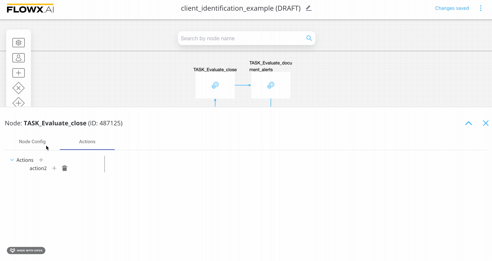
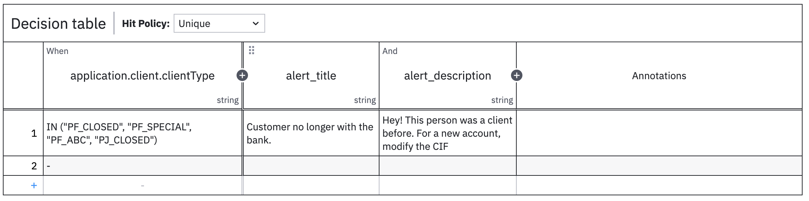

# DMN Business Rule action

For a brief introduction to Decision Model and Notation, check the following section:


[Intro to DMN](../../../../platform-overview/frameworks-and-standards/business-process-industry-standards/intro-to-dmn.md)

### **Creating a DMN Business Rule action**

To create and attach a DMN business rule action to a task node, you must do the following:

1. Open **FLOWX Designer** and go to **Process Definitions**.
2. Select your process from the list and click **Edit process**.
3. Select a **task node** then click the **edit button** (the key icon) - this will open the node configuration menu.
4. In the opened menu, go to the **Actions** tab then click the "**+**" button.
5. From the dropdown menu choose the action type - **Business Rule**.
6. In the **Language** dropdown menu, select **DMN**.



### **Using a DMN Business Rule action**

We have the following scenario, a bank needs to perform client identification tasks/actions. This action can be defined as a business rule inside a BPMN process using FLOWX Designer.

A business person or specialist can use DMN to design this business rule, without having to go deep into technical definitions.

Here is an example of an [MVEL](../../../../platform-overview/frameworks-and-standards/business-process-industry-standards/intro-to-mvel.md) script - defined as a business rule action inside a [Service Task](../task-node.md) node:

```java
closedClientType = ["PF_CLOSED", "PF_SPECIAL", "PF_ABC", "PJ_CLOSED"];
clientType = input.get("application").get("client").get("clientType");
if (closedClientType.contains(clientType)) {
    alertTitle = "Customer no longer with the bank";
    alertDescription = "Hey! This person was a client before. For a new account modify the CIF.";
    output.put("applications", {"client": {"alertTitle": alertTitle, "alertDescription": alertDescription}});

```

The previous example could be easily transformed into a DMN Business Rule action - represented by the decision table:



In the example above we used FEEL expression language in order to write the rules that should be met in order for the output to happen. FEEL defines a syntax for expressing conditions that input data should be evaluated against.

**Input** - In the example above we used as inputs the type of clients (inside a bank) using the `application.client` key

**Output** - In the example above we used as inputs the type of clients (inside a bank) using the `application.client` key

DMN also defines an XML schema that allows DMN models to be used across multiple DMN authoring platforms. The following output is the XML source of the decision table example from the previous section:

```xml
// Decision Table XML source
<?xml version="1.0" encoding="UTF-8"?>
<definitions xmlns="https://www.omg.org/spec/DMN/20191111/MODEL/" xmlns:biodi="http://bpmn.io/schema/dmn/biodi/2.0" id="Definitions_06nober" name="DRD" namespace="http://camunda.org/schema/1.0/dmn" exporter="Camunda Modeler" exporterVersion="5.0.0">
  <decision id="closed_CIF" name="Decision table">
    <decisionTable id="decisionTable_1">
      <input id="input_1" label="application.client.clientType" biodi:width="277">
        <inputExpression id="inputExpression_1" typeRef="string">
          <text></text>
        </inputExpression>
      </input>
      <output id="output_1" label="alert_title" typeRef="string" />
      <output id="OutputClause_043h9fw" label="alert_description" typeRef="string" />
      <rule id="DecisionRule_10bh1zx">
        <inputEntry id="UnaryTests_0a6rf6l">
          <text>IN ("PF_CLOSED", "PF_SPECIAL", "PF_ABC", "PJ_CLOSED")</text>
        </inputEntry>
        <outputEntry id="LiteralExpression_0xszo8x">
          <text>Customer no longer with the bank.</text>
        </outputEntry>
        <outputEntry id="LiteralExpression_0l2bioo">
          <text>Hey! This person was a client before. For a new account, modify the CIF</text>
        </outputEntry>
      </rule>
      <rule id="DecisionRule_1jj1rv2">
        <inputEntry id="UnaryTests_0cf2e91">
          <text></text>
        </inputEntry>
        <outputEntry id="LiteralExpression_1b9jkr4">
          <text></text>
        </outputEntry>
        <outputEntry id="LiteralExpression_12hua2f">
          <text></text>
        </outputEntry>
      </rule>
    </decisionTable>
  </decision>
</definitions>
```

You can use this XML example with FLOWX Designer, adding it to a Business Rule Action - using an MVEL script. Then you can switch to DMN if you need to generate a graphical representation of the model.