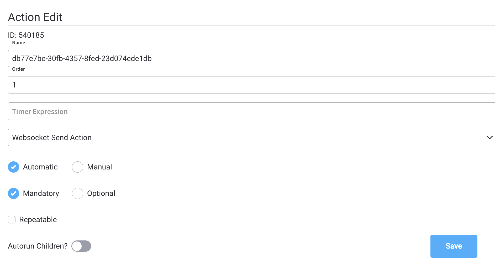
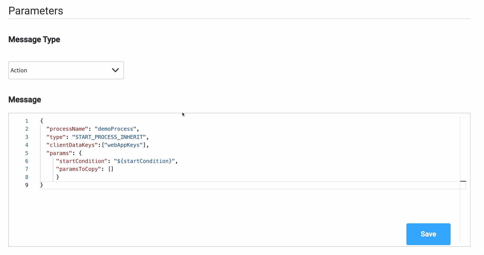

# Websocket Send action

:::info
**What is it?** A **Websocket Send action** is an action type that allows the process to push data to the frontend application.

**Why is it useful?** It provides real-time updates and communication between the process and the frontend application.
:::

### Configuring a Websocket Send action

Multiple options are available for this type of action and can be configured via the FLOWX Designer. To configure a Websocket Send Action, use the **Actions** tab at the [task node level](../../flowx-designer/managing-a-process-flow/adding-a-new-node.md), which has the following configuration options:

* [Action Edit](#action-edit)
* [Back in steps (for Manual actions)](#back-in-steps)
* [Parameters](#parameters)
* [Data to send (for Manual actions)](#data-to-send)

#### Action Edit

* **Name** - used internally to make a distinction between different actions on nodes in the process. We recommend defining an action naming standard to be able to quickly find the process actions
* **Order** - if multiple actions are defined on the same node, the running order should be set using this option
* **Timer expression** - it can be used if a delay is required on that action. The format used for this is [ISO 8601 duration format ](hthttps://www.w3.org/TR/NOTE-datetime)(for example, a delay of 30 seconds will be set up as `PT30S`)
* **Action type** - should be set to Websocket Send action
* **Trigger type** (options are Automatic/Manual) - choose if this action should be triggered automatically (when the process flow reaches this step) or manually (triggered by the user); in most use cases, this will be set to automatic
* **Required type** (options are Mandatory/Optional) - automatic actions can only be defined as mandatory. Manual actions can be defined as mandatory or optional.
* **Repeatable** - should be checked if the action can be triggered multiple times
* **Autorun Children** - when this is switched on, the child actions (the ones defined as mandatory and automatic) will run immediately after the execution of the parent action is finalized

#### **Back in steps**

* **Allow BACK on this action** - back in process is a functionality that allows you to go back in a business process and redo a series of previous actions in the process. For more details, check [Moving a token backwards in a process](../../flowx-designer/managing-a-process-flow/moving-a-token-backwards-in-a-process.md) section.



#### **Parameters**

The following fields are required for a minimum configuration of this type of action:

* **Message Type** - if you only want to send data, you can set this to **Default** (it defaults to the **data** message type)

:::warning
If you need to start a new process using a **Websocket Send action**, you can do that by setting the **Message Type** to **Action** and you will need to define a **Message** with the following format:
:::


```json
{
  "processName": "demoProcess",
  "type": "START_PROCESS_INHERIT",
  "clientDataKeys":["webAppKeys"],
  "params": {
     "startCondition": "${startCondition}",
     "paramsToCopy": []
     }
}
```

:::info
* `paramsToCopy` - choose which of the keys from the parent process parameters to be copied to the subprocess

* `withoutParams` - choose which of the keys from the parent process parameters are to be ignored when copying parameter values from the parent process to the subprocess
:::

* **Message** - here you define the data to be sent as a JSON object, you can use constant values and values from the process instance data.
* **Target Process** - is used to specify to what running process instance should this message be sent - **Active process** or **Parent process**

:::info
If you are defining this action on a [**subprocess**](../../process/subprocess), you can send the message to the parent process using **Target Process: Parent process**.
:::

#### Data to send

* **Keys** - are used when data is sent from the frontend via an action to validate the data (you can find more information in the [User Task configuration](../user-task-node/) section)

:::warning
**Data to send** option is configurable only when the action **trigger type** is **Manual**.
:::



#### Send Update Data example

To send the latest value from the [process instance](../process/active-process/process-instance/process-instance.md) data found at `application.client.firstName` key, to the frontend app, you can do the following:

1. Add a **Websocket Send Action**.
2. Set the **Message Type** to **Default** (this is default value for `data`).
3. Add a **Message** with the data you want to send:
   * `{ "name": "${application.client.firstName}" }`
4. Choose the **Target Process**.

