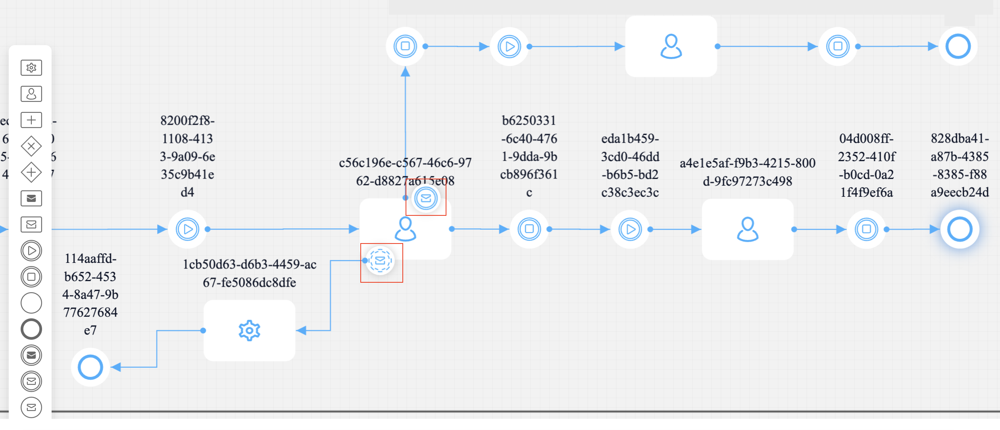

---
sidebar_position: 2
--- 

# Message Catch Boundary Events

:::info quick intro
**What is it?** A Message Catch Boundary Event is a special [**event**](../../../terms/events) that can be attached to a user task in a [**process**](../../../terms/flowx-process-definition). 

**Why it is important?** It allows the process to listen for and capture specific messages during the execution of the associated user task. 
:::

When used as a boundary event on a [**user task**](../user-task-node.md), message catch boundary event nodes behave similar to an [**exclusive gateway**](../exclusive-gateway-node.md), but they are activated upon receiving an event. This means you can proceed in the process without receiving an event and continue through the sequence initiated from the user task. 

If an event is received, it advances through the sequence from the intermediate [**node**](../../../terms/flowx-node). You can have multiple intermediate boundary events on the same user task, but only one can be activated at a time.

There are two types of Message Catch Boundary Events: 

* [**Interrupting**](#message-catch-interrupting-event)  
* [**Non-Interrupting**](#message-catch-non-interrupting-event)

## Message Catch Interrupting Event

When an Interrupting Message Catch Boundary Event is triggered by receiving a message, it interrupts the associated task that is being performed. The task is immediately finished, and the [**process flow**](../../../terms/flowx-process) continues to advance based on the received message.

It can also be used as a standalone node, see more information on the following section:

[Message Catch Intermediate Event](message-catch-intermediate-event.md)

## Message Catch Non-Interrupting Event

It is used only as a boundary event and is placed only on a user task. If your process is in that user task and receives [**events**](../../../terms/events), the event is activated, and a new token is created that advances independently. Sections with non-interrupting events should not contain user tasks. You can have multiple non-interrupting events on the same user task, and all of them can be activated simultaneously.

A Non-Interrupting Message Catch Boundary Event also listens for messages while the associated task is being performed. However, in this case, the task is not immediately finished when messages are received. The event captures the messages, allowing the task to continue its execution. Multiple non-interrupting events can be received while the task is still active, and the task will continue until its completion.

## Configuring a Message Catch Interrupting/Non-Interrupting Event

#### General config

* **Correlate with throwing events** - the dropdown contains all throw events from the process definitions accessible to the user

:::info
It is used to establish the correlation between the catch event and the corresponding throw event.
By selecting the appropriate throw event, the catch event will be triggered when a message is thrown from that event.
:::

* **Correlation key** - process key used to establish a correlation between the received message and a specific process instance

:::info
Correlation key serves as a means to correlate the incoming message with the specific process instance it belongs to.
When a message is received with a matching correlation key, the catch event will be triggered.
:::

* **Receive data (process key)** - the catch event can receive data associated with the message and store it in a process variable with the specified process key

:::info
This data can then be used within the process instance for further processing or decision-making.
:::
