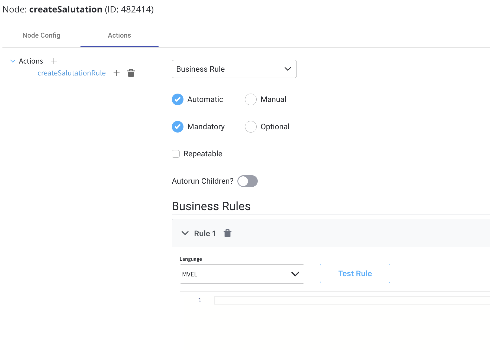
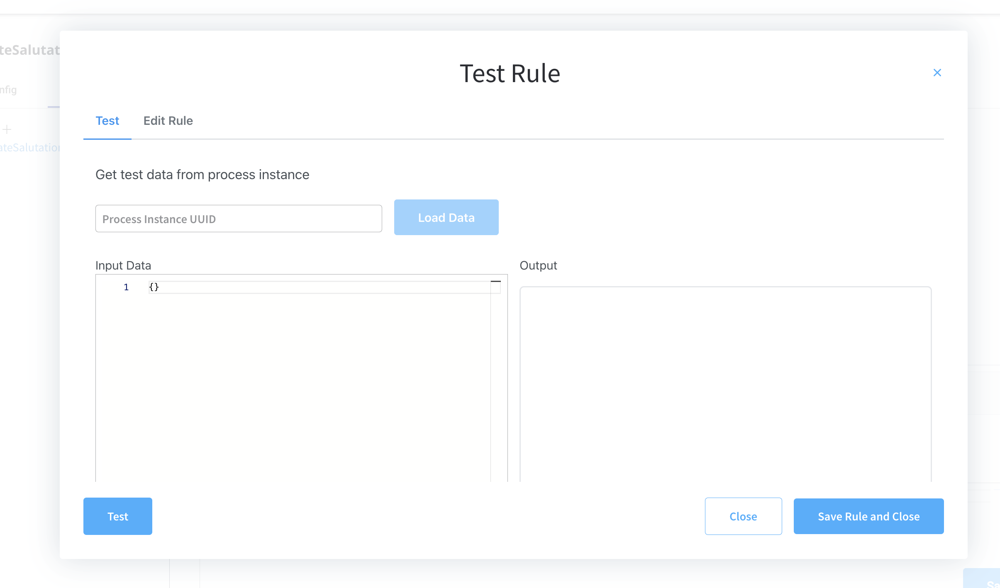
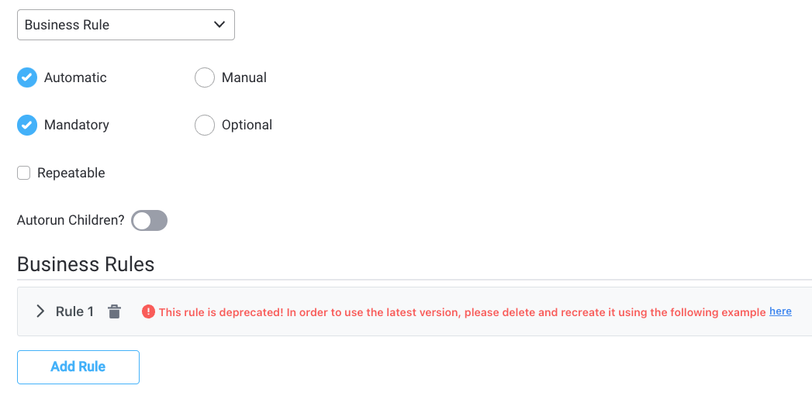

# Business Rule Action

:::info
**What is it?**  A business rule is an action type that allows you to configure a script on a BPMN task node. When the process instance token reaches this task, the defined script will be executed.

**Why is it useful?** The script can read and write the data available on the process at the moment the script is executed. For this reason, it is very important to understand what data is available on the process when the script is executed.
:::

Business rules can be attached to a node by using actions with [**action rules**](../../../actions.md#action-rules) on them. These can be specified using [DMN rules](dmn-business-rule-action.md), [MVEL](../../../../platform-overview/frameworks-and-standards/business-process-industry-standards/intro-to-mvel.md) expressions, or scripts written in Javascript, Python, or Groovy.

[Supported scripts](../../../supported-scripts)




You can also test your rules by using the **Test Rule** function.



### Example

Let's take look at the following example. We have some data about the gender of a user and we need to create a business rule that computes the formal title based on the gender:

1.  This is how the process instance data looks like before it reaches the business rule

    ```
    {
        "application" : {
            "client" : 
            {
                "firstName" : "David"
                "surName" : "James"
                "gender" : "M",
                
            }
        }
    }
    ```
2.  When the token reaches this node the following script (defined for the business rule is executed). The language used here for scripting is MVEL

    ```
    if(input.?get("application.client.gender")== "F"){
        output.put("application.client.salutation", "Ms");
    } else if(input.?get("application.client.gender")== "M") {
        output.put("application.client.salutation", "Mr");
    } else {
        output.put("application.client.salutation", "Mx");
    }
    ```
3. After the script is executed, the process instance data will look like this

```
{
    "application": {
        "client": {
            "firstName": "David",
            "surName": "James",
            "gender": "M",
            "salutation": "Mr"
        }
    }
}
```

### :warning: Flattened vs unflattened keys

:::warning
With version [**2.5.0**](/release-notes/v2.5.0-april-2022) we introduced unflattened keys inside business rules. Flattened keys are now obsolete. You are notified when you need to delete and recreate a business rule so it contains an unflattened key.
:::



1. Here is an example of a flattened key inside a business rule:

:::danger
Example for deprecated versions previous to [**v2.5.0**](/release-notes/v2.5.0-april-2022)
:::

```
def createActionForCustomer (name, cnp)
{
    return{
     "name":name,
      "cnp:cnp
  }
 }
 String cif = input.get("clientIdentification.cif");
 output.put("clientIdentification.personalIdentifactionNumber",cif)
 output.put("identificationData", createActionForCustomer("action1",input.get("clientIdentifaction.cnp")));
```

2. Here is an example of an unflattened key inside a business rule:

:::success
Example available for [**v2.5.0**](/release-notes/v2.5.0-april-2022) version and higher
:::

```
def createActionForCustomer (name, cnp)
{
  return {
    "name": name,
    "cnp": cnp
  }
}
String cif = input.clientIdentification.cif;
output.put("clientIdentification", {"personalIdentificationNumber": cif} );
output.put("identificationData", createActionForCustomer("action1", input.clientIdentification.cnp));
```

For more information about each type of Business Rule Action, check the following sections:

[DMN Business Rule Action](dmn-business-rule-action.md)