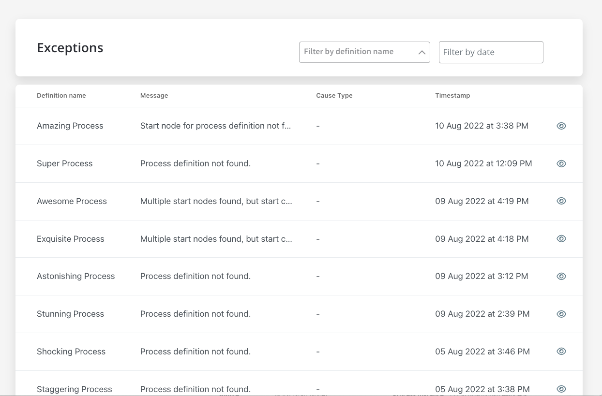
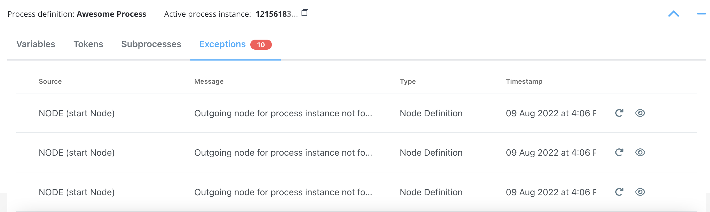
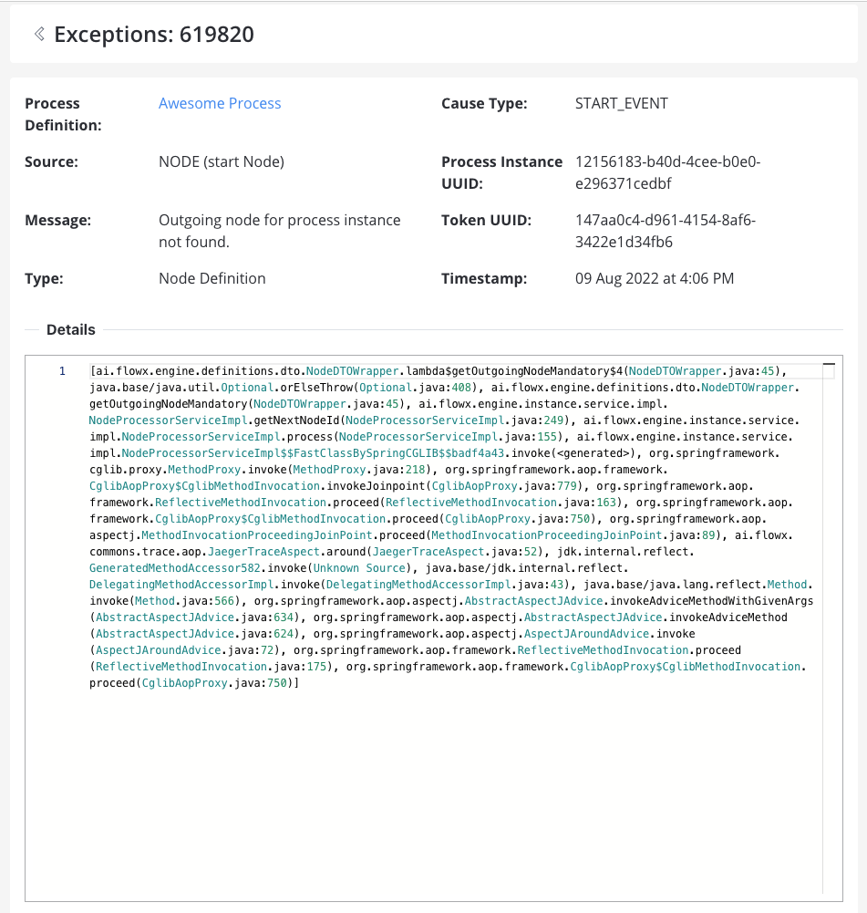

# Failed process start

## Exceptions

Exceptions are types of errors meant to help you debug a failure in the execution of a process.

Exceptions can be accessed from multiple places:

* **Failed process start** tab from **Active process** menu in FLOWX Designer
* **Process Status** view, accessible from **Process instances** list in FLOWX Designer

:::caution
If you open a process instance and it does not contain exceptions, the **Exceptions** tab will not be displayed.
:::

### Exceptions data

When you click **view** button, a detailed exception will be displayed.

* **Process Definition** - the process where the exception was thrown
* **Source** - the source of the exception (see the possible type of [sources](#possible-sources) below)
* **Message** - a hint type of message to help you understand what's wrong with your process
* **Type** - exception type
* **Cause Type** - cause type (or the name of the node)
* **Process Instance UUID** - process instance unique identifier
* **Token UUID** - token unique identifier
* **Timestamp** - default format: `yyyy-MM-dd'T'HH:mm:ss.SSSZ`
* **Details** - stack trace (a **stack trace** is a list of the method calls that the process was in the middle of when an **Exception** was thrown)

#### Possible sources:

* [Action](../../actions/actions.md)
* [Node](../../node/node.md)
* [Subprocess](../subprocess.md)
* [Process Definition](../process-definition.md)

### Exceptions type

Based on the exception type, there are multiple causes that could make a process fail. Here are some examples:

| Type                     | Cause                                                                                                                                                                                                                     |
| ------------------------ | ------------------------------------------------------------------------------------------------------------------------------------------------------------------------------------------------------------------------- |
| Business Rule Evaluation | when executing action rules fails for any reason                                                                                                                                                                          |
| Condition Evaluation     | when executing action conditions                                                                                                                                                                                          |
| Engine                   | 

when the connection with the database fails

when the connection with [Redis](../../../platform-overview/frameworks-and-standards/event-driven-architecture-frameworks/intro-to-redis.md) fails

 |
| Definition               | misconfigurations: process def name, subprocess parent process id value, start node condition missing                                                                                                                     |
| Node                     | when an outgoing node can’t be found (missing sequence etc)                                                                                                                                                               |
| Gateway Evaluation       | 
when the token can’t pass a gateway for any reason, possible causes:
<ul><li>missing sequence/node</li><li>failed node rule</li></ul>                                                                               |
| Subprocess               | exceptions will be saved for them just like for any other process, parent process ID will also be saved (we can use this to link them when displaying exceptions)                                                         |
