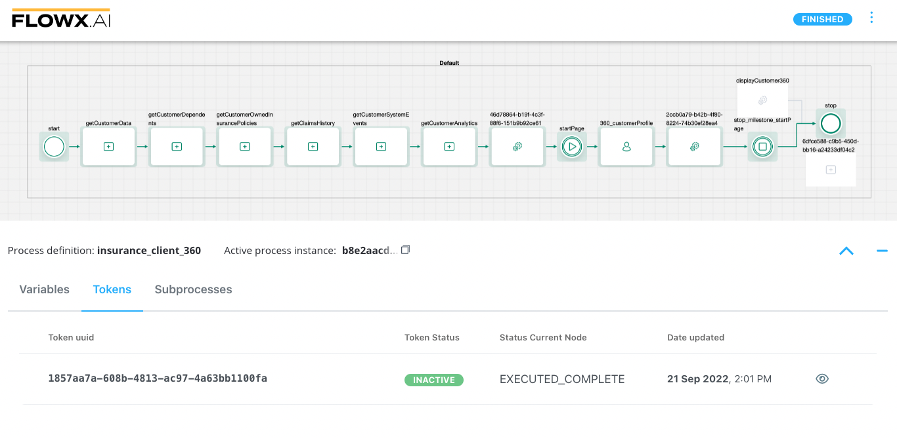
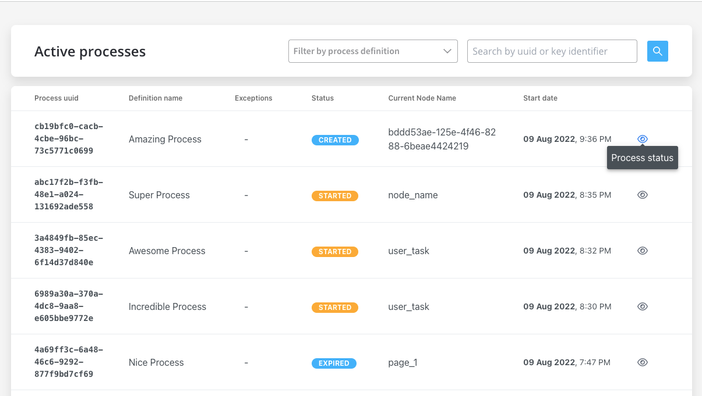
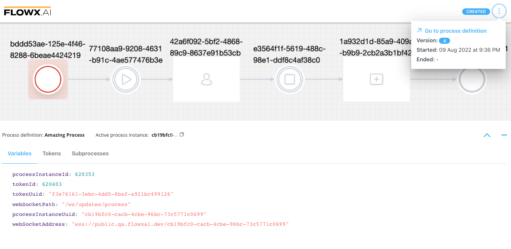
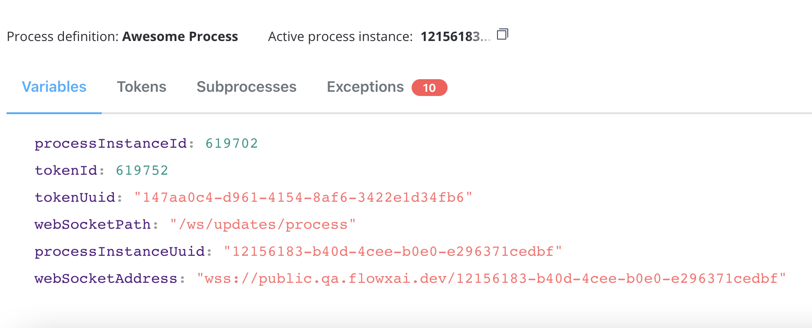
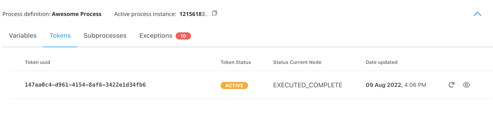
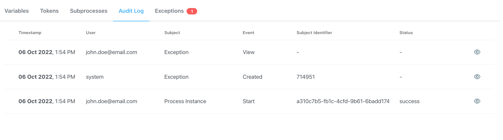
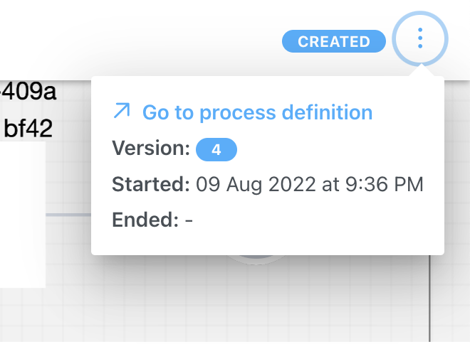
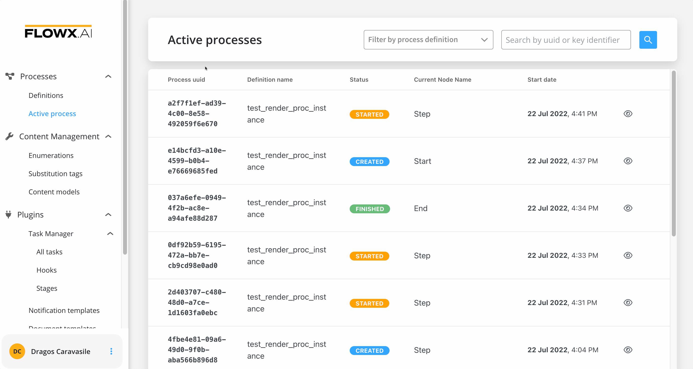
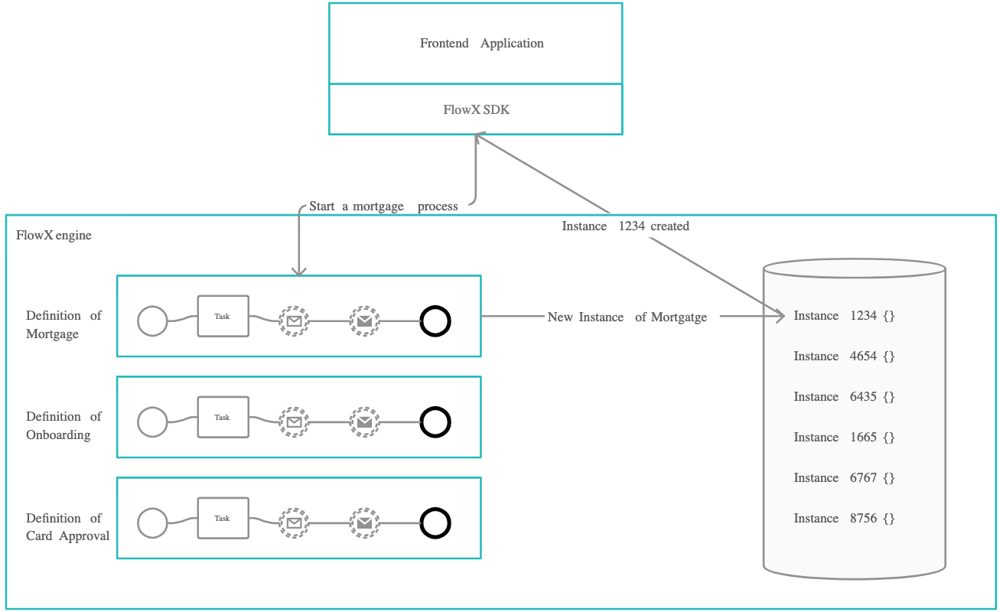

# Process instance

A process instance is a specific execution of a business process that is defined on the FLOWX.AI platform. Once a process definition is added to the platform, it can be executed, monitored, and optimized by creating an instance of the definition.

## Overview

Think of the process definition as the blueprint for a house and the process instance as the actual house. Each process instance holds its current state and related business data.

The engine takes care of going through the process steps defined and handles all the business logic on the process definition.

The [**FLOWX.AI Engine**](../../../../platform-deep-dive/core-components/flowx-engine) is responsible for executing the steps in the process definition and handling all of the business logic. The token represents the current position in the process and moves from one node to the next based on the sequences and rules defined in the exclusive gateways. In the case of parallel gateways, child tokens are created and eventually merged back into the parent token.

Kafka events are used for communication between FLOWX.AI components such as the engine and integrations/plugins. Each event type is associated with a Kafka topic to track and orchestrate the messages sent on Kafka. The engine updates the UI by sending messages through sockets.

[More about Kafka](../../../../platform-overview/frameworks-and-standards/event-driven-architecture-frameworks/intro-to-kafka-concepts.md)

## Checking the Process Status

To check the status of a process or troubleshoot a failed process, follow these steps:

1. Open **FLOWX Designer**.
2. Go to **Processes → Active Process → Process instances**.
3. Click **Process status** button.

## Understanding the Process Status Data

The process status data includes the following:

* **Status** - status of the process instance, possible values:
  * CREATED - the status is visible if there is an error in the process creation. If there is no error, the "Started" status is displayed.
  * STARTED - indicates that the process is currently running
  * DISMISSED - the status is available for processes with subprocesses, it is displayed when a user stops a subprocess
  * EXPIRED - the status is displayed when the "expiryTime" field is defined in the process definition and the defined time has passed.
  * FINISHED - the process has successfully completed its execution
* **Process definition** - the name of the process definition
* **Active process instance** - the UUID of the process instance, with a copy action available
* **Variables** - displayed as an expanded JSON

* **Tokens** - a token represents the state within the process instance and describe the current position in the process flow

:::info
For more information about token status details, [here](../../../token).
:::

* **Subprocesses** - :exclamation:displayed only if the current [process instance](process-instance.md) generated a [subprocess](../../subprocess.md) instance
* **Exceptions** - errors that let you know where the process is blocked, with a direct link to the node where the process is breaking for easy editing

:::info
For more information on token status details and exceptions, check the following section:
:::

[Failed process start](../failed-process-start.md)

* **Audit Log** - the audit log displays events registered for process instances, tokens, tasks, and exceptions in reverse chronological order by timestamp

[Audit](../../../../platform-deep-dive/core-components/core-extensions/audit)

### Process menu

In the breadcrumb menu (top-right corner), you can access the following:

* **Go to process definition** **button** - opens the process for editing
* **Version** - version of the process definition
* **Started** - timestamp for when the process instance started
* **Ended** - timestamp for when the process instance ended

### Color coding

In the **Process Status** view, some nodes are highlighted with different colors to easily identify any failures:

* **Green** - nodes highlighted with green mark the nodes passed by the [token](../../../token.md)
* **Red** - the node highlighted with red marks the node where the token is stuck (process failure)

## Starting a new process instance

To start a new process instance, a request must be made to the [FLOWX.AI Engine](../../../../platform-deep-dive/core-components/flowx-engine). This is handled by the web/mobile application. The current user must have the appropriate role/permission to start a new process instance.

To be able to start a new process instance, the current user needs to have the appropriate role/permissions:

[Configuring access roles for processes](../../../../platform-deep-dive/platform-setup-guide/flowx-engine-setup-guide/configuring-access-roles-for-processes.md)

When starting a new process instance, we can also set it to [inherit some values from a previous process instance](../../../../platform-deep-dive/core-components/flowx-engine.md#orchestration).

## Troubleshooting possible errors

If everything is configured correctly, the new process instance should be visible in the UI and added to the database. However, if you encounter issues, here are some common error messages and their possible solutions:
Possible errors include:

| Error Message                        | Description                                                                                   |
|-------------------------------------|-----------------------------------------------------------------------------------------------|
| *"Process definition not found."*  | The process definition with the requested name was not set as published.                      |
| *"Start node for process definition not found."* | The start node was not properly configured.                                                  |
| *"Multiple start nodes found, but start condition not specified."* | Multiple start nodes were defined, but the start condition to choose the start node was not set. |
| *"Some mandatory params are missing."* | Some parameters set as mandatory were not included in the start request.                        |
| `HTTP code 403 - Forbidden`        | The current user does not have the process access role for starting that process.             |
| `HTTP code 401 - Unauthorized`     | The current user is not logged in.                                                            |
