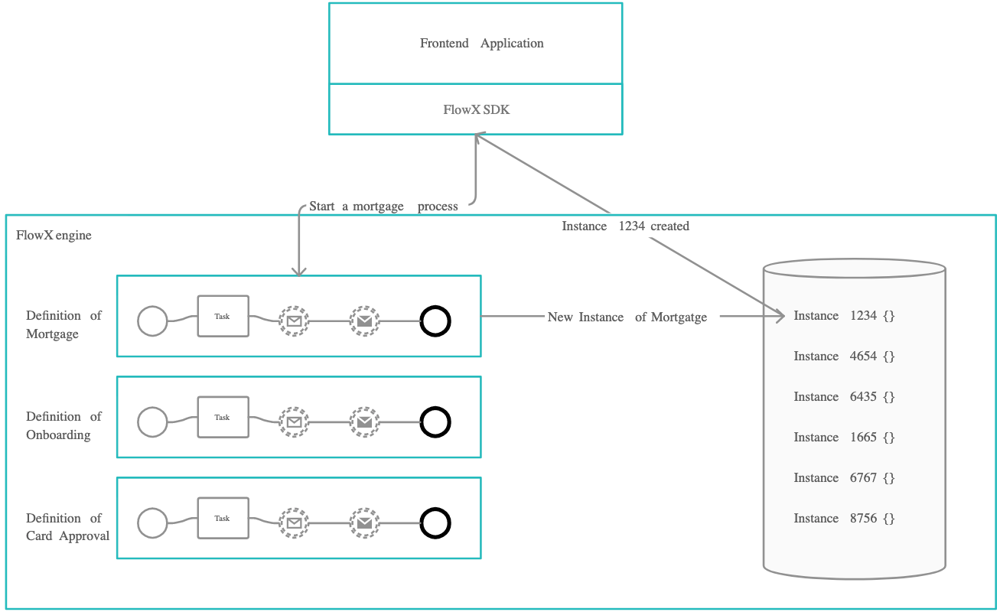

# Process instance

Once a process is defined and added on the platform, it can be executed, monitored and optimized. When a business process starts, we create an **instance** of the definition.

Think of the process instance as if the process definition is the blueprint of a house and the instance is the house.

Each process instance holds its current state and business data related to it.

The engine takes care of going through the process steps defined and handles all the business logic on the process definition.

The **token** is used to describe the current position in the process. The token moves from one node to the next one based on the defined sequences between hem and the business rules defined on the exclusive gateways. In the case of parallel gateways, child tokens are created for each flow branch and they are merged back into the parent token once the parallel execution part ends.

**Kafka events** are used for all communication between various FLOWX.AI components such as the engine and the integrations and plugins. Each event type is associated with a **Kafka topic** to be able to keep track and orchestrate the multitude of messages sent on Kafka.

The engine is also responsible with updating the UI when some actions occur. This is done by sending messages via **sockets**.

## Starting a new process instance

The new instances will be started by making a request to the  [FLOWX.AI Engine](/platform-deep-dive/core-components/flowx.ai-engine.). This will be handled by the web / mobile application that was created.

To be able to start a new process instance, the current user needs to have the appropriate role/permissions:

{configuring access roles for processes}

When starting a new process instance, we can also set it to [inherit some values from a previous process instance](https://docs.flowx.ai/flowx-engine/orchestration#start-process-and-inherit-values-from-previous-process).&#x20;

## Troubleshooting possible errors

If everything was configured correctly,  the new process instance is added in the database and visible in the UI.

### Possible errors

**`"Process definition not found."`** - there is no process definition set as published with the requested process definition name

**`"Start node for process definition not found."`** - the start node was not configured correctly

**`"Multiple start nodes found, but start condition not specified."`** - there were multiple start nodes defined but the start condition for choosing the start node was not set

**`"Some mandatory params are missing."`** - there were some parameters set as mandatory when configuring the start node, but they were not sent on the start request

**HTTP code `403 - Forbidden`** - the current user does not have the process access role for starting that process&#x20;

**HTTP code `401 - Unauthorized`** - the current user is not logged in.