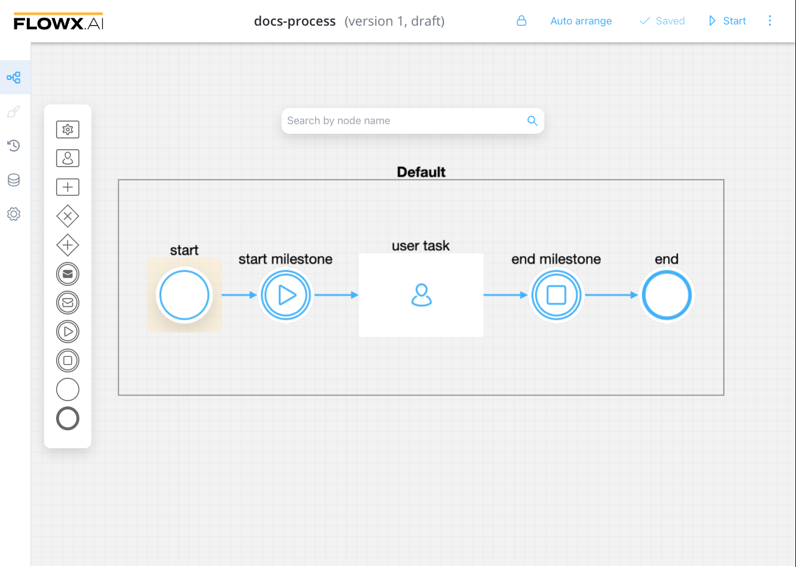

# Process

The process is the core building block of the platform. Think of it as a representation of your business use case, for example making a request for a new credit card, placing an online food order, registering your new car or creating an online fundraiser supporting your cause.

## Process definition

A process is nothing more than a series of steps that need to be followed in order to get to the desired outcome: getting a new credit card, gathering online donations from friends or having your lunch brought to you. These steps involve a series of actions, whether automated or handled by a human, that allows you to complete your chosen business objective.

[Process definition](./process-definition/process-definition.md)

## Process instance

Once the desired processes are defined in the platform, they are ready to be used. Each time a process needs to be used, for example, each time a customer wants to request a new credit card, a new instance of the specified process definition is started in the platform. Think of the process definition as a blueprint for a house, and of the process instance as each house of that type that is being built.

From this point on, the platform takes care of following the process flow, handling the necessary actions, storing and interpreting the resulting data.

[Process instance](./active-process/process-instance/process-instance.md)

[Exceptions](./active-process/failed-process-start.md)

## Process designer

When a process definition is displayed, the name contains the following:

* Process definition name 
* Version number
* State

We have designed FLOWX.AI components to closely resemble their BPMN counterparts for ease of use. In the following sections, we will provide more details on how to use the process designer.

Check the following section for more details about nodes and how to use them:

[Node](../node/node.md)

