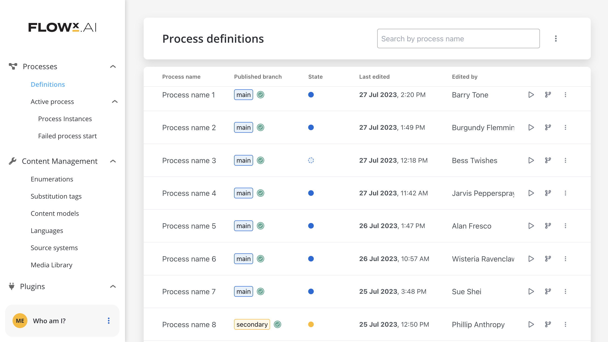

# Versioning 

## Process Definition list

1. Comprehensive Overview:
   - The tab provides a summary of all accessible process definitions in the current environment.

2. Streamlined Data Display:
   - Information displayed in the list is retrieved from both the published version and work in progress.

3. Key Information Included:
   - Easily view essential details like process definition name, published version branch name, and published version state with the following convention: 
        - work in progress - dotted
        - submitted - full
        - main branch - blue 
        - secondary branch - yellow.

4. Simplified Actions:
   - Interact efficiently with each process definition through actions such as opening the BPMN tab in edit mode, starting instances, and displaying branching options.
   - Contextual menu actions offer options to edit, open settings, view data modal, and delete process definitions.

## Branching and Commits

### Branching 

"Branching Modal" feature provides more visibility and control over the process definitions. 

The process definition header includes details about the current version, such as its state (work in progress or submitted changes) and branch name.

A "publish icon" will be displayed if the current version is set as published.
You can access the branching modal using a button, and it can also be closed from the right corner close button.

#### Branching graph

Branching graph view provides an enhanced view over the process definitions. You can easily track your process definition's evolution. 

The graph contains all versions of the process definition. Each row in the graph view displays information such as branch name, published tag, version point properties, submit message, and user initials.

Connections between versions are established in cases like new branch creation, new submit on the same branch, or merge.

