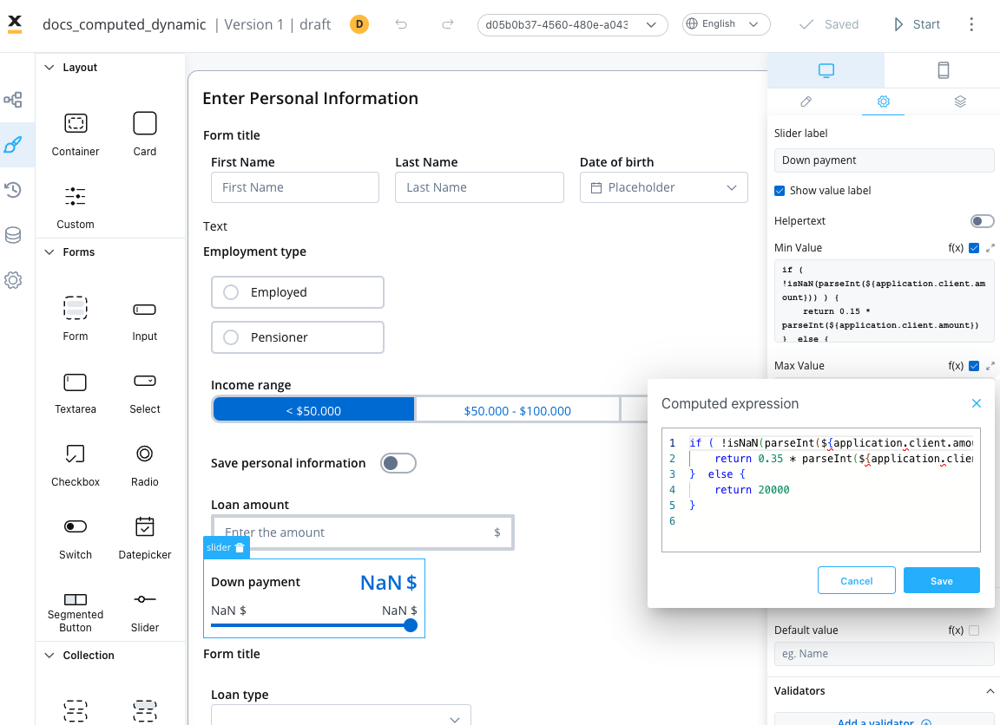

# Dynamic & computed values

## Dynamic values

You can utilize process parameters or substitution tags for the following element properties: 

* default value (excluding switch) 
* label
* placeholder 
* helpertext 
* error message 
* prefix, and suffix

Dynamic values are supported for specific elements such as:

* [**Document Preview**](./ui-component-types/file-preview.md) 
* [**Card**](./ui-component-types/root-components/card.md) 
* [**Form**](./ui-component-types/form-elements) 
* Message 
* [**Button**](./ui-component-types/buttons.md)
* [**Upload**](./ui-component-types/buttons.md#file-upload)
* [**Select**](./ui-component-types/form-elements/select-form-field.md)
* [**Checkbox**](./ui-component-types/form-elements/checkbox-form-field.md) 
* [**Radio**](./ui-component-types/form-elements/radio-form-field.md) 
* [**Segmented button**](./ui-component-types/form-elements/segmented-button.md) 
* Text 
* Link 
* Modal
* Step

## Computed values

Computed values refer to values that are dynamically generated or calculated based on JavaScript expressions rather than being statically predefined. 

:::info
If a user wants to enter a computed value, he has to explicitly check “Computed value” option (**f(x)** icon), case in which the input field becomes a JavaScript editor.
:::



Computed values can be created by writing JavaScript expressions that operate on process parameters or other variables within the application. These expressions can perform calculations, transformations, or other operations to generate the desired value at runtime. By enabling computed values, the application provides flexibility and the ability to create dynamic and responsive user interfaces.


### Slider example

The above example is provided for a Slider element, where JavaScript expressions are used to compute the minimum and maximum values based on a value entered on an input UI element (and linked by a process key - `${application.client.amount}`).

#### Min Value

```js
if ( !isNaN(parseInt(${application.client.amount})) ) {
    return 0.15 * parseInt(${application.client.amount})
}  else {
    return 10000
}
```

#### Max Value


```js
if ( !isNaN(parseInt(${application.client.amount})) ) {
    return 0.35 * parseInt(${application.client.amount})
}  else {
    return 20000
}
```

#### Explanation

The code snippets check whether the value of `${application.client.amount}` key can be successfully parsed as an integer. Here's a step-by-step explanation:

* The `parseInt()` function is used to attempt to convert `${application.client.amount}` into an integer.
* The `isNaN()` function is then used to check if the result of the conversion is `NaN` (not a number).
* If the value is not `NaN`, it means `${application.client.amount}` is a valid numeric value.
* In that case, the code calculates the computed value by multiplying the parsed integer by `0.15` (the minimum percentage value for the down payment or with 0.35, the maximum percentage value of the down payment). The result is returned as the computed value for the expression.
* If the value is `NaN` (or `${application.client.amount}` couldn't be successfully parsed as an integer), the code executes the else block and returns a default value of `10000`.

In summary, the JS expressions demonstrates how a computed value can be derived based on a conditional calculation. It first checks if a specific process parameter `(${application.client.amount})` is a valid numeric value, and if so, it computes the value by multiplying it by 0.15 or 0.35. Otherwise, it falls back to a default value of `10000` or `20000`.


### Usage

The UI Designer now allows JavaScript expressions to be used for certain setting fields in various UI elements such as:

* Slider:
    - Minimum Value (min Value)
    - Maximum Value (max Value)
    - Default Value (default Value)

* Any UI element that accepts validators (min, max, minLength, maxLength):

    - Parameters (params)

* Default Value:
    - For input elements (e.g., text input may require a default value from a process variable, while a number input may need a computed value)

* Text element

* Link text
