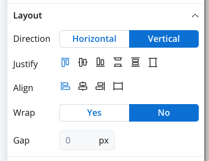

# Layout Configuration

Layout settings will be available for all components that can group other types of elements (for example, [Container](component-types/root-components/container.md) or[ Form Group](component-types/root-components/form-group.md)).

In order to understand this kind of configuration and have real-time feedback on how different  combinations work please visit: [https://tburleson-layouts-demos.firebaseapp.com/#/docs](https://tburleson-layouts-demos.firebaseapp.com/#/docs)
