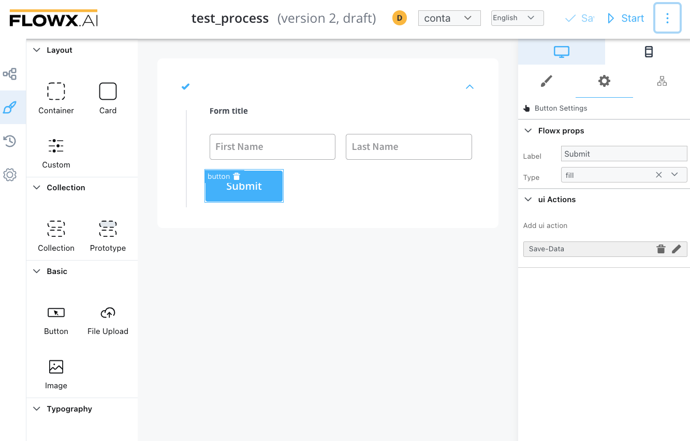
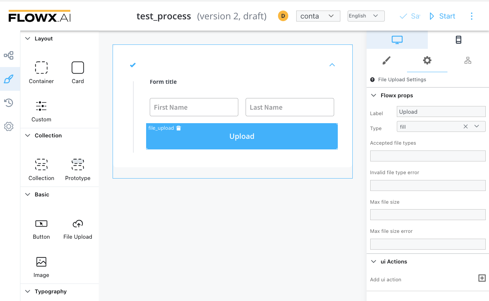

# Buttons

There are   two types of buttons, similar to each other but with different purposes:

### Button

There are used to do an action, unblock the token to move forward in the process, send an OTP, and open a new tab.

Sections that can be configured regarding general settings:

1. **Flowx props**
   * **Label**
   * **Type** - button type: fill/flat
2. ** Add UI Action** - defines what action the button will trigger ([more details on how to configure UI actions](../ui-actions.md))

### File Upload Button

This button will be used to select a file and do custom validation on it. Only the Flowx props will be different. 

Additional properties:

* Accepted file types
* Invalid file type error
* Max file size
* Max file size error
* Add UI Action 

