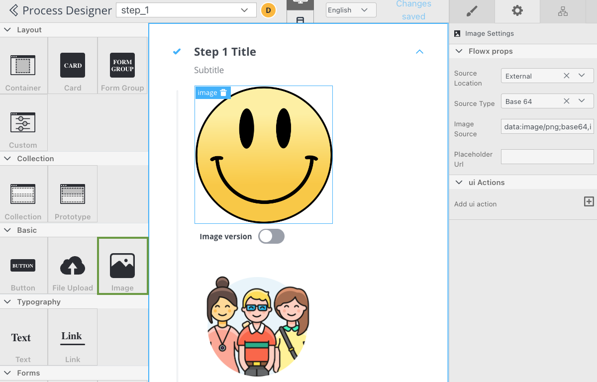
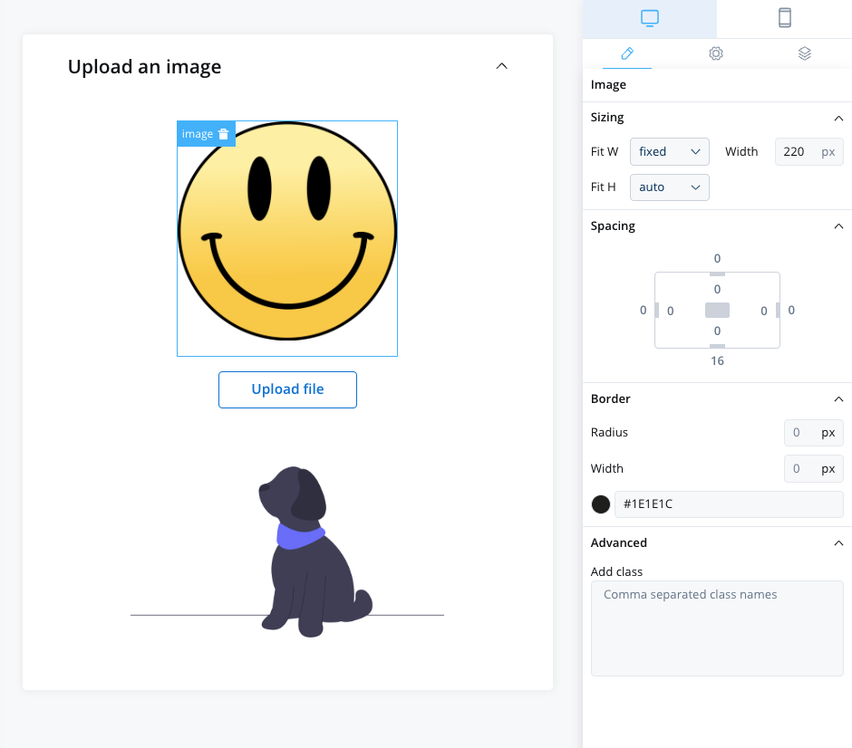

# File Preview

The File Preview UI element is a useful tool for file management, allowing users to quickly and easily preview the contents of files without having to open them fully.

You can interact with the File Preview UI element by clicking on the file preview icon, which will typically open the file in a separate window. This allows you to get a quick glimpse of the contents of a file without having to open it fully, which can save time and improve productivity.

These elements can be added to your interface using the UI Designer tool, and they are often used to convey information, enhance the aesthetic appeal of an interface, provide visual cues and feedback, support branding and marketing efforts, or present complex data or concepts in a more intuitive and accessible way.

## Configuring a File Preview element

### File Preview properties

The File Preview element settings consist of the following properties:

* **Title** - the title of the element (when downloading a document it will use this title by default)
* **Has subtitle** - the subtitle of the element
* **Display mode** - depending on the selected display method the following properties are available:
    * **Inline** → **Has accordion** → **Collapsed **or **Expanded**
    * **Modal** → view icon is enabled 
* **Source Type** - 
    * **Process Data** - process key where the document is found (creates the binding between the element and process data)
    * **Static** - URL of the document
    

### File preview styling

The file preview styling property allows you to add or to specify valid CSS properties for the element. For more details on CSS properties, for more details, click [here](../../ui-designer/ui-designer.md#styling).

