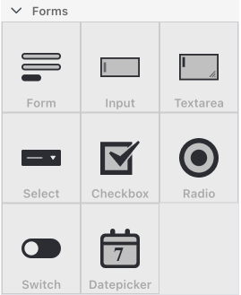

# Form elements

Form elements are used to capture user input. There are many different types of form elements such as simple form, input, textarea, select, checkbox, radio, switch, and datepicker.


[input-form-field.md](input-form-field.md)



[select-form-field.md](select-form-field.md)



[checkbox-form-field.md](checkbox-form-field.md)



[radio-form-field.md](radio-form-field.md)



[datepicker-form-field.md](datepicker-form-field.md)



[switch-form-filed.md](switch-form-filed.md)
