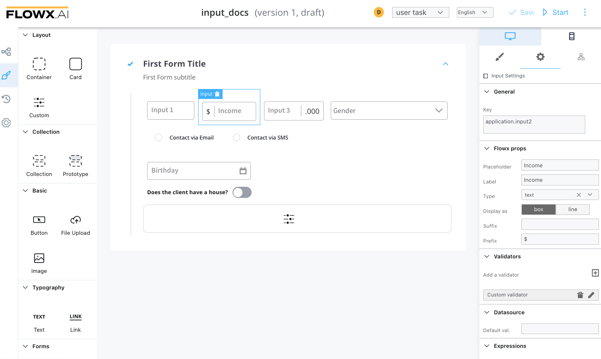
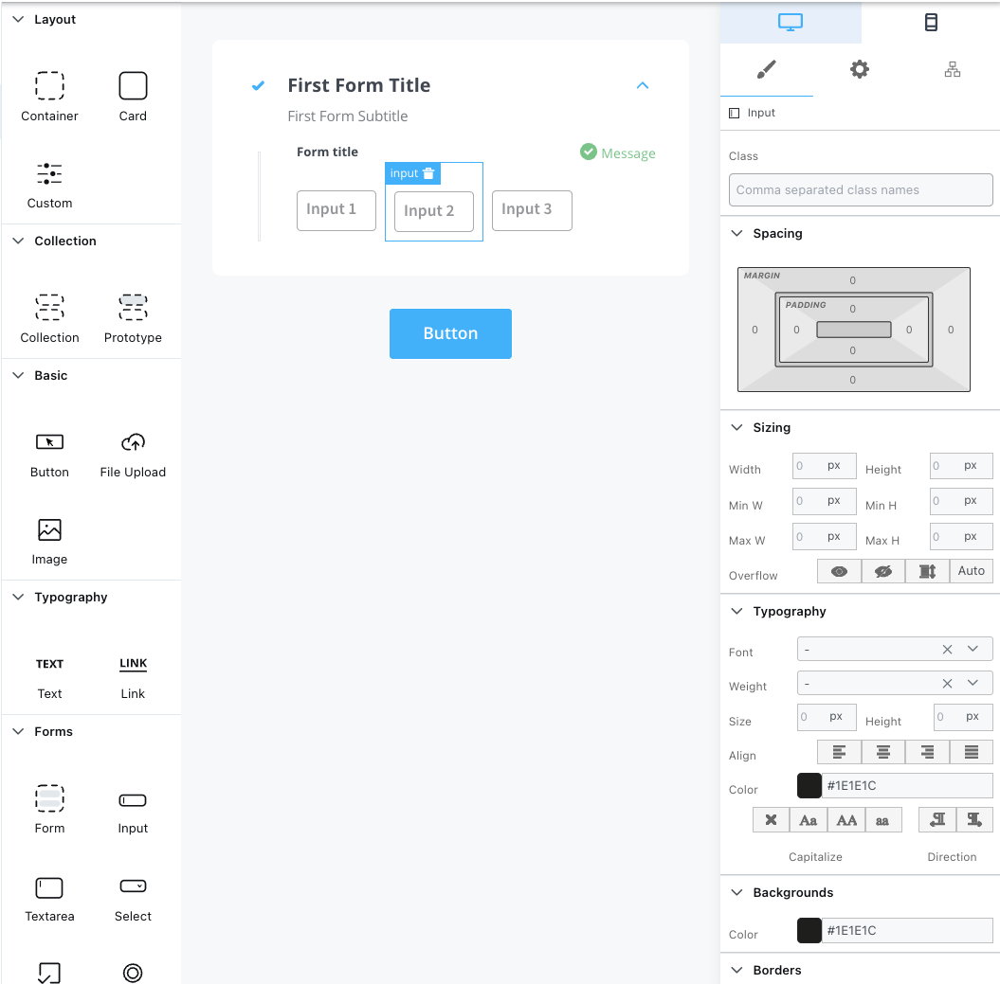

# Input Form field

This is a simple element that allows to input data, it has validations, and can be hidden or disabled.

The available configuration options for this form element are:

#### Input settings

1. **General**
   * **Key** - creates the binding between form element and process data so it can be later used in [decisions](../../../node/exclusive-gateway-node.md), [business rules](../../../node/task-node/task-node.md) or [integrations](../../../node/message-send-received-task-node.md)
2. **Flowx props**
   * **Field Placeholder** - placeholder when the field has no value
   * **Field Label** - the label of the input
   * **Input type** - text/number/email/password - based on this configuration look and feel will expect a string or a number
   * **Display as** - it can be displayed as box or line
   * **Disabled expressions** - javascript expressions that should be evaluated as true or false. It's important to make sure that hidden fields also have the same expression configured under expressions -> hide
   * **Suffix** - a label that will be added as a suffix
   * **Prefix** - a label that will be added like a prefix
3. **Validators** - multiple validators can be added to an input (more details [here](../..//validators.md))
4. **Data source** - default value can be configured here which will autofill the input
5. **Hide Expression** - javascript expressions used to hide components when they're truthy

#### Input styling

* valid CSS properties (more details [here](../../#styling))

