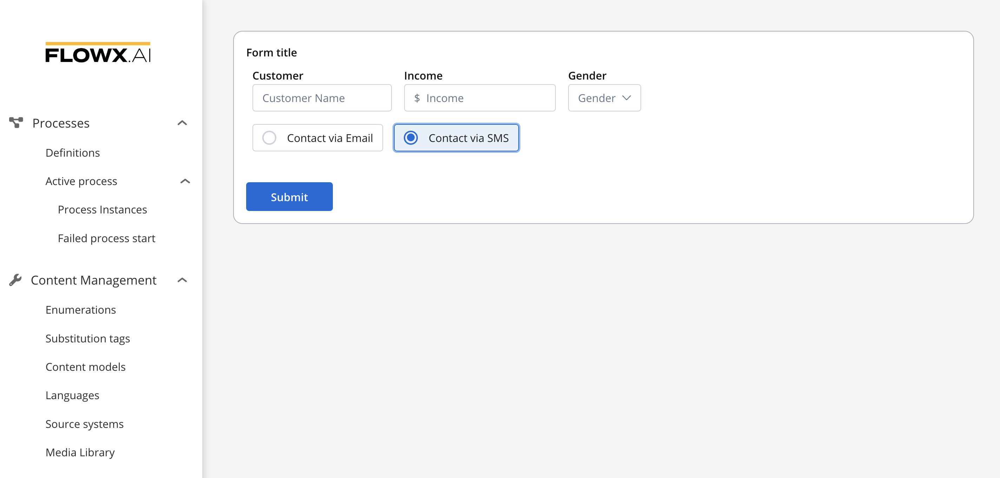
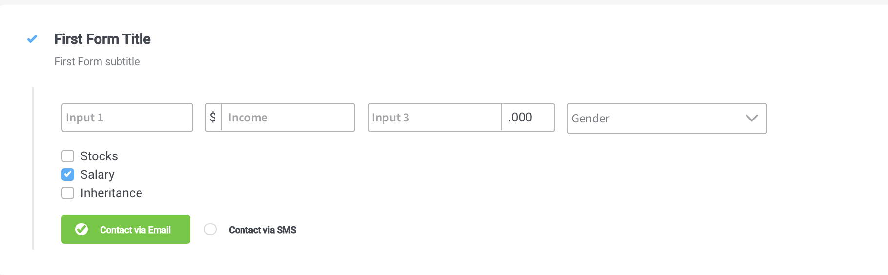

# Radio Form field

Radio buttons are normally presented in radio groups (a collection of radio buttons describing a set of related options). Only one radio button in a group can be selected at the same time.

The available configuration options for this form element are:

#### Radio Settings

1. **General**
   * **Key** - creates the biding between form element and process data so it can be later used in [decisions](../../../node/nodes-types/exclusive-gateway-node.md), [business rules ](../../../node/nodes-types/task-node/)or [integrations](../../../node/nodes-types/message-send-received-task-node.md)
2. **Validators** - multiple validators can be added to a select (more details [here](../../validators.md))
3. **Data source**
   * **Default Value** - the default values of the radio element
   * **Source Type** - it can be Static, Enumeration, or Process Data
   * **Radio Options** - label - value pairs can be defined here&#x20;
4. Expressions
   * **Disabled expressions** - javascript expressions that should be evaluated as true or false. It's important to make sure that hidden fields also have the same expression configured under expressions -> hide
   * **Hide Expression** - javascript expressions used to hide components when they're truthy

#### Radio styling

* valid CSS properties (more details [here](../../#styling))

A Radio with two options and a no layout will look like this (default the layout will be row).

