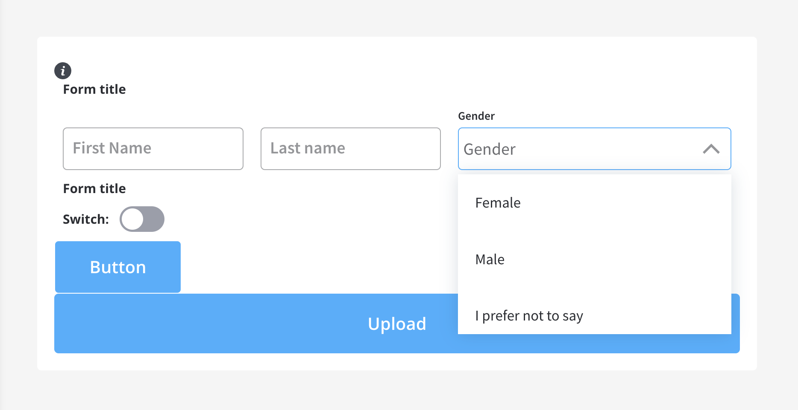
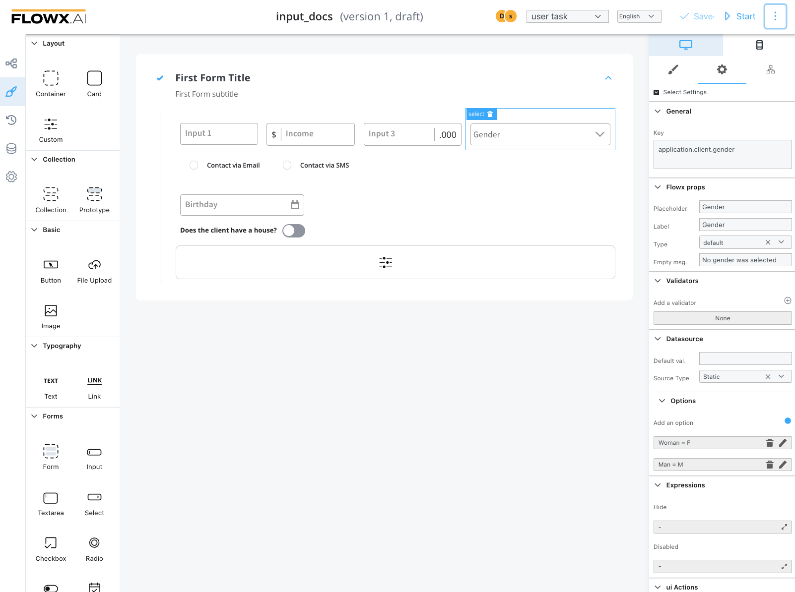
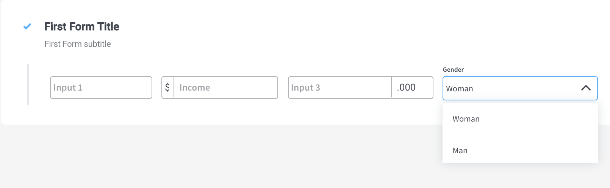

# Select Form field



This is a select element that allows a user to select from a predefined list.&#x20;

A select list has multiple values that are defined by two parameters, a Label that will be displayed in the dropdown and a code that will be saved. For example, you can have a _Woman_ label with **F** value and _Man_ with **M** which means that when you select _Woman_ on the process instance **F** will be available for the **Select** key.&#x20;

The available configuration options for this form element are:

#### Select Settings

1. **General**
   * **Key** - creates the biding between form element and process data so it can be later used in [decisions](../../../node/nodes-types/exclusive-gateway-node.md), [business rules ](../../../node/nodes-types/task-node/)or [integrations](../../../node/nodes-types/message-send-received-task-node.md)
2. **Flowx props**&#x20;
   * **Field Placeholder** - placeholder when the field has no value
   * **Field Label** - the label of the input
   * **Select type** - default or custom where the second one will allow the user to search between the options
   * **Empty message** - text displayed for custom type when no results are found
3. **Validators** - multiple validators can be added to a select (more details [here](../../validators.md))
4. **Data source**
   * **Default Value -** auto-fills the select with this value. Going back to the example with Woman label with F value and Man with M to have a default value of Woman we need to configure here F
   * **Source Type** - it can be Static, Enumeration, or Process Data
   * **Select Options -** label - value pairs can be defined here (values from CMS and defined options together are not possible)
5. **Expressions**
   * **Hide** - javascript expressions used to hide components when they're truthy
   * **Disabled expressions** - javascript expressions that should be evaluated as true or false. It's important to make sure that hidden fields also have the same expression configured under expressions -> hide



#### Select styling

* valid CSS properties (more details [here](../../#styling))

A FORM with a [layout](../../layout-configuration.md) direction of row warp and some inputs and a select element will look like this:



### Example - Dynamic dropdowns

As mentioned previously, you can create dropdowns including static data, enumerations, or **process data**. Let's create an example using **process data** to create a process that contains **dynamic dropdowns**.&#x20;

To create this kind of process, we need the following elements:

* a [**start**](../../../node/nodes-types/start-end-error-node.md#start-node) node and an [**end**](../../../node/nodes-types/start-end-error-node.md#end-node) node
* a [**start milestone** ](../../../node/nodes-types/milestone-node.md)node (add a [page](../../../node/nodes-types/milestone-node.md#page) UI element to it) and an **end milestone** node


* a **** [**task node**](../../../node/nodes-types/task-node/) **** (this will be used to set which data will be displayed on the dropdowns)

 (1).png>)

* a [**user task node**](../../../node/nodes-types/user-task-node/) **** (here we have the client forms and here we add the SELECT elements)


#### Creating the process

Follow the next steps to create the process from scratch:

1. Open **FLOWX.AI Admin** and from the **Processes** tab select **Definitions**.
2. Click on the breadcrumbs (top-right corner) then click **New process** (the Process Designer will now open).
3. Now add all the **necessary nodes** (as mentioned above).

#### Configuring the nodes

1. On the **start milestone** node, add a **page** UI element.
2. On the **task node**, add a new **Action** (this will set the data for the dropdowns) with the following properties:
   * Action type - **Business Rule**
   * **Automatic**
   * **Mandatory**
   * **Language** (we used an [**MVEL**](../../../../overview/frameworks-and-standards/business-process-industry-standards/intro-to-mvel.md) script to create a list of objects)

.gif>)

&#x20; 3\.  On the **user task node,** add a new **Action** (submit action, this will validate the forms and save the date) with the following properties:

* Action type - **Save Data**
* **Manual**
* **Mandatory**
* **Data to send** (the key where the data will be sent) **-** `application`

.gif>)

Below you can find the MVEL script used in the above example:

```mel
output.put("application",
{
    "client": {
        "identity": [
        {
            "value": "001",
            "label": "Eddard Stark"
        },
        {
            "value": "002",
            "label": "Sansa Stark"
        },
        {
            "value": "003",
            "label": "Catelyn Stark"
        }
    ]},
    "contracts": {
        "001": [
            {
                "value": "c001",
                "label": "Eddard Contract 1"
            },
            {
                "value": "c007",
                "label": "Eddard Contract 2"
            }
        ],
        "003": [
            {
                "value": "c002",
                "label": "Catelyn Contract 1",
            },
            {
                "value": "c003",
                "label": "Catelyn Contract 2 ",
            },
            {
                "value": "c004",
                "label": "Catelyn Contract 3"
            }
        ],
        "002": [
            {
                "value": "c005",
                "label": "Sansa Contract 1",
            }
        ]
    }
});
```

#### Configuring the UI

Follow the next steps to configure the UI needed:

1. Select the **user task node** and click the **brush icon** to open [**UI Designer**](../../).
2. Add a [**form group**](../root-components/form-group.md) element as a[ **root component**](../root-components/) (this will group the other elements inside it) with the following properties:
   * **Key** - `form`
   * **Message** - `{"application": ${application}}`
   * **Title** - _Customer Contract_
3. Inside the **form group**, add a [**form element**](./).
4. Inside the **form** add two **select elements,** first will represent, for example, the _Customer Name_ and the second the _Contract ID._
5. For first select element (Customer Name) set the following properties:
   * **Key** - `application.client.selectedClient`
   * **Placeholder** - Customer Name
   * **Label** - Customer Name
   * **Type** - default
   * **Source type** - Process Data (to extract the data added in the **task node**)
   * **Name** - `application.client.identity`
6. For the second select element (Contract ID) set the following properties:
   * **Key** - `application.client.selectedContract`
   * **Placeholder** - Contract ID
   * **Label** - Contract ID
   * **Type** - default
   * **Source Type** - Process Data
   * **Name -** `application.contracts`
   * **Parent Name -** `application.client.selectedClient`
7. Add a button under the form that contains the select elements with the following properties:
   * **Label** - Submit
   * **Type** - fill
   * **Add ui action** (add the submit action attached earlier to the user task node)


8\. Test and run the process by clicking **Start process**.

