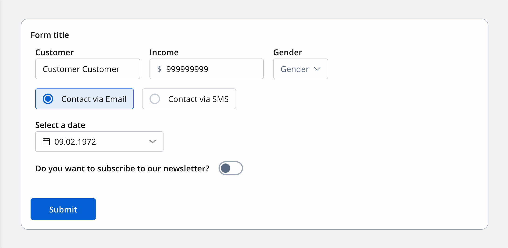
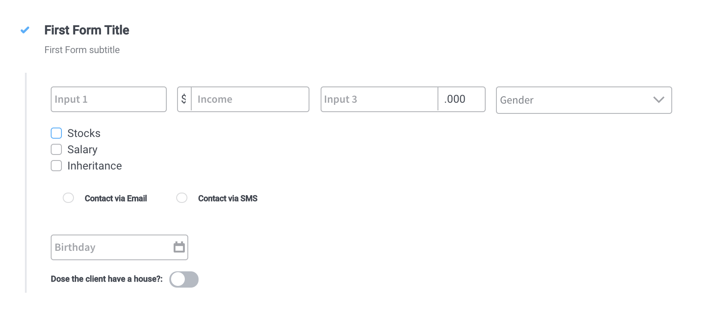

# Switch Form field

Another form element available for generating the UI interface is the switch, a toggle that can be used to pick a response. Depending on the user selection on the toggle, the corresponding true/false value will be stored in the process instance values.

The available configuration options for this form element are:

#### Switch settings

1. General
   * **Key** - creates the biding between form element and process data so it can be later used in [decisions](../../../node/nodes-types/exclusive-gateway-node.md), [business rules ](../../../node/nodes-types/task-node/)or [integrations](../../../node/nodes-types/message-send-received-task-node.md)
2. Flowx props
   * **Field Label** - the label of the field
3. **Validators** - multiple validators can be added to a select (more details [here](../../validators.md))
4. **Data source**
   * **Default Value** - the default value of the switch form field (it can be switched on or switched off)
5. Expressions
   * **Disabled expressions** - javascript expressions that should be evaluated as true or false. It's important to make sure that hidden fields also have the same expression configured under expressions -> hide
   * **Hide Expression** - javascript expressions used to hide components when they're truthy

#### Switch styling

* valid CSS properties (more details [here](../../#styling))

This is how the switch element defined above will look in a form:

