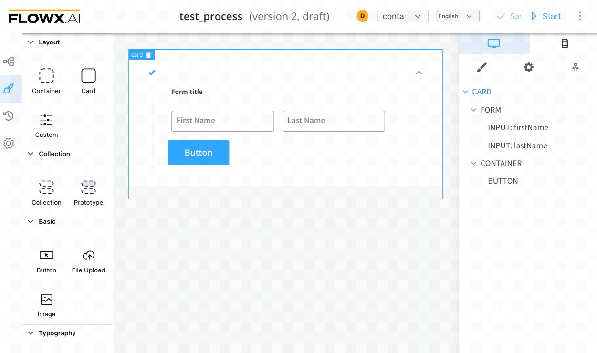
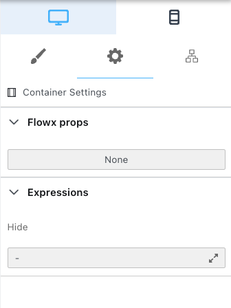
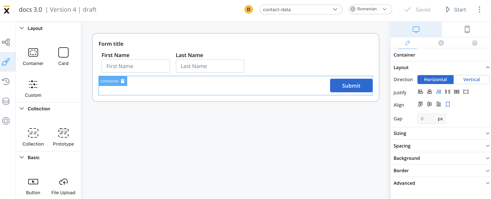

# Container

A container is a versatile element that allows you to group components and align them as desired.

The following properties can be configured in the container:

### Settings

* **Expressions (Hide)** - JavaScript expressions used to hide components when they evaluate to true

### Styling

* **Layout** - this property is available for components that group children and includes the following options:

    * Direction - Horizontal / Vertical (for example, select *Horizontal*)
    * Justify (H) - (for example, select *end*)
    * Align (V) - this option allows you to align components vertically
    * Gap - you can set the gap between components

More layout demos available below:

[Layout Demos](https://tburleson-layouts-demos.firebaseapp.com/#/docs)

When you apply the above properties, you can generate the following output, with the button appearing on the right side of the container, underneath the form with three form elements:

For more information about styling and layout configuration, check the following section:

[UI Designer](../../ui-designer.md#styling)