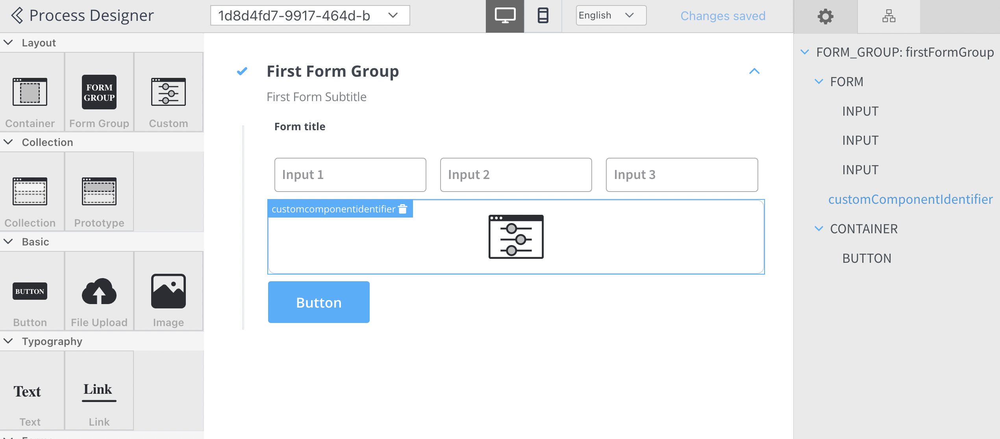

# Custom

Custom components are developed in the web application and referenced here by component identifier. This will dictate where the component is displayed in the component hierarchy and what actions are available for the component.

To add a custom component in the template config tree, we need to know its unique identifier and the data it should receive from the process model.



The properties that can be configured are as follows:

* **Identifier** - this will enable the custom component to be displayed in the component hierarchy and what actions are available for the component
* **Input keys** - used to define the process model paths from which the components will receive their data
* [**UI Actions**](../../ui-actions.md) - actions defined here will be made available to the custom component


<div className= "image-scaled">


</div>


#### Display of User Interface Elements

When a process instance is initiated, the web application receives all the UI elements that can be displayed in the process under the `templateConfig` key.

When a user task is reached in the process instance, a web socket message is sent to the SDK, triggering it to display the associated UI element.

Example:

1. Starting a process:
* The following is an example of starting a process instance via a **POST** request to `{{processUrl}}/api/internal/process/DemoProcess/start`:

```json
{
    "processDefinitionName": "DemoProcess",
    "tokens": [
        {
            "currentNodeId": 40201,
            "uuid": "98f32ee3-0b17-417b-9fa4-7a1acb105e0e"
        }
    ],
    "state": "STARTED",
    "templateConfig": [
        {
            "id": 39888,
            "nodeDefinitionId": 40202,
            "componentIdentifier": "CONTAINER",
            "type": "FLOWX",
            "order": 1,
            "canGoBack": true,
            "templateConfig": [
                {
                    "id": 39889,
                    "uiTemplateParentId": 39888,
                    "componentIdentifier": "TEXT",
                    "type": "FLOWX",
                    "order": 1,
                    "displayOptions": {
                        "flowxProps": {
                            "text": "Demo Text"
                        }
                    },
                    "templateConfig": [],
                    "formFields": [],
                    "inputKeys": []
                }
            ],
            "formFields": []
        }
    ],
    "webSocketPath": "/ws/updates/process",
    "uuid": "3647c9fd-c0f2-4f17-b142-4095b79f459c",
    "generalData": null
}
```

2. The following is an example of a web socket progress message:

```json
{
  "progressUpdateDTO": {
    "processInstanceUuid": "db573705-71dd-4216-9d94-5ba2fb36ff2a",
    "tokenUuid": "b00d98c5-6d64-4ce8-9070-ef82738a3c00",
    "currentNodeId": 40202
  }
}
```

3. **ProgressUpdateDto** will trigger the **SDK** to search for the UI element having the same **nodeId** as the one from the web socket progress event

4. Additionally, it will ask for data and actions that are required for this component via a GET request `{{processUrl}}/api/process/db573705-71dd-4216-9d94-5ba2fb36ff2a/data/42062`