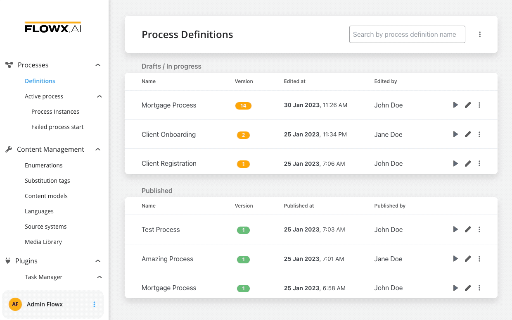
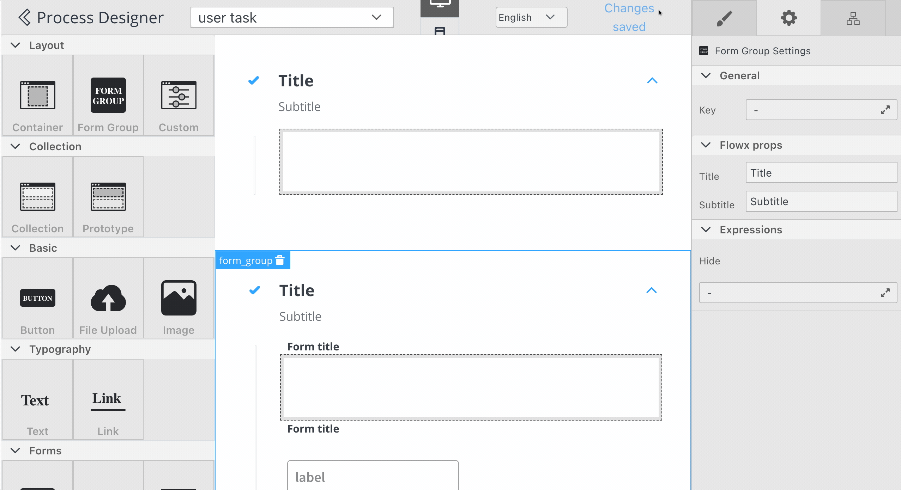
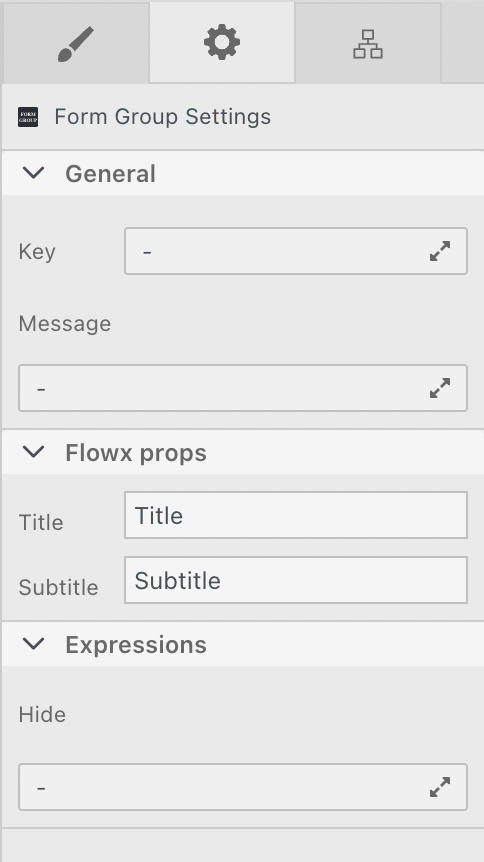
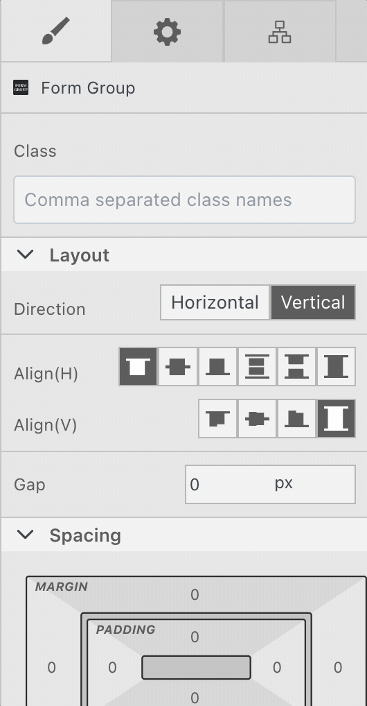
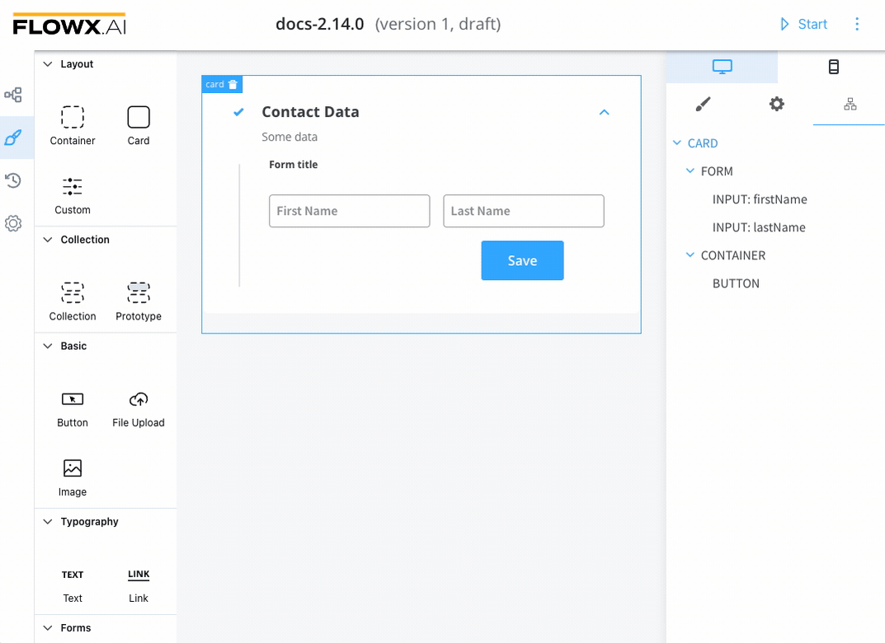

# UI Designer

The FLOWX.AI platform offers a series of ready-to-use [UI components](component-types/) that can be used to create rich web interfaces. These include common form elements like [input](component-types/form-elements/input-form-field.md), [select](component-types/form-elements/select-form-field.md), [checkbox](component-types/form-elements/checkbox-form-field.md), [radio](component-types/form-elements/radio-form-field.md)**,** or [switch](component-types/form-elements/switch-form-filed.md), as well as other UI elements like image, text, anchor links, etc. Each of these components' properties can be configured further using the details tab available when clicking on a specific component. [Design flexibility](./#styling) is possible by adding styles or CSS classes to each of the pre-defined components.

UI templates are built in a tree-like structure, with a root component at the top.

The FLOWX Designer includes an intuitive UI Designer (drag-and-drop editor) for creating diverse UI templates. You can use various elements from basic buttons, indicators, and forms, but also predefined [collections](component-types/collection/) or [prototypes](component-types/collection/collection-prototype.md).

### Accessing the UI Designer

To access the UI Designer, follow the next steps:

1. Open **FLOWX Designer** and from the **Processes** tab select **Definitions**.
2. Select a **process** from the process definitions list.
3. Click the **Edit** **process** button.
4. Select a **node** from the Process Designer then click the **brush** icon to open the **UI Designer**.

:::caution
The UI designer is available for [User task](../node/nodes-types/user-task-node/) nodes and [Milestone](../node/nodes-types/milestone-node.md) nodes (nodes that require human interaction).
:::

### Using the UI Designer

After adding a specific component to the node, the right-side menu will display more configuration options.

:::caution
Depending on the component type different properties are available for configuration.&#x20;
:::

For example, for a [form group](component-types/root-components/form-group.md) element (as in the example above), the following properties can be configured:

#### Settings

1. **General -** where you define the **Key** and **Message**
   * **Key -** used to bind form element to process model
   * **Message** - :exclamation:available for [Root components](component-types/root-components/); describes the data pushed to the frontend application when the process reaches this [user task](../node/nodes-types/user-task-node/); should be a valid JSON
2. **Flowx props** - depending on the component type, custom properties will be available here
3. **Expressions (Hide)** -  javascript expressions used to hide components when they're truthy

#### Styling

1. **Class** - add CSS classes to each of the pre-defined components
2. **Layout** -  available for components that group children, more details about layouts can be found [here](https://tburleson-layouts-demos.firebaseapp.com/#/docs). The following properties can be edited:
   * Direction
   * Alignment
   * Gap
3. **Spacing** - margin, and padding can be adjusted using spacing
4. **Sizing** - use sizing to edit width, height, min W/H, max W/H or overflow
5. **Typography** - use to manipulate fonts, font color, text indentation etc.
6. **Backgrounds** -  set the color of a background
7. **Borders** - set the radius, borders style, width or color

#### Tree View

This panel is used for displaying component hierarchy. Clicking on a specific component in the component tree will highlight the selection in the editor.

For more information about Component types, check the next section:

[component-types](component-types)
