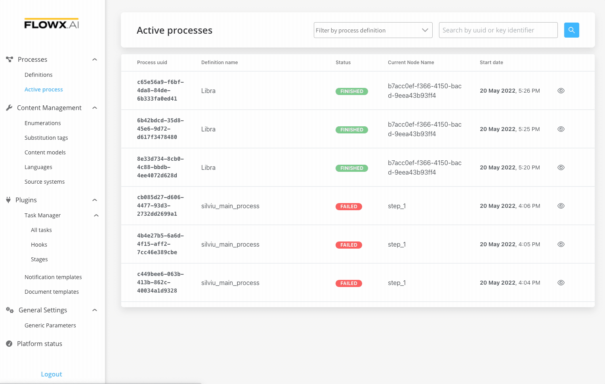

# Adding a new node

Once you create a new process definition, you can start configuring it by adding new nodes.

You can choose between a series of available node types below. For an overview of what each node represents, see [BPMN 2.0 basic concepts](https://app.gitbook.com/@flowx-ai/s/flowx-docs/\~/drafts/-MWUDp87GMzNmryEgBSx/visual-studio/what-is-the-visual-studio):

* [start event](../../flowx-elements/node/nodes-types/start-end-error-node.md)
* [end event](../../flowx-elements/node/nodes-types/start-end-error-node.md)
* [service task](../../flowx-elements/node/nodes-types/task-node/)
* [user task](../../flowx-elements/node/nodes-types/user-task-node/)
* [parallel gateway](../../flowx-elements/node/nodes-types/parallel-gateway.md)
* [exclusive gateway](../../flowx-elements/node/nodes-types/exclusive-gateway-node.md)
* [message send event](../../flowx-elements/node/nodes-types/message-send-received-task-node.md)
* [message receive event](../../flowx-elements/node/nodes-types/message-send-received-task-node.md)
* [start milestone](../../flowx-elements/node/nodes-types/milestone-node.md)
* [end milestone](../../flowx-elements/node/nodes-types/milestone-node.md)

### Steps for creating a new node

To create a new node on an existing process:

1. Open **FLOWX.AI Designer** and from the **Processes** tab select **Definitions**.
2. Open your **process**.
3. Click the **Edit process** button from the process definition.
4. Drag and drop one **node element**.
5. To connect the node that you just created:
   * Click  the node, select the **arrow** command
   * Click the node that you wish to link to the newly added node

For each new node, you can set its name, and a set of values (timeout, topic name, key name) and you can also add various [actions](../../flowx-elements/node/actions) to it.

[Node](../../building-blocks/node)

Now, check the next section to learn how to add an action to a node.