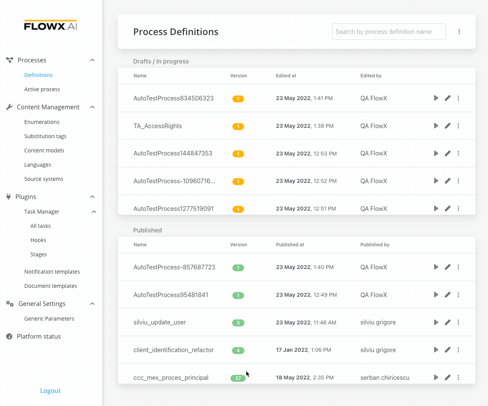

# Adding more flow branches

To split the process flow into more steps, you just need to use a [parallel gateway](../../flowx-elements/node/nodes-types/parallel-gateway) node type.

### Steps for creating a flow with two branches

To create a flow with two branches:

1. Open **FLOWX Designer** and go to the **Definitions** tab.
2. Click on the **New process** button, using the **breadcrumbs** from the top-right corner.
3. Add a **start node** and a **parallel gateway node**.
4. Add two different **task nodes** and link them after the **parallel gateway node**.
5. Add a **parallel gateway** to merge the two flow branches back into one branch.
6. Add an **end node**.

[Parallel Gateway](../../flowx-elements/node/nodes-types/parallel-gateway)
