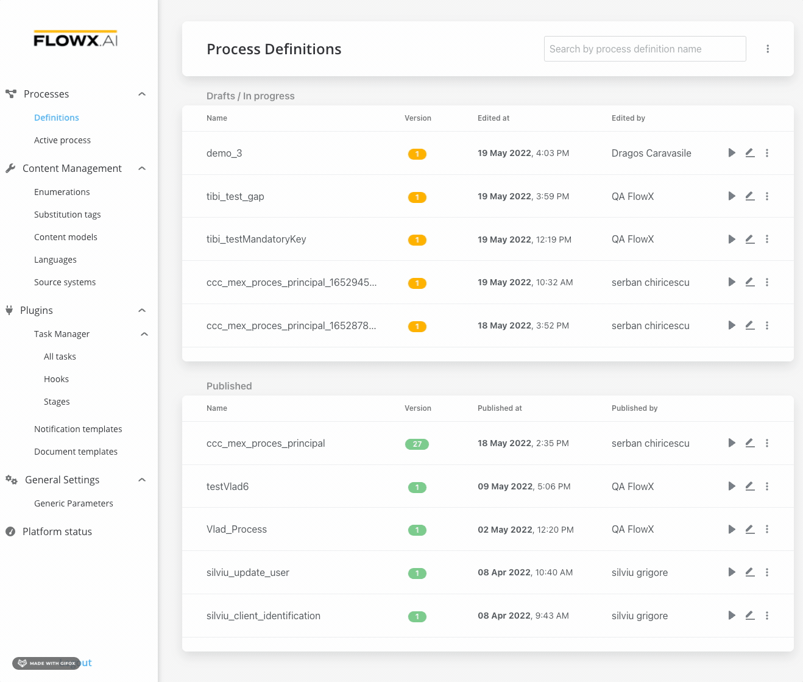

# Creating a new process definition

The first step of defining your business process in the FLOWX Designer is adding a new [process definition](../../flowx-elements/process/process-definition.md) for it.

This should include at least one [START](../../flowx-elements/node/nodes-types/start-end-error-node.md) and [END](../../flowx-elements/node/nodes-types/start-end-error-node.md) node.

### Steps for creating a new process definition

To create a new process definition:

1. Open **FLOWX Designer** and go to the **Definitions** tab.
2. Click the **New process** button, using the **breadcrumbs** from the top-right corner.&#x20;
3. Enter a unique name for your process and click **Create**.
4. You're automatically taken to the **FLOWX Designer** editor where you can start building your process.

In the following section, you will learn how to add a new node to your newly created process.