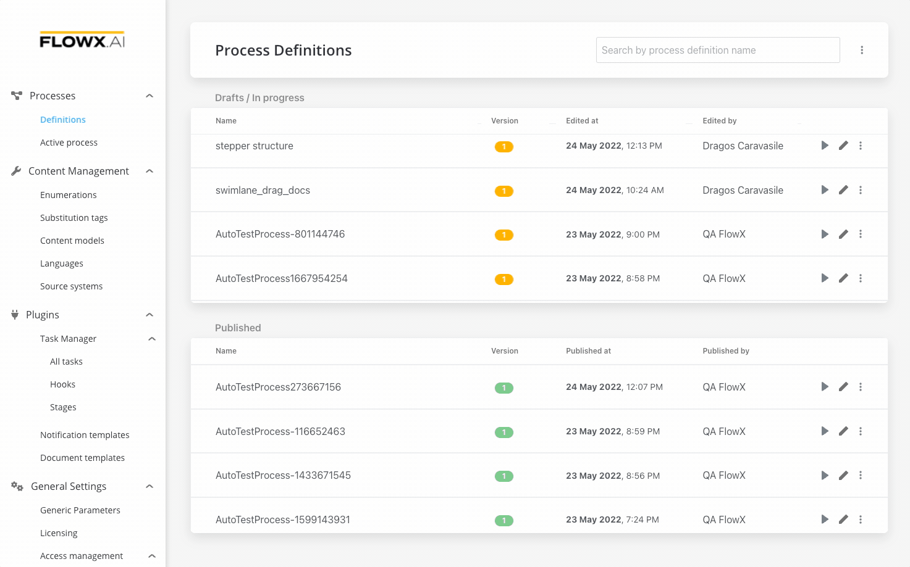
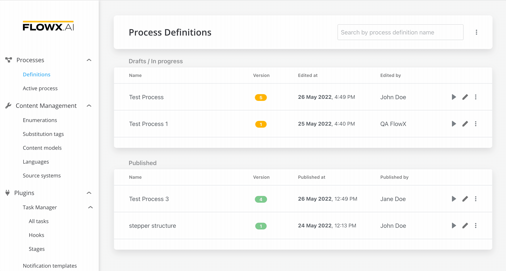
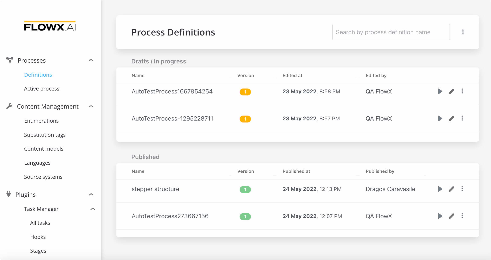

# Creating a user interface

## Creating a stepper structure

To create a stepper structure:

1. Go to **FLOWX Designer** and go to the **Definitions** tab.
2. Click on the **New process** button, using the **breadcrumbs** from the top-right corner.
3. Add a **start node**.
4. Add a new **milestone** to describe all the user tasks.
5. Add a **user task** that will represent the first card of our step.
6. Add an **end milestone** for both the step and the stepper.
7. End your process with an **end node**.

## Configuring the UI

* All the UI elements are configured via the Node UI designer
* Starting from our basic process, we need to set the start of the stepper template config
* It is enough to open the drag and drop menu and add a Stepper template config for now
* For the first step, it will be useful to add also a label&#x20;
* Clear the cache to test what we have until now

### Testing the flow that we have

1. From the **process definition**, click the **Start process** button.
2. We will not pass any data to this process so an empty object `{}`.
3. Click **Start Process** and you will see the first step.

## Adding a card with one input

1. Go to your **user task**  (this will represent the **first card** of your step).
2. Add a **`FORM GROUP`** (this is the UI card element).
3. Add a **Form** to it (Form elements group inputs together).
4. Add an **input** into the form:
   * Configure the **key** - you can use the key to retrieve the data form saved on that element
   * Configure a **label**

### Testing  our first input

1. **Start** one more time **the process** that you just configured.
2. The **input** is displayed.
3. Test the **input**.

## Adding second input and a submit action

1. Go to your **user task** node and add a new input via **Node UI designer**.
2. Now go back to the process and add a new [**action rule**](../../flowx-elements/node/actions.md):
   * first of all we need to configure the action - the action is called when the button is pressed - the action should be **Manual** (not automatic because it is triggered by a user)
   * we need to keep in mind the name of the action - `saveDataFirstStep`
3. Go back to the Node UI designer and add a button (we need to link the **button** to the **action** based on the name).

