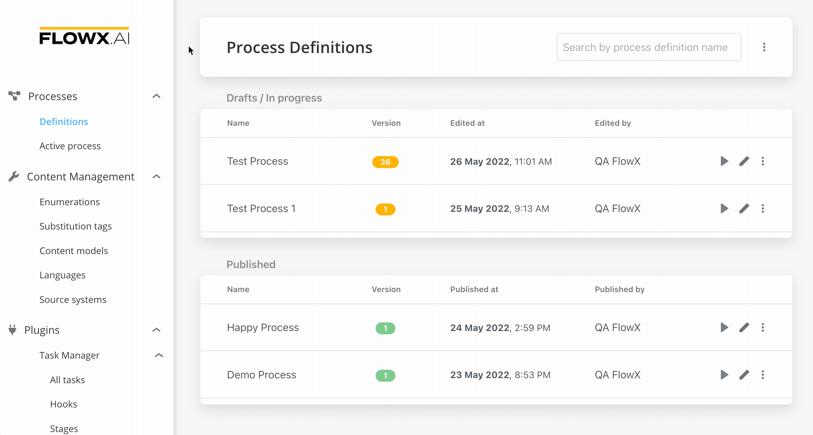
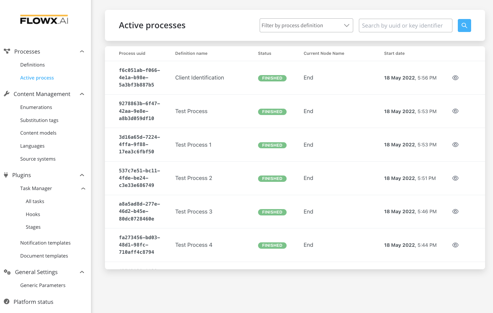
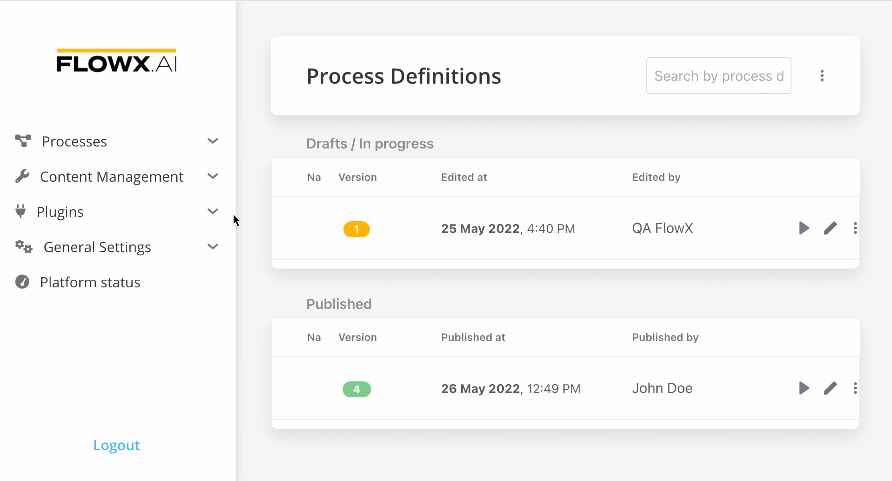
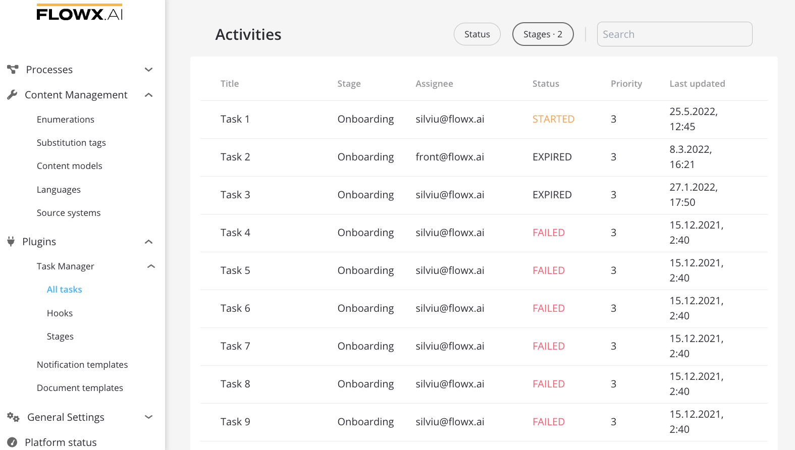
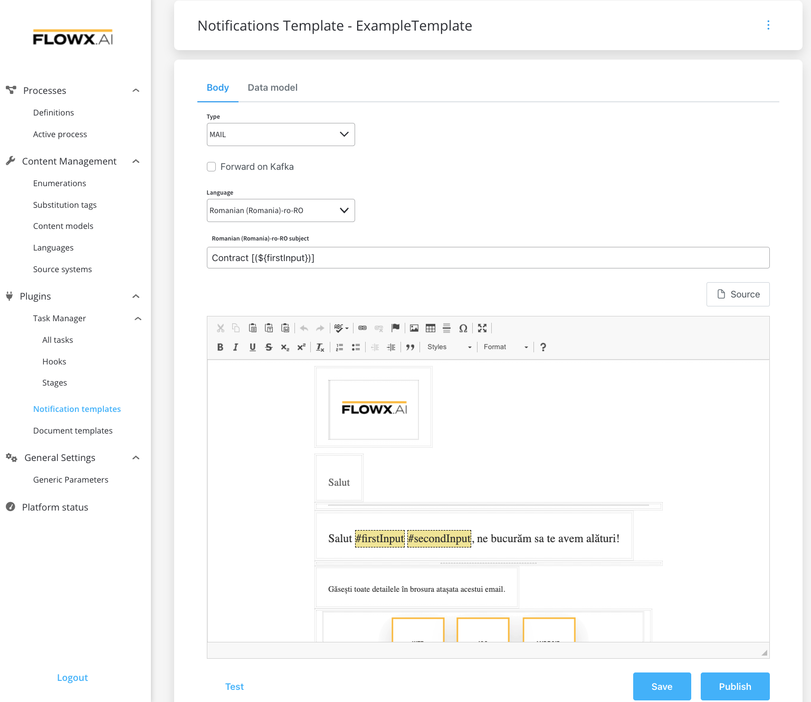
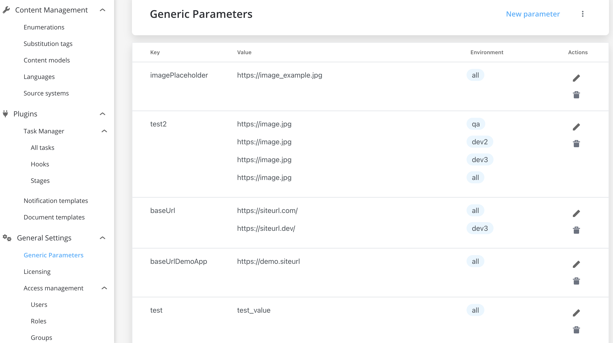
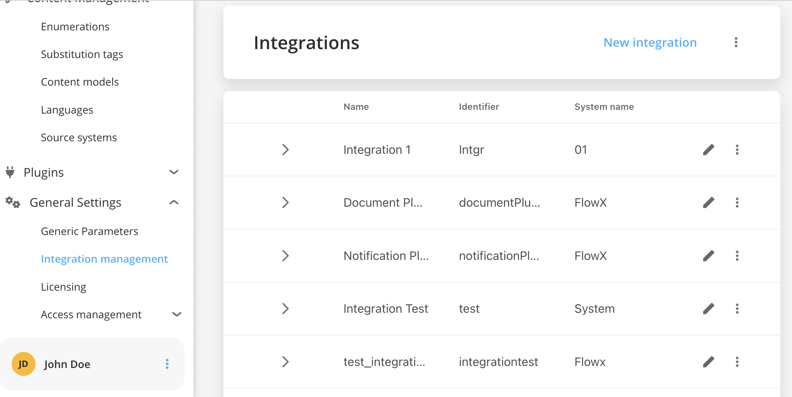
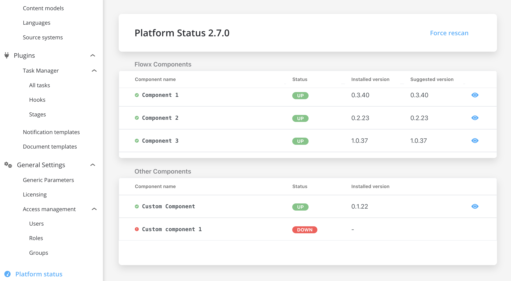

# Overview

:writing_hand: Let's go through the main options available in the FLOWX Designer:

Processes

#### Process Definitions

* create, view, run and edit [processes](../building-blocks/process/process.md)
* view versioning history

#### Active Process

* view active [process instances](../building-blocks/process/active-process/process-instance/process-instance.md)
* [token](../building-blocks/token.md) instance and its content
* [subprocesses](../building-blocks/process/subprocess.md)

Content Management

#### Enumerations

* nomenclature containing static value definitions
* used to manage a list of values that can be used as content in UI components or templates

#### Substitution tags

* used to generate dynamic content across the platform
* list of values used for localization

#### Content models

* content models are used to create complex content collections

#### Languages

* enumeration values can be defined for a specific language

#### Source systems

* used for multiple source systems, if multiple enumerations values are needed to communicate with other systems

[Example here](../platform-deep-dive/core-components/core-extensions/content-management/using-the-service.md#example-request-a-label-by-language-or-source-system-code)

Plugins

#### Task manager

* it is a plugin suitable for back-officers and supervisors as it can be used to easily track and assign activities/tasks inside a company
* for more information, check the [Task Management](../platform-deep-dive/plugins/custom-plugins/task-management/task-management.md) section

#### Notification templates

* send various types of notifications: SMS, push notifications to mobile devices, emails
* forward custom notifications to external outgoing services
* generate and validate [OTP](../platform-deep-dive/plugins/custom-plugins/notifications-plugin/using-notifications-plugin/otp-flow/otp-flow.md) passwords for user identity verification
* for more information, check the [Notification templates plugin](../platform-deep-dive/plugins/custom-plugins/notifications-plugin/notifications-plugin.md) section

#### Document templates

* store and make changes to documents
* generate documents based on predefined templates (docx or HTML) and custom process related data
* convert documents between various formats
* splitting bulk documents into smaller separate documents
* editing documents to add generated barcodes/signatures and pictures
* for more information, check the [Document templates plugin](../platform-deep-dive/plugins/custom-plugins/documents-plugin/documents-plugin.md) section

General Settings

#### Generic parameters

* you can add generic parameters by defining key-value pairs
* they are used for values that might change from one environment to another
* for example, an URL that has different values from a development environment to a production environment

#### Access management

* Access Management is used  to administrate users, roles and groups
* Access Management is accessing keycloak through an API call, extracting all the necessary details
* it is based on user roles that need to be configured in the identity management solution

#### Integration management

* Integration management helps you configure integrations between the following components: FLOWX Process engine, plugins, or different adapters
* Integration management enables you to keep track of each integration and its correspondent component and different scenarios used: creating an OTP, document generation, notifications, etc

Platform status

* you can check the platform's health by using the **Platform Status** feature
* you can also check the installed versions against the suggested versions for each FLOWX Component

:::info
Depending on your access rights, some tabs might not be visible. For more information, check [Configuring access rights for Admin](designer-setup-guide/configuring-access-rights-for-admin.md) section.
:::

## Managing process definitions

A process definition is uniquely identified by its name and version number.

[Process definition](../building-blocks/process/process-definition/process-definition.md)

[Managing a process flow](./managing-a-process-flow/managing-a-process-flow.md)

## Viewing active process instances

The complete list of active [process instances](../building-blocks/process/active-process/process-instance/process-instance.md) is visible from the FLOWX Designer. They can be filtered by [process definition](../building-blocks/process/process-definition/process-definition.md) names and searched by their unique id. You can also view the current process instance status and data.

[Process instance](../building-blocks/process/active-process/process-instance/process-instance.md)

## Managing CMS

Using the content management feature you can perform multiple actions that enable manipulation of the content and simplification of it. You need first to deploy the CMS service in your infrastructure, so you can start defining and using the custom content types described in the **Content Management** tab above.

[Headless CMS](../platform-deep-dive/core-components/core-extensions/content-management/content-management.md)

[CMS Setup Guide](../platform-deep-dive/platform-setup-guide/cms-setup-guide/cms-setup-guide.md)

## Managing tasks

The Task Manager plugin has the scope to show a process that you defined in Designer, offering a more business-oriented view. It also offers interactions at the assignment level.&#x20;

[Task Management](../platform-deep-dive/plugins/custom-plugins/task-management/task-management.md)

## Managing notification templates

The notification templates plugin can be viewed, edited, and activated/inactivated from the FLOWX Designer.

[Notifications](../platform-deep-dive/plugins/custom-plugins/notifications-plugin/notifications-plugin.md)

## Managing document templates

One of the main features of the [document management plugin](../platform-deep-dive/plugins/custom-plugins/documents-plugin/documents-plugin.md) is the ability to generate new documents based on custom templates and prefilled with data related to the current process instance.

[Document management](../platform-deep-dive/plugins/custom-plugins/documents-plugin/documents-plugin.md)

## Managing generic parameters

Through the FLOWX Designer, you can edit generic parameters, and import or export them. You can set generic parameters and assign the environment(s) where they should apply.

:::caution
The maximum length of an input value is 255 characters.
:::

## Managing users access

Access Management is used to administrate users, roles and groups, directly in FLOWX Designer. Access Management helps you to access the identity management solution (keycloak/[RH-SSO](https://access.redhat.com/products/red-hat-single-sign-on)) through its API, extracting all the necessary details. Access Management is based on user roles that need to be configured in the identity management solution.

[Configuring access rights for admin](designer-setup-guide/configuring-access-rights-for-admin)

## Managing integrations

Integration management enables you to keep track of each integration and its correspondent component and different scenarios used: creating an OTP, document generation, notifications, etc.

## Checking platform status

You can quickly check the health status of all the FLOWX services and all of your custom connectors.

Check the next section to learn how to create and manage a process from scratch:

[Managing a process flow](managing-a-process-flow/)
