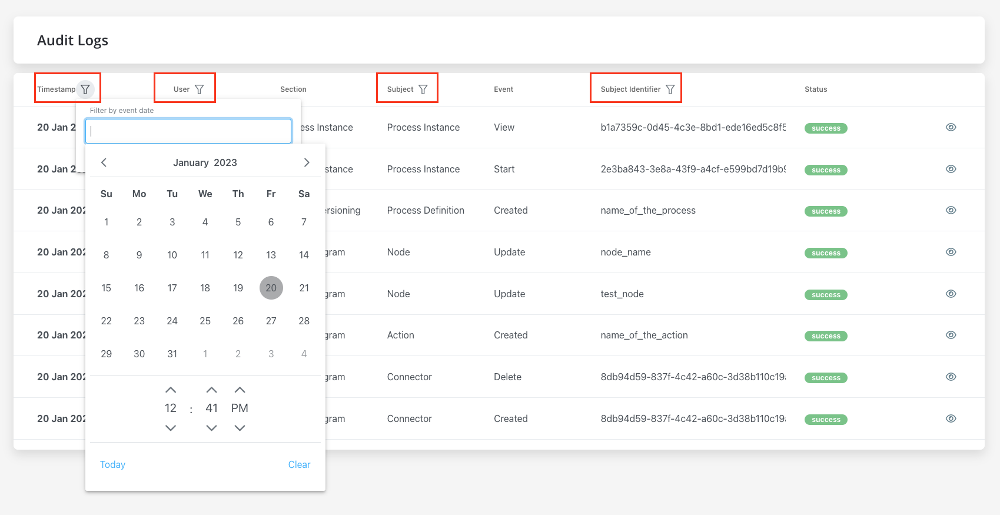
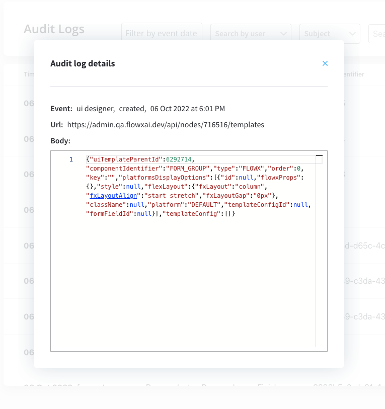

# Audit log

The Audit log service groups all audit events in a single place. The following details are available:

 Timestamp 

* The timpestamp is displayed in a reversed chronologically order.

 User 

* The entity assigned: could be username or system.

 Subject 

Possible values:
    
* Process Instance
* Token
* Task
* Exception
* Process definition
* Node
* Action
* UI Component
* General Settings
* Swimlane
* Connector

Event

Possible values:

* Create
* Update
* Update bulk
* Update state
* Export
* Import
* Delete
* Clone
* Start
* Start with inherit
* Advance
* View
* Expire
* Message Send
* Message Receive
* Notification receive
* Run scheduled action
* Execute action
* Finish
* Dismiss
* Retry
* Abort
* Assign
* Unassign
* Hold
* Unhold

 Subject identifier 

* Subject identifier - the unique identifier is related to the subject, there are different types of identifiers based on the selected subject.

 Version  

 Status 

* Status - **success** or **error**

Audit records can be filtered by using the following options:

* Filter by event date 

* User - single selection, type at least 4 characters
* Subject - single selection
* Subject identifier - exact match

### Audit log details

You can access audit log details window by clicking the eye icon on the right of each entry in the list.

Here you have the following information:

* Event
* URL
* Body 

