# Integration management

Integration management helps you configure integrations between the following components: FLOWX Process engine, plugins, or different adapters. The only requirement is that they should connect to [Kafka](../../../overview/frameworks-and-standards/event-driven-architecture-frameworks/intro-to-kafka) to communicate with the [FLOWX.AI Engine](../../flowx-engine/).

Integration management enables you to keep track of each integration and its correspondent component and different scenarios used: creating an OTP, document generation, notifications, etc.

[Broken link](broken-reference)

:::warning
Integrations must be compatible with Kafka, so they can communicate with external adapters and FLOWX.AI Engine. Communication is done through Kafka topics (handled by consumers and producers, see [Kafka configuration](../../platform-setup-guide/flowx-engine-setup-guide/#kafka-configuration) section for more details).
:::

After defining one integration (inside **Integration management**) you can open a compatible node and start using them.

:::info
Integrations are used with the following nodes: [task nodes](../../../flowx-elements/node/nodes-types/task-node/)**,** [user task nodes](../../../flowx-elements/node/nodes-types/user-task-node/), [message send tasks](../../../flowx-elements/node/nodes-types/message-send-received-task-node.md#message-send-task), and [message receive tasks](../../../flowx-elements/node/nodes-types/message-send-received-task-node.md#message-receive-task)).
:::

You can easily create or import an integration using the **Integration management** feature just by accessing **FLOWX.AI Admin-> Integration management**.

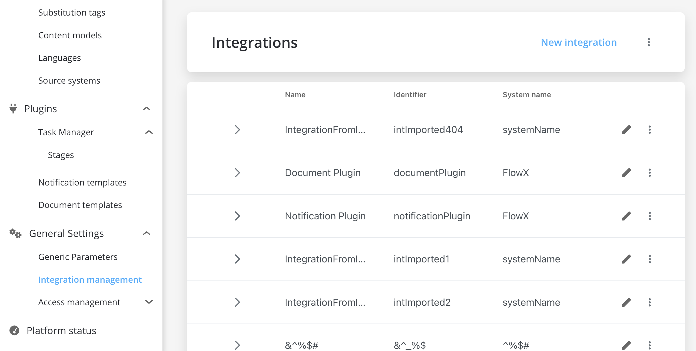

## Accessing Integration management

To access Integration management:

1. Open **FLOWX FLOWX.AI Admin** and go to the **General Settings** tab.
2. From the expanded menu, select **Integration management**.
3. From the list, select an **Integration**.
4. Click the **arrow** icon to expand the list with the scenarios.

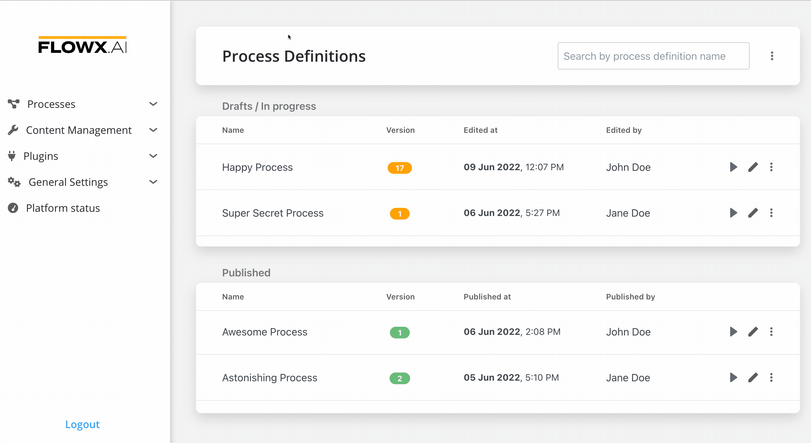

### Configuring Access Rights for Integrations Management

For more details on how to configure access rights for Integrations Management, check the following section:

[configuring-access-rights-for-integration-management](configuring-access-rights-for-integration-management)

## Creating a new integration

To create a new integration, see the steps described in [Accessing Integration management](./#accessing-integration-management), then follow the next steps:

1. Click **New integration** and fill in the details:
   * **Name** - the name of the integration
   * **Identifier** - fill in a unique identifier for your integration
   * (Optional) **System name** - used for multiple source systems, if multiple enumerations values are needed to communicate with other systems
2. Click **Add**.

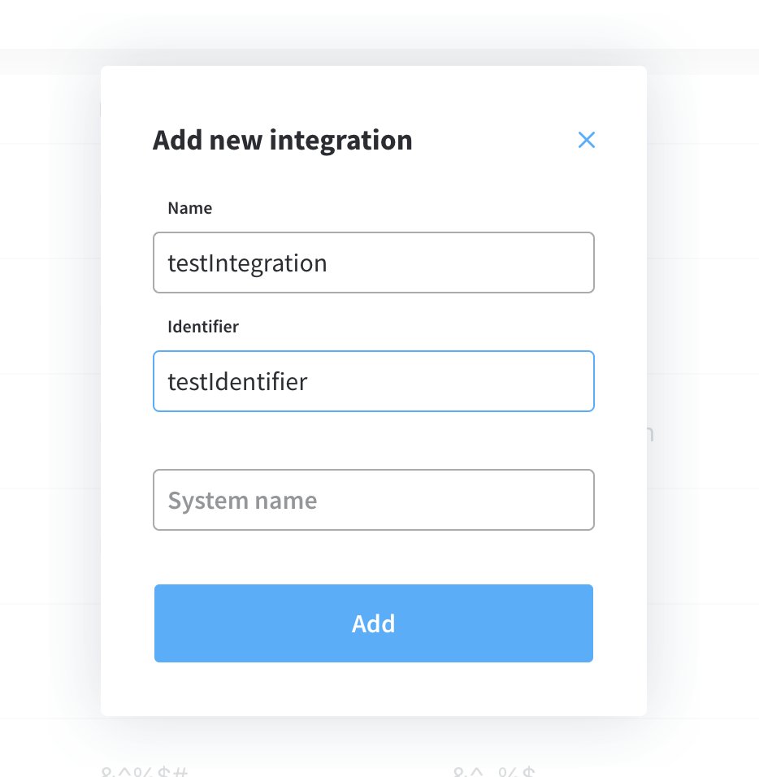

### Adding new scenarios

After you added a new integration, you can configure scenarios by following the next steps:

1. Open the newly created **integration**.
2. Click the **arrow** icon to expand the **drop-down list** with scenarios.
3. Click **+ Add new scenario** button and fill in the details:
   * **Name** - the name of the scenario
   * **Identifier** - fill in a unique identifier for your scenario

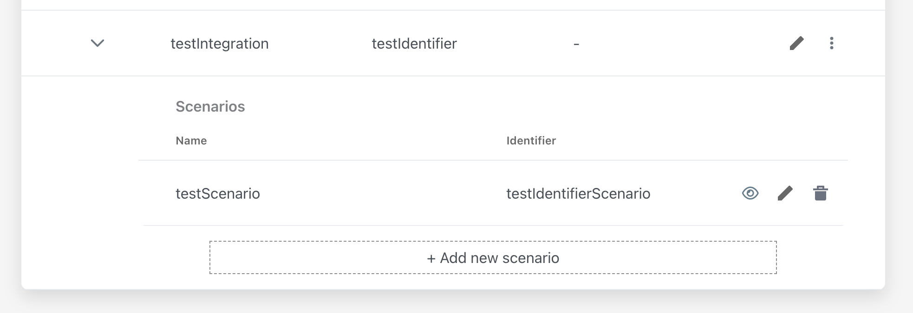

### Configuring scenarios

You have multiple scenarios that you can configure on an integration. For example, for integration with the [notification plugin](../../../plugins/custom-plugins/notifications/), you can configure the following scenarios: generate email notification, generate email OTP, generate push notifications, etc.

After you created a scenario you can configure the **data model** for it by following the next steps:

1. Select a **scenario** then click the **eye icon** to open the configuration.
2. You have multiple **properties** that you need to configure:

* [**Topics** ](./#configuring-topics)
* [**Input model**](./#configuring-input-model)
* [**Output model** ](./#configuring-output-model)
* [**Headers**](./#headers)

### Configuring topics

Topics are defined depending on the environment where you want to use them. You need to configure the following details:

* **Output topic (out)** - the information that the [FLOWX.AI Engine ](../../flowx-engine/)is sending to the plugin or to the adapter&#x20;
* **Input topic (in)** - the information that the FLOWX.AI Engine is reading, coming from the plugin or from the adapter&#x20;
* **Environment** - the environment where the topic should be used (if you leave this field empty, all the environments will be selected)

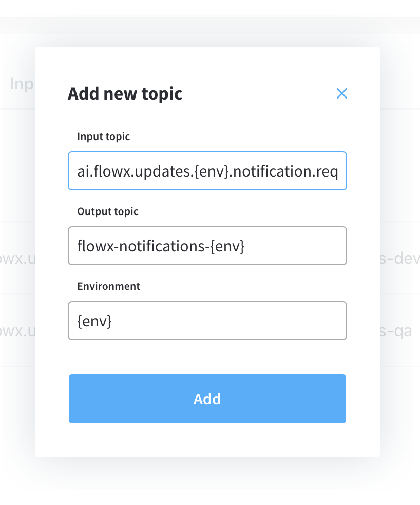

### Configuring Input model

The input data model represents the content of the message that the adapters or plugins send to the FLOWX.AI Engine.

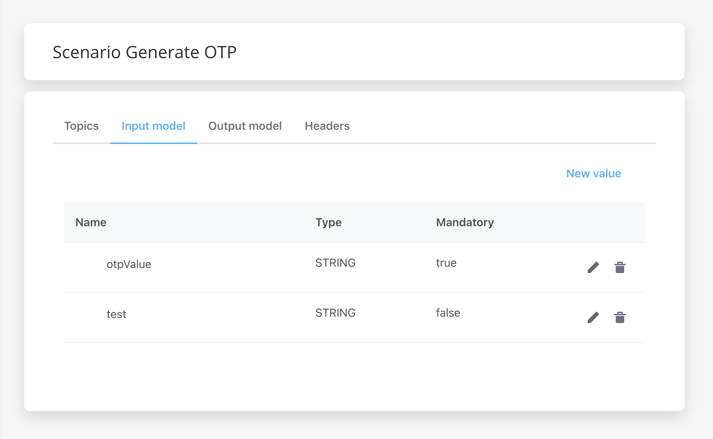

To configure a new input model, follow the next steps:

1. Open FLOWX.AI Admin.
2. From the left-side menu, select **Integration Management**.
3. Select an **integration**.

The following details need to be configured:

* **Property name** - the name of the property
* **Property types:**
  * STRING
  * NUMBER
  * BOOLEAN
  * OBJECT - you can add multiple values inside an OBJECT

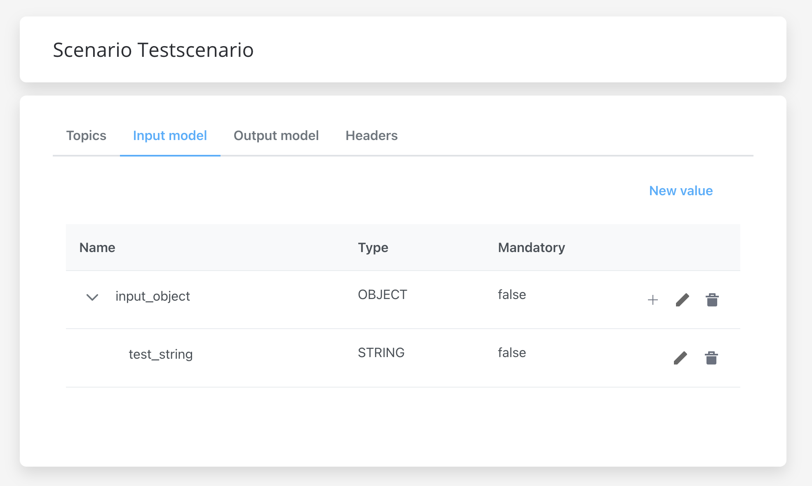

* OBJECT\_REF - used for values that are already defined in the process
* ARRAY -  for arrays you must specify the **Item type**

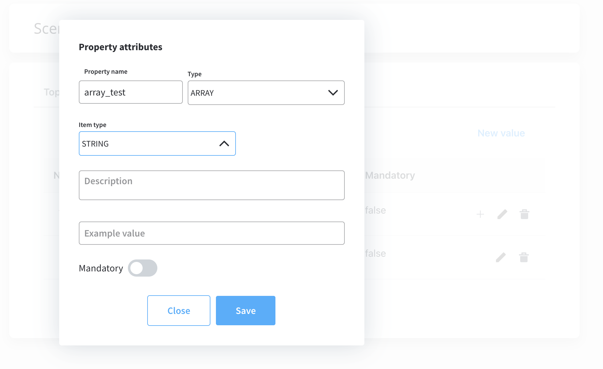

* ARRAY\_REF - used for values that are already defined in the process
* ENUM - a special data type that enables for a variable to be a set of predefined constants

* **Description** - description of the input
* **Example value -** example value based on the type of the input
* **Mandatory** - could be mandatory or not

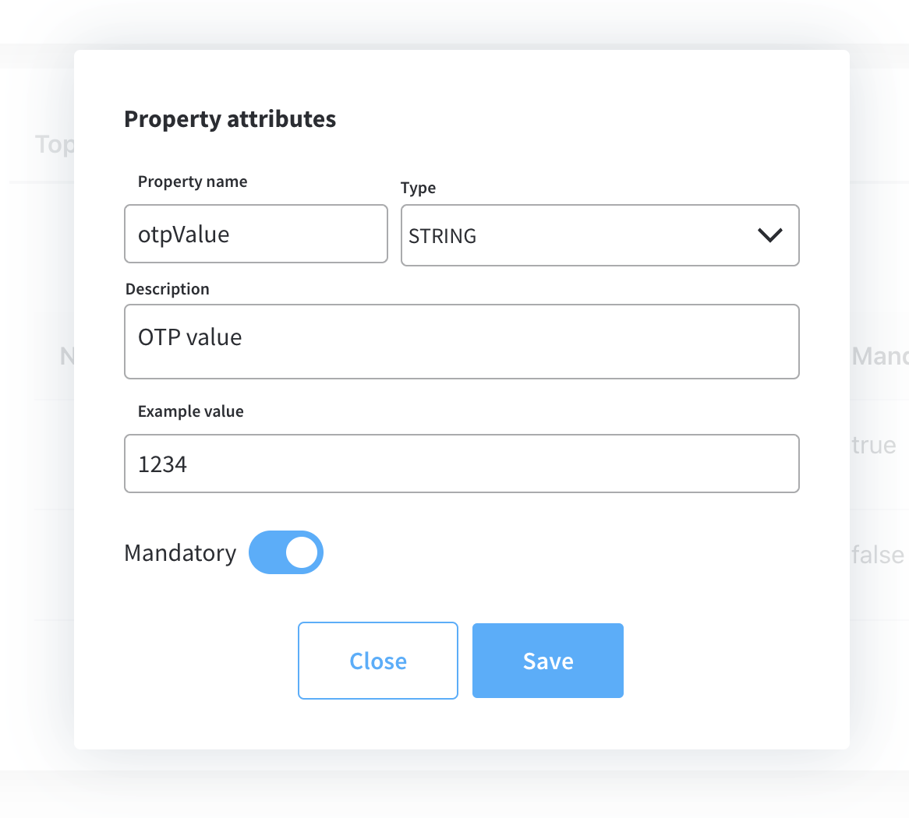

### Configuring Output model

The output data model represents the content of the message that FLOWX.AI Engine sends to the adapters or plugins.

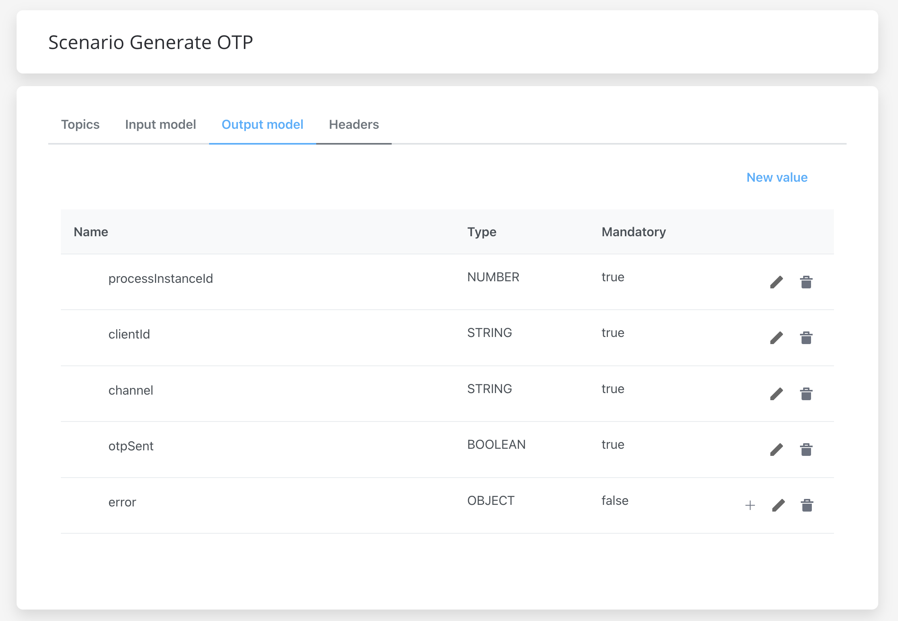

The following details need to be configured:

* **Property name** - the name of the property
* **Type** - STRING, NUMBER, BOOLEAN, OBJECT, ARRAY or ENUM
* **Description** -  description of the input
* **Example value** -example value based on the type of the input

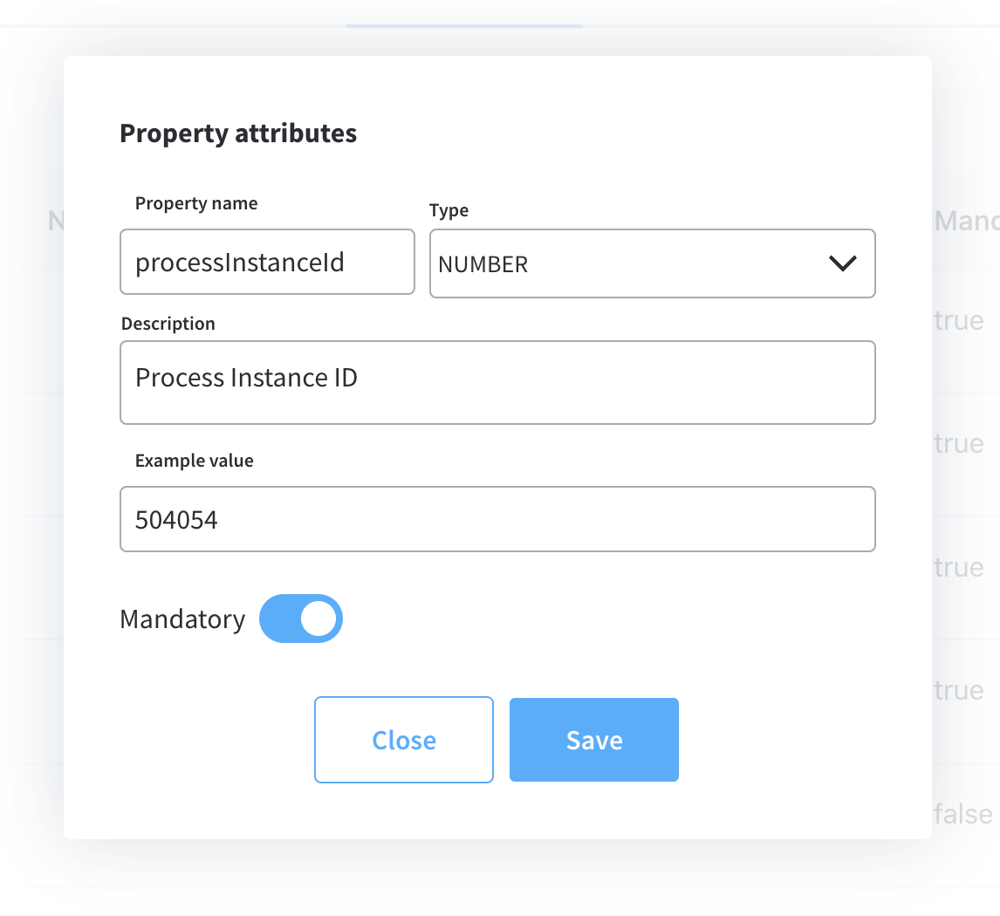

### Headers

The only header configured in the above example is - `processInstanceId`.

:::info
If you have actions that contain [callbacks](../../../flowx-elements/node/actions.md#defining-callbacks), multiple headers can be added, like the action name or the name of the node.
:::

Headers may also contain Kafka authorization (token in the header).

## Using integrations

As mentioned earlier, you can use integrations management to configure integrations between FLOWX.AI Engine and different plugins and adapters. These configurations are defined so that when you create a process (and it is using Kafka-related activities) you will no longer have to manually search for suitable topics or environments.&#x20;

Use predefined integrations, that you have already configured, on different processes and nodes. Places where integrations will be used:

* Node -> Actions ->  **Kafka Send Action** (to send data to the integration)

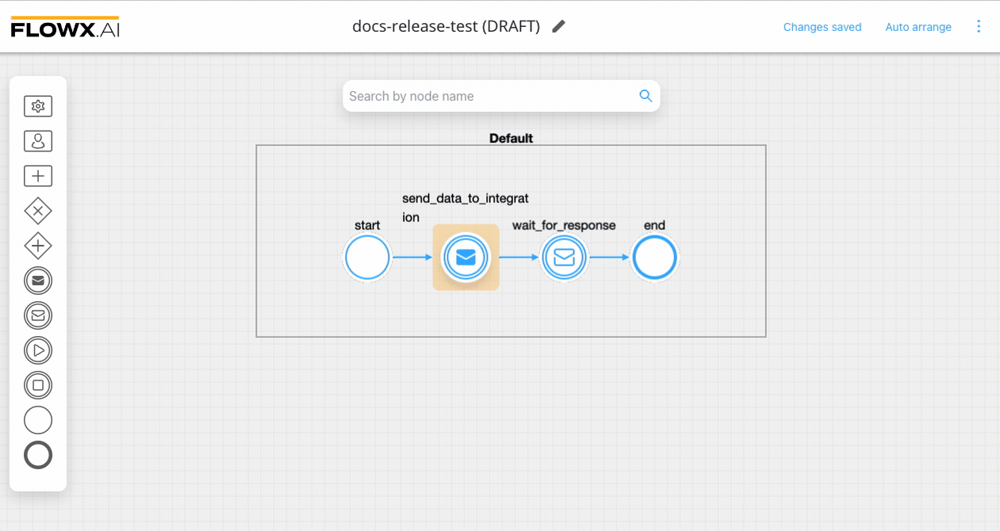

* Node -> Node config -> **Data stream topics** (the topic name where the [process engine](../../flowx-engine/) listens for the response)

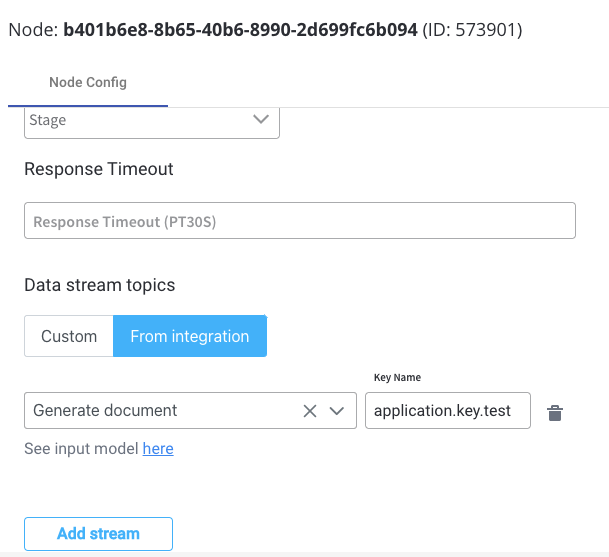

:::info
Data stream topics are used to select the integration and the key on which the response is saved.
:::

If your integration has scenarios that are already used in another process, you will always be notified.

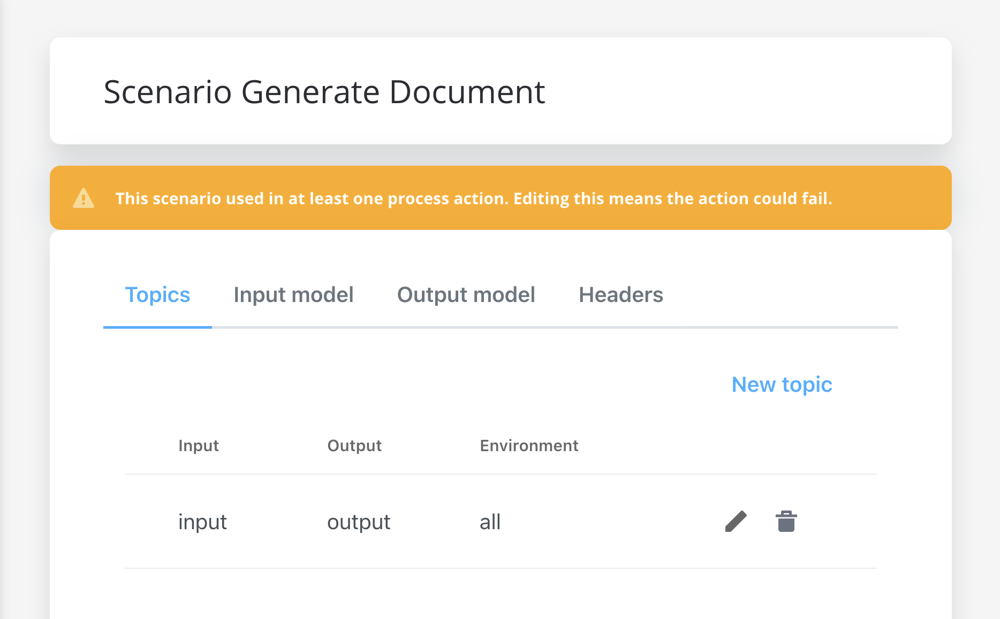