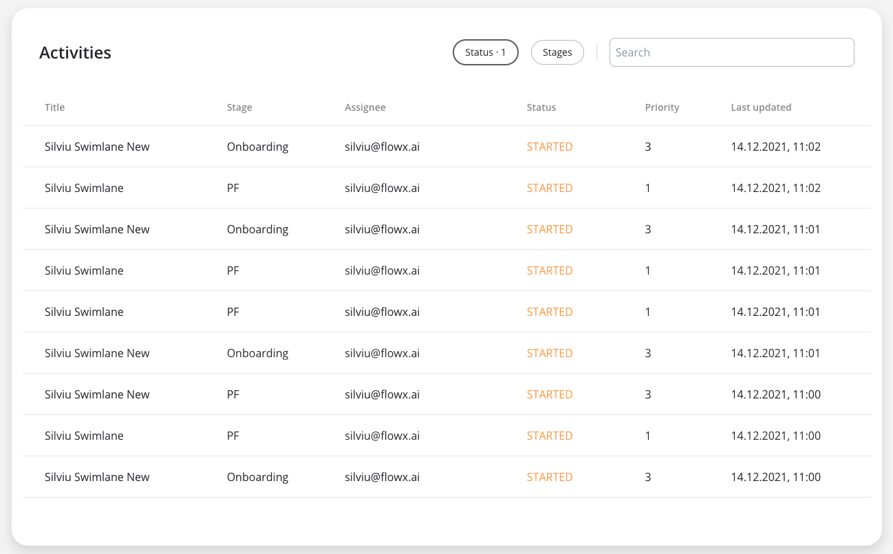

# Using the Angular Renderer

FlowxProcessRenderer is a low code library designed to render UI configured via the Flowx Process Editor.

## Angular project requirements

Your app MUST be created using the NG app from the @angular/cli~14 package. It also MUST use SCSS for styling.

```
npm install -g @angular/cli@14.2.2
ng new my-flowx-app
```

## Installing the library

:::info
To install the npm libraries provided by FLOWX you will need to obtain access to the private FLOWX Nexus registry. Please consult with your project DevOps.
:::

:::caution
The library uses Angular version **@angular\~14.2.2**, **npm v8.1.2** and **node v16.13.2**.
:::

:::info

If you are using an older version of Angular (for example, v13.0), please consult the following link for update instructions: 

[**Update Angular from v13.0 to v14.0**](https://update.angular.io/?l=2&v=13.0-14.0)

:::

Use the following command to install the **renderer** library and its required dependencies:

```bash
npm install 
  flowx/ui-sdk@3.0 
  @flowxai/ui-toolkit@3.0 
  @flowx/ui-theme@3.0 
  paperflow-web-components 
  vanillajs-datepicker@^1.2.0 
  moment@^2.27.0 
  @angular/flex-layout@14.0.0-beta.40 
  @angular/material@^14.2.2 
  @angular/material-moment-adapter@^14.2.2 
  @angular/cdk@^14.2.2
```

The above command installs several packages to use in your web development project:

* flowx/ui-sdk: version 3.0 of the UI SDK from FlowX
* @flowxai/ui-toolkit: version 3.0 of the UI toolkit from FlowX
* @flowx/ui-theme: version 3.0 of the UI theme from FlowX
* paperflow-web-components: web components from Paperflow
* vanillajs-datepicker: version 1.2.0 or a compatible version of the VanillaJS Datepicker library
* moment: version 2.27.0 or a compatible version of the Moment.js library
* @angular/flex-layout: version 14.0.0-beta.40 of Angular Flex Layout library
* @angular/material: version 14.2.2 or a compatible version of the Angular Material library
* @angular/material-moment-adapter: version 14.2.2 or a compatible version of the Angular Material Moment adapter library
* @angular/cdk: version 14.2.2 or a compatible version of the Angular CDK library


## Using the library

Once installed, FlxProcessModule will be imported in the `AppModule FlxProcessModule.forRoot({})`. 

You MUST also import the dependencies of `FlxProcessModule: HttpClientModule` from `@angular/common/http` and **IconModule** from `@flowxai/ui-toolkit`.

**Using Paperflow web components**

Add path to component styles to stylePreprocessesOptions object in **angular.json file**

```
"stylePreprocessorOptions": {
  "includePaths": [
  "./node_modules/paperflow-web-components/src/assets/scss",
  "./node_modules/flowx-process-renderer/src/assets/scss/style.scss",
  "src/styles"]
}
```
:::info
Because the datepicker module is build on top of angular material datepicker module, using it requires importing one predefined material theme in you **angular.json** configuration.
:::

```
 "styles": ["..., "./node_modules/@angular/material/prebuilt-themes/indigo-pink.css"],
```

#### Theming

Component theming is done through two json files (`theme_tokens.json`, `theme_components.json`) that need to be added in the assets folder of your project The file paths need to be passed to the `FlxProcessModule.forRoot()` method through the `themePaths` object.

```typescript
themePaths: {
    components: 'assets/theme/theme_components.json',
    tokens: 'assets/theme/theme_tokens.json',
  },
```
The **assets/theme/theme_tokens.json** - should hold the design tokens (e.g. colors, fonts) used in the theme. An example can be found here.

The **assets/theme/theme_components.json** - holds metadata used to describe component styles. An example can be found here.


For **Task Management** theming is done through the ppf-theme mixin that accepts as an argument a list of colors grouped under **primary**, **status** and **background**

```typescript
@use 'ppf-theme';

@include ppf-theme.ppf-theme((
  'primary': (
    'color1': vars.$primary,
    'color2': vars.$secondary,
    'color3': vars.$text-color,
  ),
  'status': (
    'success': vars.$success,
    'warning': vars.$warning,
    'error': vars.$error,
  ),
  'background': (
    'background1': vars.$background1,
    'background2': vars.$background2,
    'background3': vars.$background3,
  ),
));
```

### Authorization

:::info
Every request from the **FLOWX** renderer SDK will be made using the **HttpClientModule** of the client app, which means those requests will go through every interceptor you define here. This is most important to know when building the auth method as it will be the job of the client app to intercept and decorate the requests with the necessary auth info (eg. `Authorziation: Bearer ...`).
:::

:::note
It's the responsibility of the client app to implement the authorization flow (using the **OpenID Connect** standard). The renderer SDK will expect to find the **JWT** saved in the browser **localStorage** object at the key named access\_token.
:::

```typescript
import {BrowserModule} from '@angular/platform-browser';
import {NgModule} from '@angular/core';
import { HttpClientModule, HTTP_INTERCEPTORS } from '@angular/common/http';
import {FlxProcessModule} from 'flowx-process-renderer';
import { IconModule } from 'paperflow-web-components';

import {AppRoutingModule} from './app-routing.module';
import {AppComponent} from './app.component';

@NgModule({
  declarations: [
    AppComponent,
  ],
  imports: [
    BrowserModule,
    AppRoutingModule,
    // will be used by the renderer SDK to make requests
    HttpClientModule,
    // needed by the renderer SDK
    IconModule.forRoot(),
    FlxProcessModule.forRoot({
      components: {},
      services: {},
      themePaths: {
        components: 'assets/theme/theme_components.json',
        tokens: 'assets/theme/theme_tokens.json',
      },
    }),
  ],
  // this interceptor with decorate the requests with the Authorization header
  providers: [
    { provide: HTTP_INTERCEPTORS, useClass: AuthInterceptor, multi: true },
  ],
  bootstrap: [AppComponent]
})
export class AppModule {}

```

The `forRoot()` call is required in the application module where the process will be rendered. The `forRoot()` method accepts a config argument where you can pass extra config info, register a **custom component**, **service**, or **custom validators**.

**Custom components** will be referenced by name when creating the template config for a user task.

**Custom validators** will be referenced by name (`currentOrLastYear`) in the template config panel in the validators section of each generated form field.

```typescript
// example
FlxProcessModule.forRoot({
  components: {
    YourCustomComponentIdenfier: CustomComponentInstance,
  },
  services: {
    NomenclatorService,
    LocalDataStoreService,
  },
  validators: {currentOrLastYear },
})
```

```typescript
# example with custom component and custom validator
FlxProcessModule.forRoot({
  components: {
    YourCustomComponentIdenfier: CustomComponentInstance,
  },
  services: {
    NomenclatorService,
    LocalDataStoreService,
  },
  validators: {currentOrLastYear },
})

  // example of a custom validator that restricts data selection to 
  // the current or the previous year 
   
  currentOrLastYear: function currentOrLastYear(AC: AbstractControl): { [key: string]: any } {
    if (!AC) {
      return null;
    }

    const yearDate = moment(AC.value, YEAR_FORMAT, true);
    const currentDateYear = moment(new Date()).startOf('year');
    const lastYear = moment(new Date()).subtract(1, 'year').startOf('year');

    if (!yearDate.isSame(currentDateYear) && !yearDate.isSame(lastYear)) {
      return { currentOrLastYear: true };
    }

    return null;
  }
```

:::caution
The error that the validator returns **MUST** match the validator name.
:::

The component is the main container of the UI, which will build and render the components configured via the **FlowX Designer**. It accepts the following inputs:

```
<flx-process-renderer
  [apiUrl]="baseApiUrl"
  [processApiPath]="processApiPath"
  [processName]="processName"
  [processStartData]="processStartData"
  [debugLogs]="debugLogs"
  [keepState]="keepState"
  [language]="language"
></flx-process-renderer>
```

#### Parameters:

| Name             | Description                                                                                                                                                                             | Type    | Mandatory | Default value | Example                                          |
| ---------------- | --------------------------------------------------------------------------------------------------------------------------------------------------------------------------------------- | ------- | --------- | ------------- | ------------------------------------------------ |
| baseApiUrl       | Your base url                                                                                                                                                                           | string  | true      | -             | [https://yourDomain.dev](https://yourdomain.dev) |
| processApiPath   | Engine API prefix                                                                                                                                                                       | string  | true      | -             | /onboarding                                      |
| processName      | Identifies a process                                                                                                                                                                    | string  | true      | -             | client\_identification                           |
| processStartData | Data required to start the process                                                                                                                                                      | json    | true      | -             | { "firstName": "John", "lastName": "Smith"}      |
| debugLogs        | When set to true this will print WS messages in the console                                                                                                                             | boolean | false     | false         | -                                                |
| language         | Language used to localize the application.                                                                                                                                              | string  | false     | ro-RO         | -                                                |
| keepState        | <p>By default all process data is reset when the process renderer component gets destroyed. Setting this to true will keep process data even if the viewport gets destroyed</p><p></p>  | boolean | false     | false         | -                                                |
| isDraft          | When true allows starting a process in draft state. \*Note that isDraft = true requires that processName be the **id** (number) of the process and NOT the name.                        | boolean | false     | false         | -                                                |

#### Data and actions

Custom components will be hydrated with data through the $data input observable which must be defined in the custom component class.

```typescript

@Component({
  selector: 'my-custom-component',
  templateUrl: './custom-component.component.html',
  styleUrls: ['./custom-component.component.scss'],
})
export class CustomComponentComponent  {
  @Input() data$: Observable<any>;
  }
```

Component actions are always found under `data` -> `actionsFn` key.

Action names are configurable via the process editor.&#x20;

```typescript
# data object example
data: {
   actionsFn: {
      action_one: () => void;
      action_two: () => void; }
   }
```

#### Interacting with the process

Data from the process is communicated via **websocket** protocol under the following keys:

| Name            |                                        Description                                       | Example |   |
| --------------- | :--------------------------------------------------------------------------------------: | :-----: | - |
| Data            |             data updates for process model bound to default/custom components            |         |   |
| ProcessMetadata | updates about process metadata, ex: progress update, data about how to render components |         |   |
| RunAction       |                       instructs the UI to perform the given action                       |         |   |

#### Task management component



The flx-task-management component is found in the FlxTaskManagementModule. In order to have access to it, import the module where needed:&#x20;

```typescript
import {FlxTaskManagementModule} from 'flowx-process-renderer';
@NgModule({
  declarations: [
    ...,
  ],
  imports: [
    ...,
    FlxTaskManagementModule
  ],
  
})
export class MyModule {
}
```

Then in the template:

```
<flx-task-management [baseUrl]="baseUrl" [title]="'Tasks'">
</flx-task-management>
```

#### Parameters:

| Name            | Description                            | Type   | Default    | Mandatory  | Example                      |
| --------------- | -------------------------------------- | ------ | ---------- | ---------- | ---------------------------- |
| apiUrl          | Endpoint where the tasks are available | string | -          | true       | https://yourDomain.dev/tasks |
| title           | Table header value                     | string | Activities | false      | Tasks                        |
| pollingInterval | Interval for polling task updates      | number | 5000 ms    | false      | 10000                        |


### Development

When modifying the library source code and testing it inside the designer app use the following command which rebuilds the flx-process-renderer library, recreates the link between the library and the designer app and recompiles the designer app:

```
npm run build && cd dist/flowx-process-renderer/ && npm link && cd ../../ && npm link flowx-process-renderer && npm run start:designer
```

or alternatively run

`./start_with_build_lib.sh`

If you want to start the designer app and the flx-process-renderer library in development mode (no need to recompile the lib for every change) run the following command:

`npm run start:designer-dev`

:::caution
Remember to test the final version of the code by building and bundling the renderer library to check that everything works e2e
:::

Trying to use this lib with npm link from another app will most probably fail. If (when) that happens, there are two alternatives that you can use:

1. Use the build-and-sync.sh script, that builds the lib, removes the current build from the client app ** node_modules** and copies the newly build lib to the node_modules dir of the client app:

```
./build-and-sync.sh ${path to the client app root}

# example (the client app is demo-web):
./build-and-sync.sh ../../demo-web
```


NOTE: This method uses under the hood the build-and-sync.sh script from the first version and the chokidar-cli library to detect file changes.

2. Use the build-and-sync:watch npm script, that builds the library and copies it to the client app's ** node_module** directory every time a file changes:
```
npm run build-and-sync:watch --target-path=${path to the client app root}

# example (the client app is demo-web):
npm run build-and-sync:watch --target-path=../../demo-web
```


### Running the tests

`ng test`

#### Coding style tests

Always follow the Angular official [coding styles](https://angular.io/guide/styleguide).

Below you will find a Storybook which will demonstrate how components behave under different states, props, and conditions, it allows you to preview and interact with individual UI components in isolation, without the need for a full-fledged application:

[Storybook](https://storybook.demo.flowxai.dev/)

