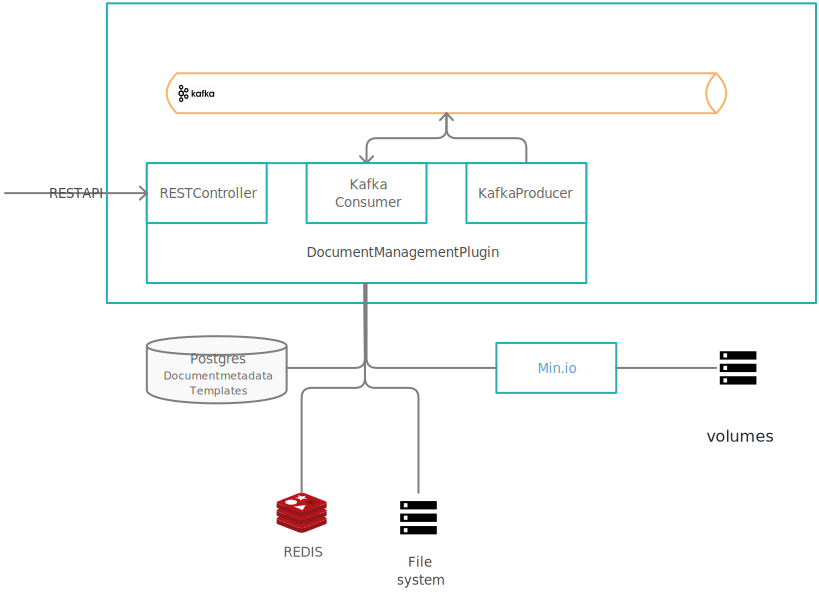
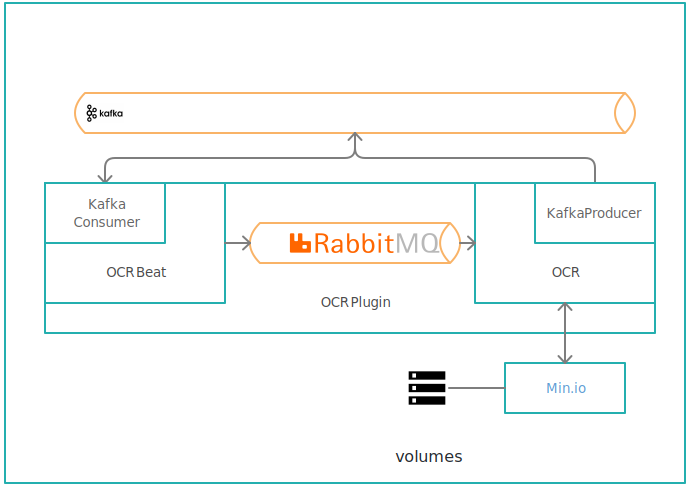
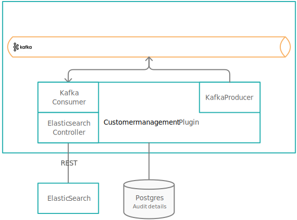

# Custom plugins

Let's get into a bit more details about the custom plugins 🎛️

## Notifications plugin

**Multi-channel notifications made easy**. The notifications plugin handles various types of notifications:&#x20;

* SMS,&#x20;
* push notifications to mobile devices,
* email notifications and
* generating and validating OTP passwords for **user identity verification**

It can also be used to forward custom notifications to external outgoing services. It offers an intuitive interface for defining templates for each kind of notification and handles sending and auditing notifications easily.&#x20;

[what-is-the-notifications-plugin](../notifications-plugin/what-is-the-notifications-plugin)

## Document management plugin

**Effortless document generation and safe-keeping.** The document management plugin stores documents in a secure way, facilitates document generation based on predefined templates and also handles conversion between various document formats.&#x20;

It offers an easy-to-use interface for handling documents on both REST and event based Kafka streams.

[what-is-the-document-management-plugin](../documents-plugin/what-is-the-document-management-plugin.md)

## OCR plugin

**Automatic key information extraction.** Used to easily read barcodes or extract handwritten signatures from pdf documents.

[ocr-service](custom-plugins/ocr-service)

## CMS

**The go-to place for all taxonomies.** The plugin offers a convenient way of managing various definitions, list and content translations.

## Customer management

**Convenient and secure access to user data.** Light CRM uses an Elastic Search engine to user retrieve details using partial match on big databases.

[customer-management](custom-plugins/customer-management/)
