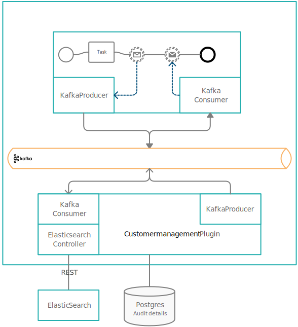

# Using the customer management plugin

The customer management plugin offers the possibility of retrieving customer details from an Elastic Search engine.



The plugin listens for incoming requests on a Kafka topic and sends the reply to the Engine on an outgoing topic.


[Kafka topics for Customer Management](#kafka-topics-for-customer-management)


## Kafka topics for customer management

### Customer Search

`KAFKA_TOPIC_CUSTOMER_SEARCH_IN` - Used to search customers in the customer management.

The request sent to the plugin can use any key that was previously configured in the elaticsearch index where the customers are saved.

Example of an elastic search index:

```
{
    "settings": {
      "analysis": {
        "normalizer": {
          "lowercase_normalizer": {
            "type": "custom",
            "filter": ["lowercase"]
          }
        }
      }
    },
    "mappings": {
      "properties": {
        "ClientUniqueIdentifier": {
          "type": "keyword",
          "normalizer": "lowercase_normalizer"
        },
        "ClientType":{
          "type": "text"
        },
        "FirstName":{
          "type": "text",
          "fields": {
            "keyword":{
              "type": "keyword",
              "normalizer": "lowercase_normalizer"
            }
          }
        },
        "LastName":{
          "type": "text",
          "fields": {
            "keyword":{
              "type": "keyword",
              "normalizer": "lowercase_normalizer"
            }
          }
        },
        "CompanyName":{
          "type": "text",
          "fields": {
            "keyword":{
              "type": "keyword",
              "normalizer": "lowercase_normalizer"
            }
          }
        },
        "DateOfBirth":{
          "type": "date",
          "format": "dd.MM.yyyy"
        },
        "IDDocType":{
          "type": "text"
        },
        "IDSeries":{
          "type": "text"
        },
        "IDNumber":{
          "type": "text"
        },
        "IDIssueDate": {
          "type": "date",
          "format": "dd.MM.yyyy"
        },
        "IDExpiryDate":{
          "type": "date",
          "format": "dd.MM.yyyy"
        },
        "LegalForm":{
          "type": "text"
        },
        "MobilePhone":{
          "type": "text"
        }
      }
    }
  }
```

With this index configuration we can search for customers using any key:

Example 1 - using only the "ClientUniqueIdentifier" key:

```
{
"ClientUniqueIdentifier": "1900101223344"
}
```

Example 2 - using "FirstName" and "LastName" keys:

```
{
"FirstName": "TestFirstName",
"LastName": "Test Last Name"
}
```

Example 3 - using "FirstName", "DateOfBirth" and "LegalForm" keys:

```
{
"FirstName": "TestFirstName",
"DateOfBirth": "01.01.1990",
"LegalForm": "PF"
}
```

`KAFKA_TOPIC_CUSTOMER_SEARCH_OUT` - Used to get the response from the customer management plugin to the Engine.

Keys description:

* customers = list of customers found in the customer management, in the used elasticsearch index, maximum 10 results
* hasMore = boolean, true if number of results are bigger than 10, false if the number of results are equal or smaller than 10
* error = error description if the request returned an error

Topic name example:

```
ro.flowx.updates.sandbox.customer.management.response
```

Sent body example:

```
{ 
    "customers": 
    [ 
        { 
            "firstName": "Tyisha", 
            "lastName": "Ebert", 
            "birthDate": "01.01.1990", 
            "ClientUniqueIdentifier": "1900101223344", 
            "companyName": "", 
            "clientType": "PF", 
            "idSeries": "XQ", 
            "idNumber": "623509", 
            "idDocType": "CI", 
            "idExpiryDate": "27.01.2027", 
            "legalForm": "", 
            "mobilePhone": "0711111111" 
        } 
    ], 
    "hasMore": false, 
    "error": null 
}
```