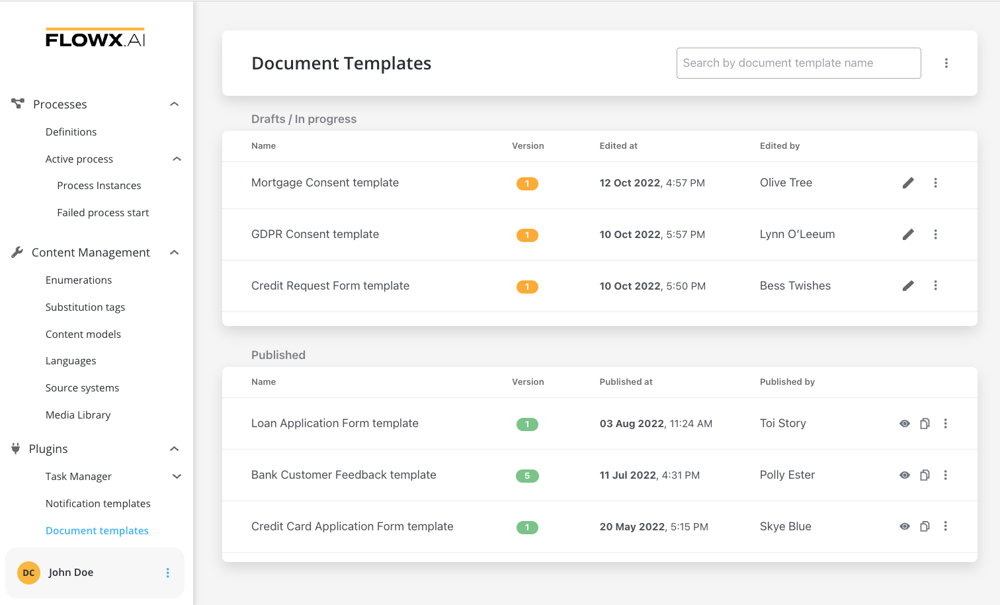
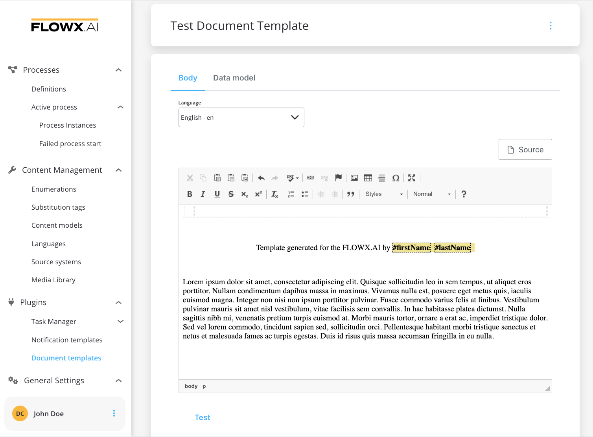
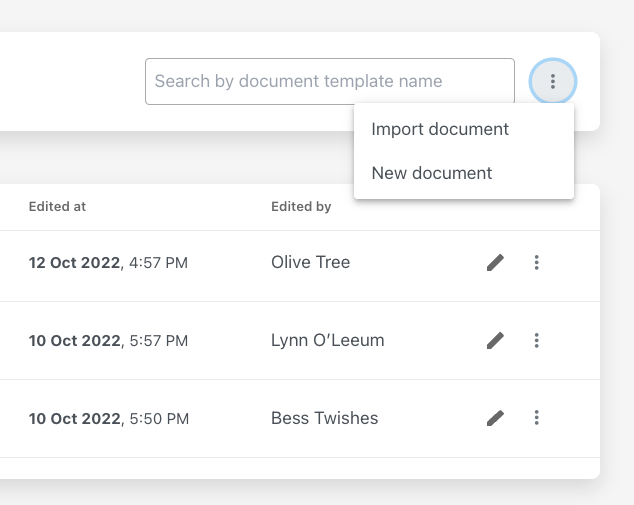

# 📦 Documents plugin

The document plugin can be easily added to your custom FLOWX.AI deployment to **enhance the core platform capabilities with functionality specific to document handling**.

The plugin offers the possibility to:

* store and make changes to documents
* generate documents based on predefined templates and custom process related data
* create various templates using the [WYSIWYG](../../wysiwyg.md) editor

    
* import already created templates

* convert documents from PDF to JPEG 
* splitting bulk documents into smaller separate documents
* editing documents to add generated barcodes/signatures and assets

It can be quickly deployed on the chosen infrastructure, preloaded with the needed industry-specific document templates using an intuitive WYSIWYG editor, and then connected to the FLOWX.AI Engine through Kafka events.

It can be easily used and integrated into your business [processes definitions](../../../../building-blocks/process/process-definition/process-definition.md) by using Kafka send/receive event nodes.

[Kafka send event node](../../../../building-blocks/node/message-send-received-task-node.md#message-send-task)

[Kafka receive event node](../../../../building-blocks/node/message-send-received-task-node.md#message-receive-task)

Let's go through the steps needed in order to deploy and set up the plugin:

[Documents plugin setup](../../plugins-setup-guide/documents-plugin-setup/documents-plugin-setup.md)

We've prepared some examples of various use cases where this plugin would be useful:

[Using the plugin](./using-documents-plugin/using-documents-plugin.md)
