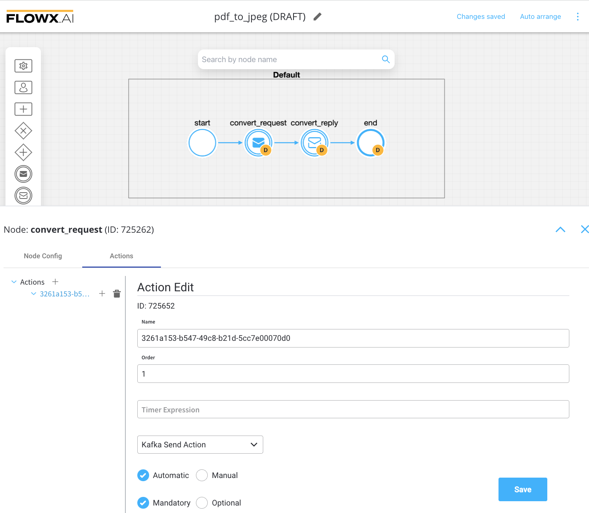
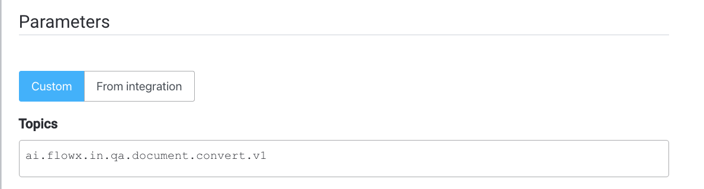
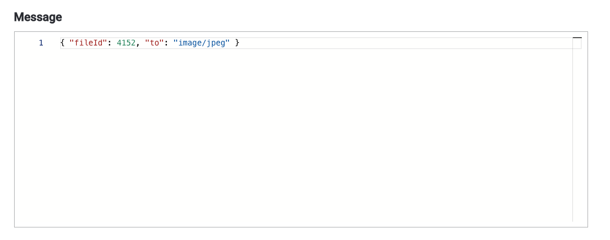
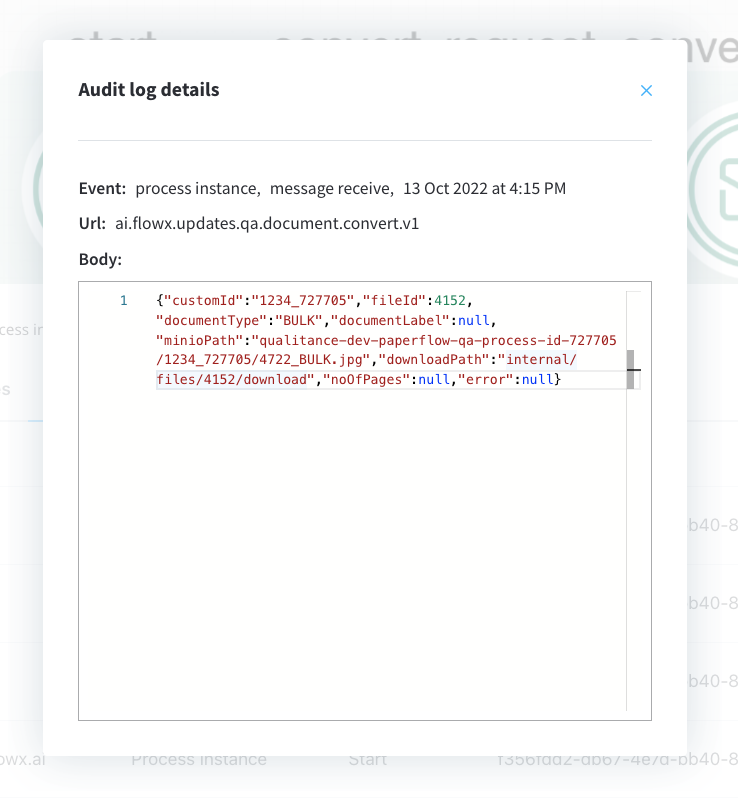

# Converting documents to different formats

:::caution
The current supported conversion is from **pdf** to **jpeg**.
:::

## Sending the request

To create a process that converts from pdf to jpeg format:

1. Create a process in which you add a **kafka send event** node and a **kafka receive event** node (one to send the request, one to receive the reply). 
2. Configure the first node (**kafka send event**) - add a **kafka send action**. 

3. Add the kafka topic where to send the request:

4. Fill in the body message request:

* `fileId` = file ID that will be converted 
* `to` = file extension to convert to

:::info
Kafka topic names can be set by using (overwriting) the following environment variables in the deployment:

KAFKA_TOPIC_FILE_CONVERT_IN - default value: `ai.flowx.in.qa.document.convert.v1`

KAFKA_TOPIC_FILE_CONVERT_OUT - default value: `ai.flowx.updates.qa.document.convert.v1`

The above examples of topics are extracted from an internal testing environment, when setting topics for another environments, follow the next pattern, for example, `ai.flowx.updates.{{environment}}.document.convert.v1`.

:::

:::caution
The Engine is listening for messages on topics with names of a certain pattern, make sure to use an outgoing topic name that matches the pattern configured in the Engine.
:::

## Receiving the reply

Values expected in the reply body:

* customId = client ID
* fileId = file ID
* documentType = document type
* documentLabel = document label
* minioPath = minio path for the converted file
* downloadPath = download path for the converted file

