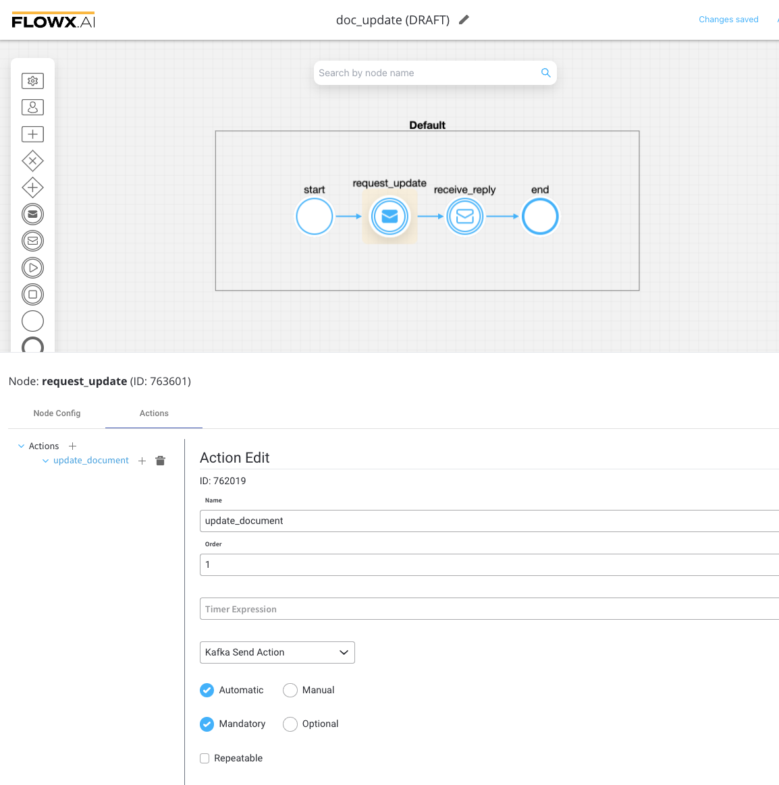
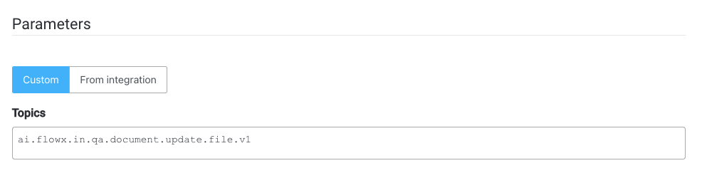
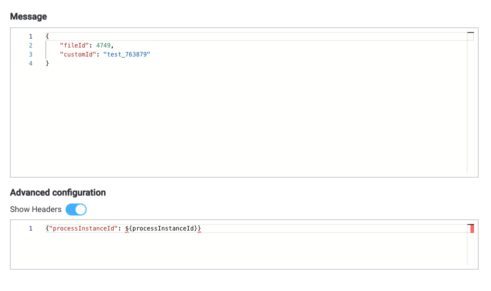
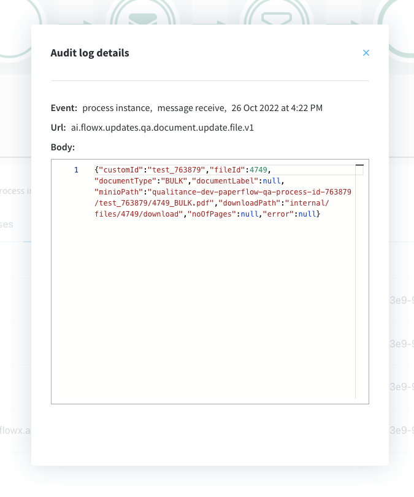
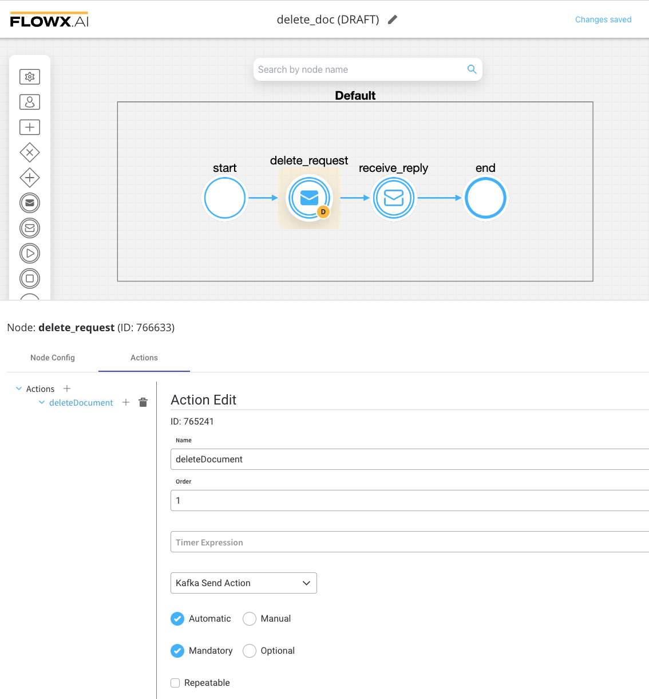
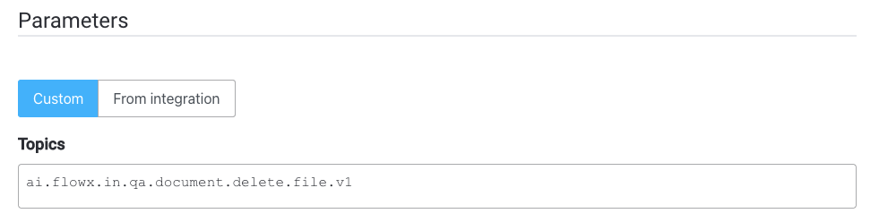
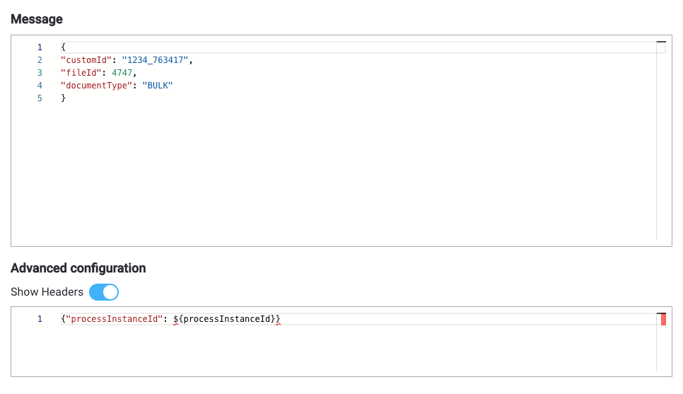
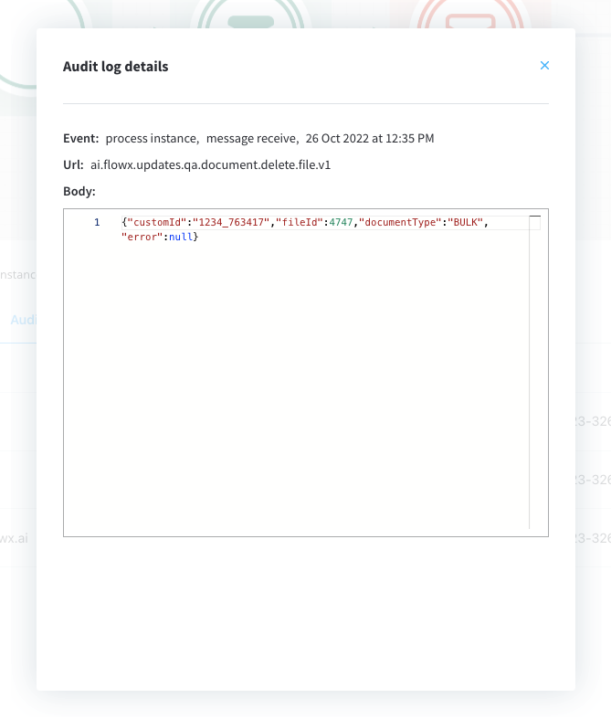

# Updating and deleting document files

The documents plugin provides functionality for updating and deleting files associated with documents. You can update existing files or remove them from a document.

## Updating files

### Sending the request

To update files, follow these steps:

1. Create a process and add a [**Kafka send event node**](../../../../../building-blocks/node/message-send-received-task-node.md#configuring-a-message-send-task-node) and a [**Kafka receive event node**](../../../../../building-blocks/node/message-send-received-task-node.md#configuring-a-message-receive-task-node) (one for sending the request and one for receiving the reply).
2. Configure the first node (Kafka send event) by adding a  **Kafka send action**.



3.Specify the [**Kafka topic**](../../../plugins-setup-guide/documents-plugin-setup/documents-plugin-setup.md#kafka-configuration) to send the request to.



4. Fill in the body of the request message:



* **fileId**: The ID of the file.
* **customId**: The client ID.
* **documentType**: The document type.

:::info
Kafka topic names can be customized by overwriting the following environment variables during deployment:

* `KAFKA_TOPIC_FILE_UPDATE_IN:` - default value: `ai.flowx.in.qa.document.update.file.v1`

* `KAFKA_TOPIC_FILE_UPDATE_OUT` - default value: `ai.flowx.updates.qa.document.update.file.v1`

The above examples of topics are extracted from an internal testing environment, when setting topics for other environments, follow the next pattern, for example, `ai.flowx.updates.{{environment}}.document.update.file.v1`.
:::

:::caution
Make sure to use an outgoing topic name that matches the pattern configured in the Engine, as the Engine listens for messages on topics with specific naming patterns.
:::

### Receiving the reply



Values expected in the reply body:

* customId = client ID
* fileId = file ID
* documentType = document type
* documentLabel = document label
* minioPath = minio path for the updated file
* downloadPath = download path for the updated file
* error = error description

Example:

```json
{
  "customId": "test_763879",
  "fileId": 4749,
  "documentType": "BULK",
  "documentLabel": null,
  "minioPath": "qualitance-dev-paperflow-qa-process-id-763879/test_763879/4749_BULK.pdf",
  "downloadPath": "internal/files/4749/download",
  "noOfPages": null,
  "error": null
}
```

## Deleting files from a document

Used to delete files after bulk upload.

### Sending the request

1. Create a process in which you add a [**Kafka send event node**](../../../../../building-blocks/node/message-send-received-task-node.md#configuring-a-message-send-task-node) and a [**Kafka receive event node**](../../../../../building-blocks/node/message-send-received-task-node.md#configuring-a-message-receive-task-node) (one to send the request, one to receive the reply).
2. Configure the first node (Kafka send event) - add a **Kafka send action**.



3. Add the [**Kafka topic**](../../../plugins-setup-guide/documents-plugin-setup/documents-plugin-setup.md#kafka-configuration) where to send the request:



4. Fill in the body message request:



* `fileId`- the id of the file 
* `customId` - the client ID
* `documentType` - document type

:::info
Kafka topic names can be set by using (overwriting) the following environment variables in the deployment:

`KAFKA_TOPIC_FILE_DELETE_IN` - default value: `ai.flowx.in.qa.document.delete.file.v1`

`KAFKA_TOPIC_FILE_DELETE_OUT` - default value: `ai.flowx.updates.document.delete.file.v1`


:::caution
The Engine is listening for messages on topics with names of a certain pattern, make sure to use an outgoing topic name that matches the pattern configured in the Engine.
:::

### Receiving the reply



Values expected in the reply body:

* customId = client ID
* fileId = file ID
* documentType = document type
* error = error description

Example:

```json
{
  "customId": "1234_763417",
  "fileId": 4747,
  "documentType": "BULK",
  "error": null
}
```