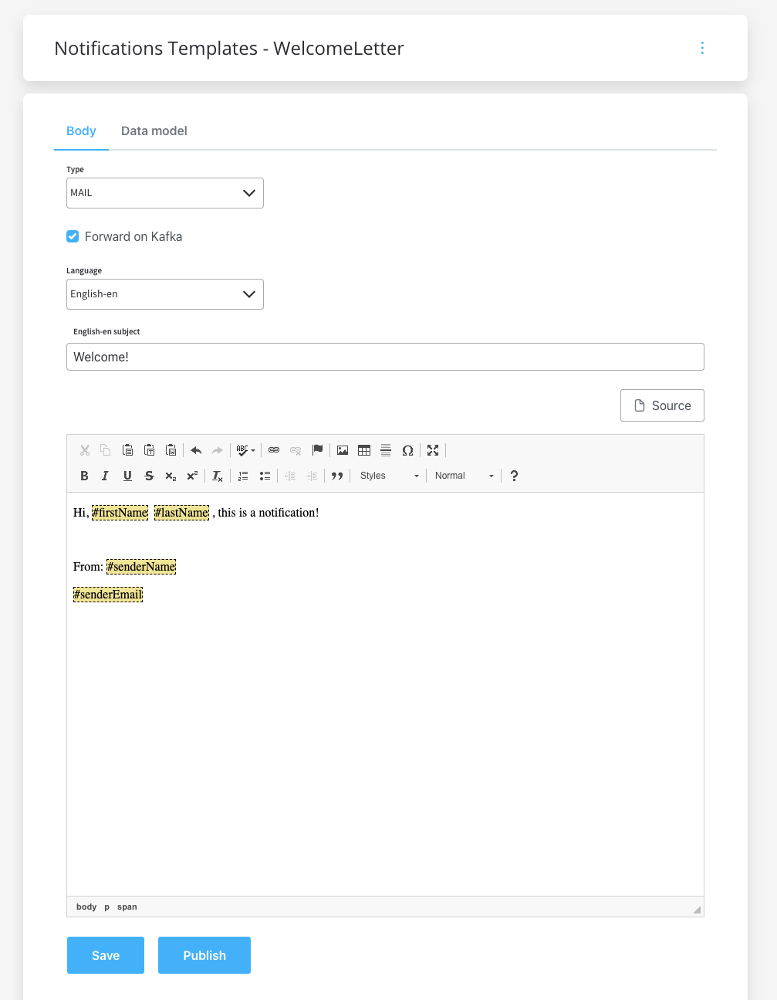
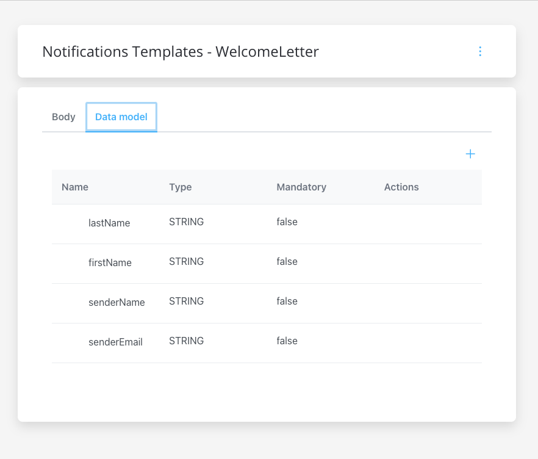

# Forward notifications to an external system

If the Notification service is not directly connected to a SMTP / SMS server and you want to use an external system for sending the notifications, you can use the notification plugin just to forward the notifications to your custom implementation.

### Define needed Kafka topics 

Kafka topic names can be set by using environment variables:

* `KAFKA_TOPIC_NOTIFICATION_INTERNAL_IN` - topic used to trigger the request to send a notification
* `KAFKA_TOPIC_NOTIFICATION_EXTERNAL_OUT` - the notification will be forwarded on this topic to be handled by an external system
* `KAFKA_TOPIC_NOTIFICATION_INTERNAL_OUT` - topic used for sending replies after sending the notification

### Example: send a notification from a business flow

Let's pick a simple use-case, say we need to send a new welcome letter when we onboard a new customer. The steps are the following:

1. Configure the template that you want to use for the welcome email. 
2. To configure a document template, first, you need to select some information stored in the Body:

* **Type** - MAIL (for email notifications)
* **Forward on Kafka** - if this box is checked, the notification is not being sent directly by the plugin to the destination, but forwarded to another adapter
* **Language** - choose the language for your notification template
* **Subject** - enter a subject

3. You can edit the content of a notification template by using the WYSIWYG editor embedded in the body of the notification templates.

4. Configure the data model for the template.

5. Use the FLOWX.AI Designer to add a new Kafka send event to the correct node in the process definition.
6. Open your process definition and check that the needed topic is configured correctly `KAFKA_TOPIC_NOTIFICATION_EXTERNAL_OUT`
7. Add the proper configuration to the action, the Kafka topic and message to be sent.