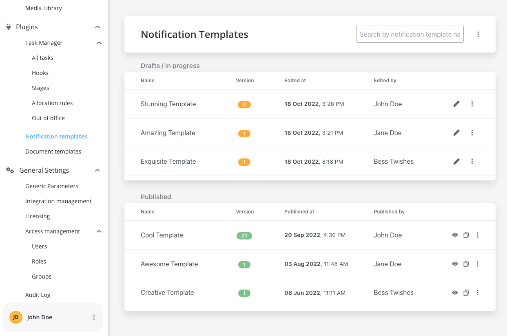
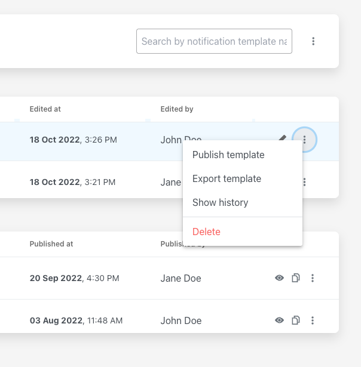

# Managing notification templates

You can create and manage notification templates using FLOWX.AI Designer web application, accessing the dedicated section.

### Configuring a template

To configure a document template, first, you need to select some information stored in the **Body**:

1. **Type** - could be either MAIL or SMS notifications
2. [**Forward on Kafka**](forwarding-notifications-to-an-external-system.md) - if this box is checked, the notification is not being sent directly by the plugin to the destination, but forwarded to another adapter (this is mandatory for SMS notifications templates)
3. **Language** - choose the language for your notification template
4. **Subject** - enter a subject

#### Editing the content

You can edit the content of a notification template by using the [WYSIWYG](../../../wysiwyg.md) editor embedded in the body of the notification templates body.

### Configuring the data model

Using the data model, you can define key pair values (parameters) that will be displayed and reused in the editor. Multiple parameters can be added:

* STRING
* NUMBER
* BOOLEAN
* OBJECT
* ARRAY (which has an additional `item` field)

After you defined some parameters in the **Data Model** tab, you can type "**#**" in the editor to trigger a dropdown where you can choose which one you want to use/reuse.

[WYSIWYG Editor](../../../wysiwyg.md)

### Testing the template

You can use the test function to make sure your template configuration is working as it should before publishing it.

In the example above, some keys that are marked as mandatory were not used in the template, letting you know that you've missed some important information. After you enter all the mandatory keys, the notification test will go through:

### Other actions

When opening the contextual menu (accessible by clicking on the breadcrumbs button), you have multiple actions to work with the notifications templates:

* Publish template - publish a template (it will be then displayed in the **Published** tab), you can also clone published templates
* Export template - export a template (JSON format)
* Show history - (version history and last edited)

