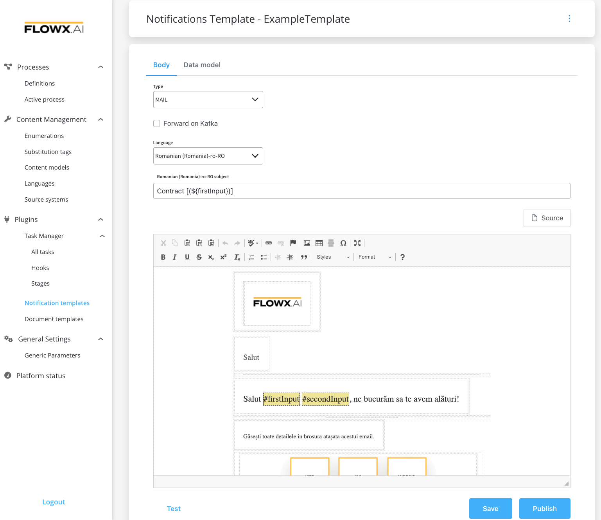
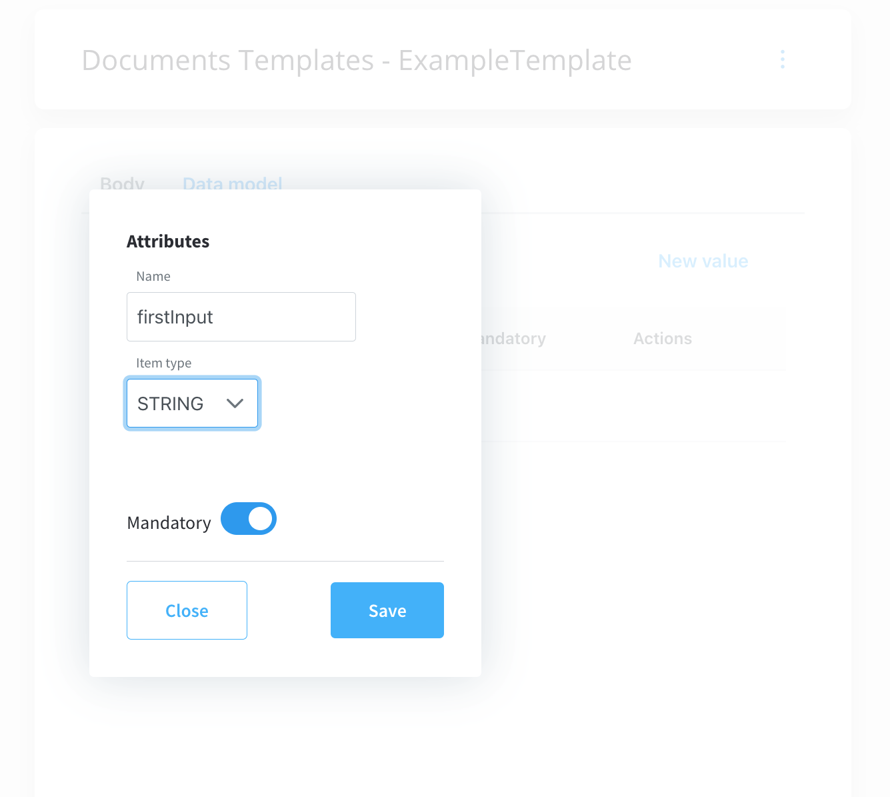
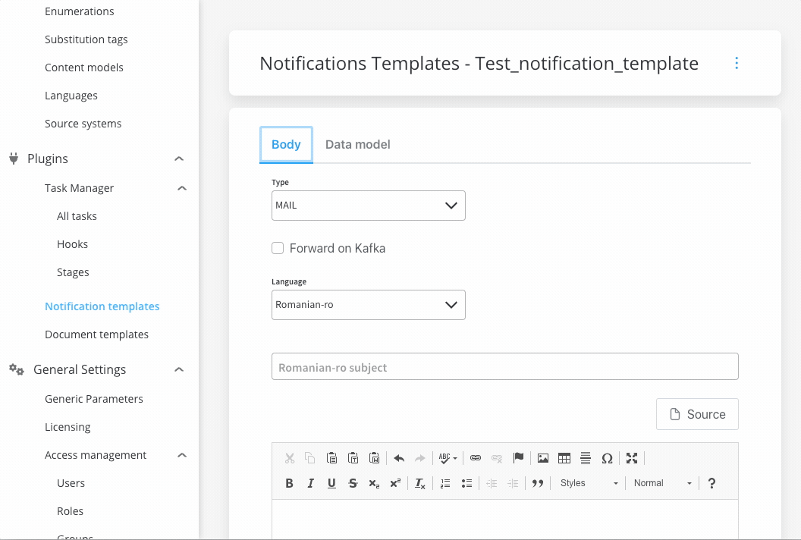
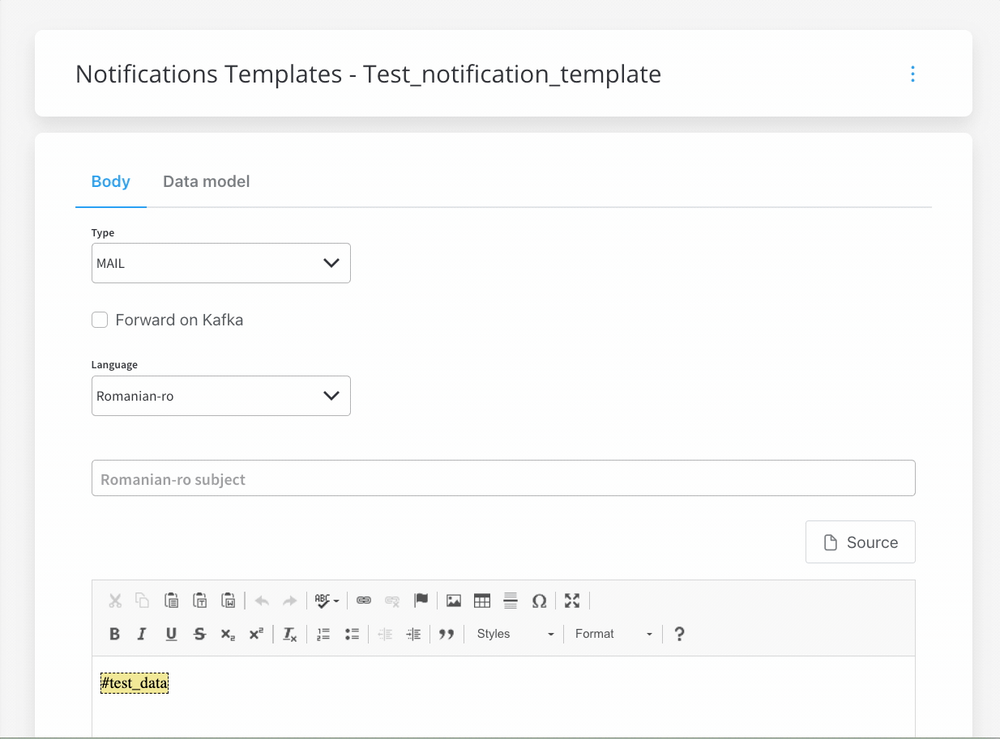
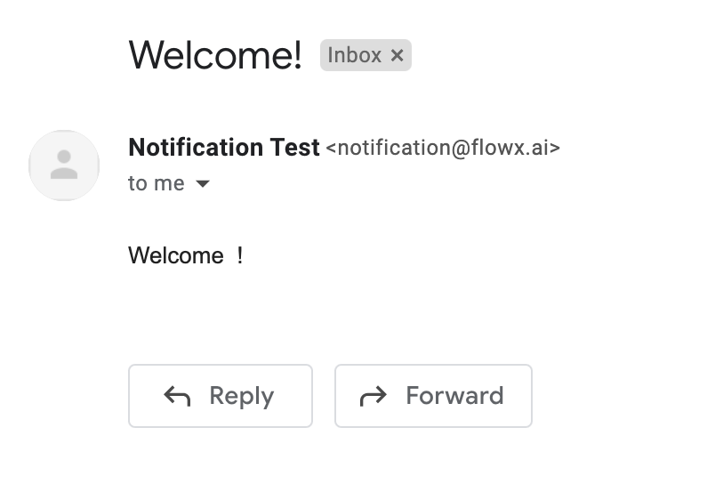

# Managing notification templates

Notification templates can be easily managed using FLOWX Designer.

### Configuring the body

To configure a document template, first, you need to select some information stored in the **Body**:

1. **Type** - could be either MAIL or SMS notifications
2. [**Forward on Kafka**](forward-notifications-to-an-external-system) - if this box is checked, the notification is not being sent directly by the plugin to the destination, but forwarded to another adapter
3. **Language** - choose the language for your notification template
4. **Subject** - enter a subject

#### Editing the content

You can edit the content of a notification template by using the [WYSIWYG ](../../../wysiwyg-editor) editor embedded in the body of the notification templates body.

### Configuring the data model

Using the data model, you can define key pair values (parameters) that will be displayed and reused in the editor. Multiple parameters can be added:

* STRING
* NUMBER
* BOOLEAN
* OBJECT
* ARRAY (which has an additional `item` field)

After you defined some parameters in the **Data Model** tab, you can type "**#**" in the editor to trigger a dropdown where you can choose which one you want to use/reuse.

### Testing the template

You can use the test function to make sure your template configuration is working as it should before publishing it.

In the example above, some keys that are marked as mandatory were not used in the template, letting you know that you've missed some important information. After you enter all the mandatory keys, the notification test will go through:

