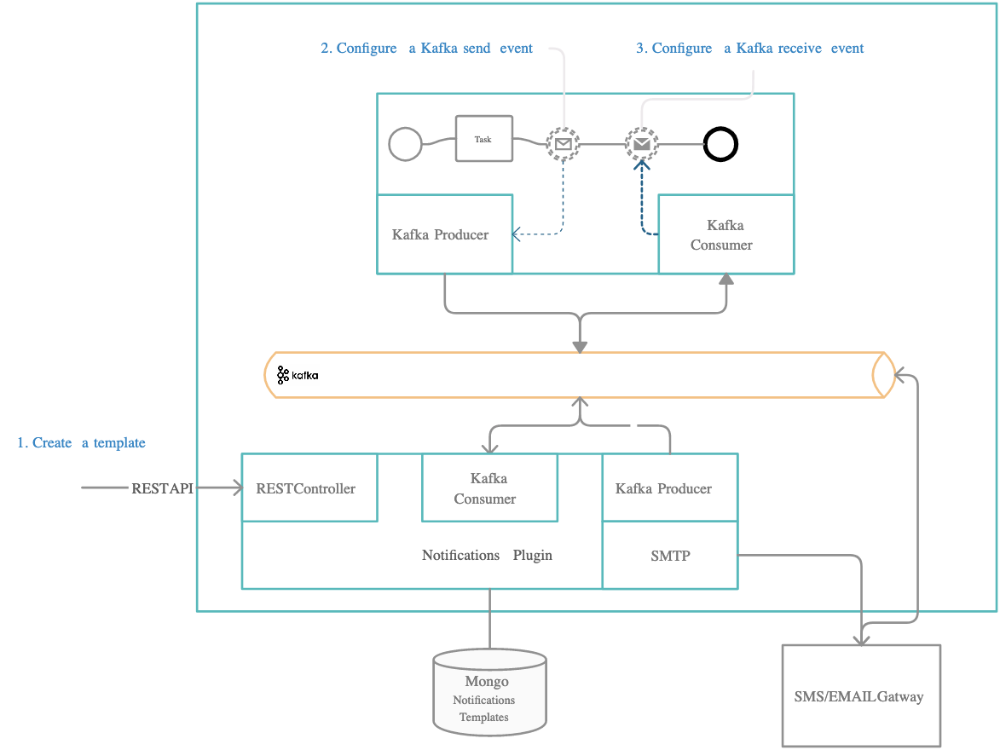
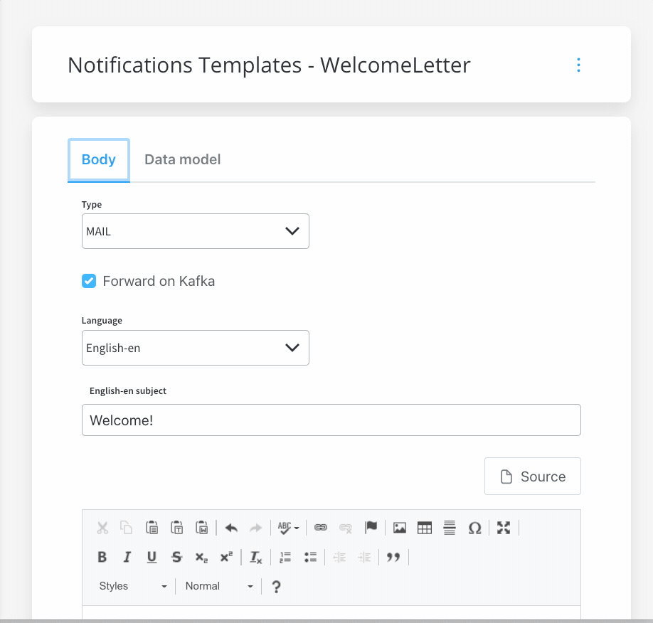

# Sending a notification

The plugin can be used for sending many kinds of notifications: emails, push notifications to mobile devices, and SMS notifications.

## **Defining process actions**

### Define needed Kafka topics 

Kafka topic names can be set by using environment variables:

* `KAFKA_TOPIC_NOTIFICATION_INTERNAL_IN` - topic used to trigger the request to send a notification
* `KAFKA_TOPIC_NOTIFICATION_INTERNAL_OUT` - topic used for sending replies after sending the notification

### Configure an action to send a notification 

**Step 1:** Go to the Visual Flow Designer and add a Kafka send event

**Step 2:** Configure the Kafka send event with the name of the template, `KAFKA_TOPIC_NAME`value for the Kafka topic and the specific body

The following values are expected in the request body:

|        Key        |                                          Definition                                         |                |
| :---------------: | :-----------------------------------------------------------------------------------------: | :------------: |
| processinstanceId |                                     Process instance ID                                     |    Mandatory   |
|      language     |                               The language that should be used                              |    Mandatory   |
|    templateName   |                      The name of the notification template that is used                     |    Mandatory   |
|      channel      |                             Notification channel: SMS/MAIL/PUSH                             |    Mandatory   |
|     receivers     |                          Notification receivers: email/phone number                         |    Mandatory   |
|    senderEmail    |                                  Notification sender email                                  |    Optional    |
|     senderName    |                                   Notification sender name                                  |    Optional    |
|   contentParams   |             contentParams are now deprecated, the new format suggested is `data`            | Now deprecated |
|    attachments    | Attachments that are sent with the notification template (only used for MAIL notifications) |    Optional    |

### Example: send a notification from a business flow

Let's pick a simple use-case, say we need to send a new welcome letter when we onboard a new customer. The steps are the following:

**Step 1:** Configure the template that you want to use for the welcome email, see the previous section, [Managing notification templates](managing-notification-templates.md) for more information.

**Step 2:** Check that the needed topics are configured correctly:

`KAFKA_TOPIC_NOTIFICATION_INTERNAL_IN`

`KAFKA_TOPIC_NOTIFICATION_INTERNAL_OUT`

**Step 3:** Use the FLOWX Designer to add a new Kafka send event to the correct node in the process definition.

**Step 4:** Add the proper configuration to the action, the Kafka topic and message to be sent.