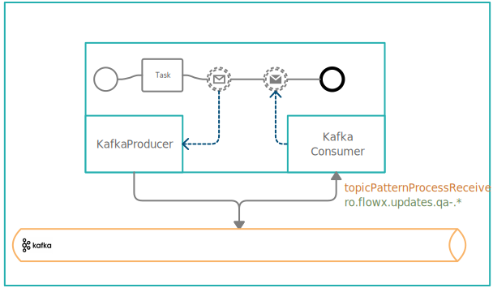

# FLOWX.AI Engine setup guide

## Introduction

This guide will provide instructions on how to set up and configure the FLOWX.AI Engine to meet your specific requirements.

## Infrastructure prerequisites

The FLOWX.AI Engine requires the following components to be set up before it can be started:

* **Docker engine** - version 17.06 or higher
* **Kafka** - version 2.8 or higher
* **Elasticsearch** - version 7.11.0 or higher
* **DB instance** 

# Dependencies

* [**Database**](#database---postgres--oracle)
* [**Redis server**](../platform-setup-guides.md#redis-configuration)
* [**Kafka**](#kafka-configuration)
* [**Logging**](../platform-setup-guides.md#logging)

For Microservices architecture, some Microservices holds their data individually using separate Databases.

A basic Postgres configuration can be set up using a helm values.yaml file as it follows:

*   helm values.yaml:

    ```yaml
      onboardingdb:
        existingSecret: {{secretName}}
        metrics:
          enabled: true
          service:
            annotations:
              prometheus.io/port: {{prometheus port}}
              prometheus.io/scrape: "true"
            type: ClusterIP
          serviceMonitor:
            additionalLabels:
              release: prometheus-operator
            enabled: true
            interval: 30s
            scrapeTimeout: 10s
        persistence:
          enabled: true
          size: 1Gi
        postgresqlDatabase: onboarding
        postgresqlExtendedConf:
          maxConnections: 200
          sharedBuffers: 128MB
        postgresqlUsername: postgres
        resources:
          limits:
            cpu: 6000m
            memory: 2048Mi
          requests:
            cpu: 200m
            memory: 512Mi
    ```

## Dependencies

* **Redis server** - a Redis cluster is required for the engine to cache process definitions, compiled scripts, and Kafka responses
* **Kafka cluster** - Kafka is the backbone of the engine and all plugins and integrations are accessed via the Kafka broker
* **Additional dependencies** - details about how to set up logging via Elasticsearch, monitoring, and tracing via Jaeger, can be found [**here**](../platform-setup-guides.md)

## Configuration

* [**Datasource configuration**](../platform-setup-guides.md#datasource-configuration)
* [**Redis configuration**](../platform-setup-guides.md#redis-configuration)
* [**Logging**](../platform-setup-guides.md#logging)
* [**Authorization & access roles**](../platform-setup-guides.md#authorization--access-roles)
* [**Configuring access roles for processes**](configuring-access-roles-for-processes)
* [**Kafka configuration**](#kafka-configuration)

### Configuring Kafka

Kafka handles all communication between the FLOWX Engine and external plugins and integrations. It is also used for notifying running process instances when certain events occur. 

Both a producer and a consumer must be configured. The following Kafka-related configurations can be set by using environment variables:

* `SPRING_KAFKA_BOOTSTRAP_SERVERS` - the address of the Kafka server, it should be in the format "host:port"

* `KAFKA_AUTH_EXCEPTION_RETRY_INTERVAL` - the interval between retries after AuthorizationException is thrown by KafkaConsumer

* `KAFKA_MESSAGE_MAX_BYTES` - this is the largest size of the message that can be received by the broker from a producer.

The configuration related to consumers (group ids and thread numbers) can be configured separately for each message type:

* `KAFKA_CONSUMER_GROUP_ID_NOTIFY_ADVANCE`

* `KAFKA_CONSUMER_GROUP_ID_NOTIFY_PARENT`

* `KAFKA_CONSUMER_GROUP_ID_ADAPTERS`

* `KAFKA_CONSUMER_GROUP_ID_SCHEDULER_RUN_ACTION`

* `KAFKA_CONSUMER_GROUP_ID_SCHEDULER_ADVANCING`

* `KAFKA_CONSUMER_GROUP_ID_PROCESS_START`

* `KAFKA_CONSUMER_GROUP_ID_PROCESS_EXPIRE`

* `KAFKA_CONSUMER_GROUP_ID_PROCESS_OPERATIONS`

* `KAFKA_CONSUMER_THREADS_NOTIFY_ADVANCE`

* `KAFKA_CONSUMER_THREADS_NOTIFY_PARENT`

* `KAFKA_CONSUMER_THREADS_ADAPTERS`

* `KAFKA_CONSUMER_THREADS_SCHEDULER_RUN_ACTION`

* `KAFKA_CONSUMER_THREADS_SCHEDULER_ADVANCING`

* `KAFKA_CONSUMER_THREADS_PROCESS_START`

* `KAFKA_CONSUMER_THREADS_PROCESS_EXPIRE`

* `KAFKA_CONSUMER_THREADS_PROCESS_OPERATIONS`


It is important to know that all the events that start with a configured pattern will be consumed by the engine. This makes it possible to create a new integration and connect it to the engine without changing the configuration of the engine.

 

* `KAFKA_TOPIC_PROCESS_NOTIFY_ADVANCE` - Kafka topic used internally by the engine

* `KAFKA_TOPIC_PROCESS_NOTIFY_PARENT` - Topic used for sub-processes to notify parent process when finished

* `KAFKA_TOPIC_PATTERN` - the topic name pattern that the Engine listens on for incoming Kafka events

* `KAFKA_TOPIC_LICENSE_OUT` - the topic name used by the Engine to generate licensing-related details

#### **Topics related to the Task Management plugin**

* `KAFKA_TOPIC_TASK_OUT` - used for sending notifications to the plugin

* `KAFKA_TOPIC_PROCESS_OPERATIONS_IN` - user for receiving calls from the task management plugin

#### **Topics related to the scheduler extension**


[Scheduler](../../platform-deep-dive/core-components/core-extensions/scheduler.md)

* `KAFKA_TOPIC_PROCESS_EXPIRE_IN` - the topic name that the Engine listens on for requests to expire processes

* `KAFKA_TOPIC_PROCESS_SCHEDULE_OUT_SET` - the topic name used by the Engine to schedule a process expiration

* `KAFKA_TOPIC_PROCESS_SCHEDULE_OUT_STOP` - the topic name used by the Engine to stop a process expiration

* `KAFKA_TOPIC_PROCESS_SCHEDULE_IN_RUN_ACTION` - the topic name that the Engine listens on for requests to run scheduled actions

* `KAFKA_TOPIC_PROCESS_SCHEDULE_IN_ADVANCE` - 

[Using the scheduler](../../platform-deep-dive/core-components/core-extensions/scheduler.md#using-the-scheduler)
#### **Topics related to the Search Data service**

* `KAFKA_TOPIC_DATA_SEARCH_IN` - the topic name that the Engine listens on for requests to search for processes

* `KAFKA_TOPIC_DATA_SEARCH_OUT` - the topic name used by the Engine to reply after finding a process

#### **Topics related to the Audit service**

* `KAFKA_TOPIC_AUDIT_OUT` - topic key for sending audit logs. Default value: `ai.flowx.audit.log`

#### **Processes that can be started by sending messages to a Kafka topic**

* `KAFKA_TOPIC_PROCESS_START_IN` - the Engine listens on this topic for requests to start a new process instance

* `KAFKA_TOPIC_PROCESS_START_OUT` - used for sending out the reply after starting a new process instance

### Configuring WebSockets

The engine communicates with the frontend application via WebSockets. The following environment variables need to be configured for the socket server connection details:

* `WEB_SOCKET_SERVER_URL_EXTERNAL` - the external URL of the WebSocket server

* `WEB_SOCKET_SERVER_PORT` - the port on which the WebSocket server is running

* `WEB_SOCKET_SERVER_PATH` - the WebSocket server path

### Configuring file upload size

The maximum file size allowed for uploads can be set by using the following environment variables:

* `SPRING_SERVLET_MULTIPART_MAX_FILE_SIZE` - maximum file size allowed for uploads

* `SPRING_SERVLET_MULTIPART_MAX_REQUEST_SIZE` - maximum request size allowed for uploads


### Configuring Advancing controller

To use advancing controller, the following env vars are needed for `process-engine` to connect to Advancing Postgres DB:

* `ADVANCING_DATASOURCE_JDBC_URL` - environment variable used to configure a JDBC (Java database connectivity) data source, it specifies the connection URL for a particular database, including the server, port, database name, and any other connection parameters necessary

* `ADVANCING_DATASOURCE_USERNAME` - environment variable used to authenticate the user access to the data source

* `ADVANCING_DATASOURCE_PASSWORD` - environment variable used to set the password for a data source connection

[Advancing controller setup](../flowx-engine-setup-guide/advancing-controller-setup-guide)
