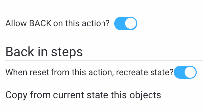
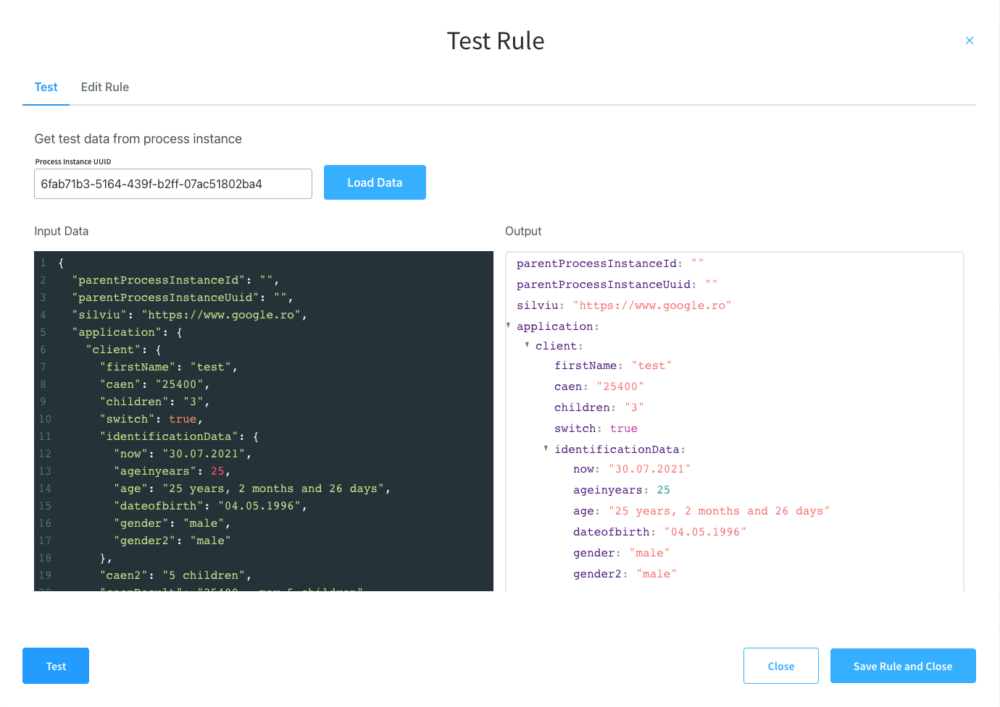
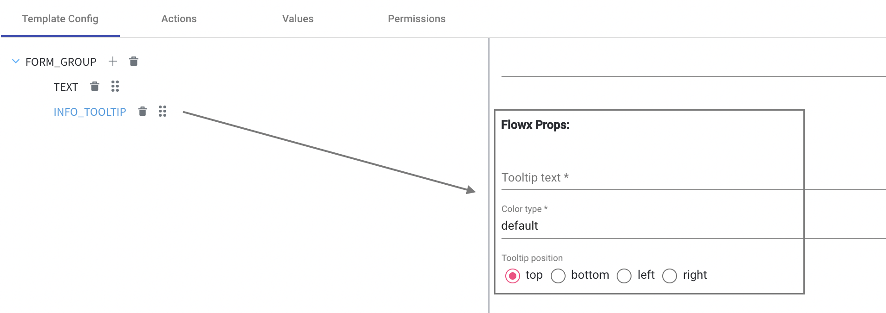
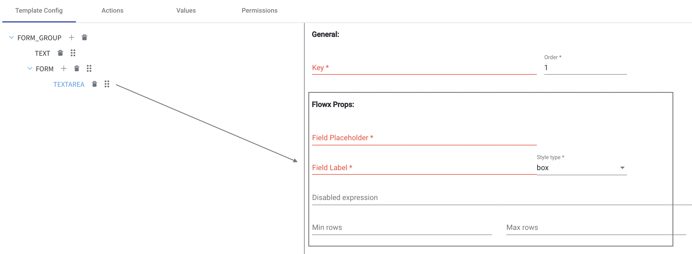

# v1.11.0 - Aug 2021

## New features

** 𝌙 Advanced node types:** we launched a new type of node in the UI to mark the start of a sub-process. Check it out [here](../../docs/building-blocks/node/subprocess-run-node).

:::success
Take a deep dive into [Subprocesses](../../docs/building-blocks/process/subprocess)
:::

** 🏁 Triggering nodes or skipping nodes in a process:** We've updated the process designer with Flow Names. This option allows you to configure a process where, depending on an initial variable, certain nodes will be skipped or will be activated. For example in the case of an onboarding process where you have to onboard a minor or an adult.

:::success
Read more about [Triggering or Skipping Nodes](../../docs/platform-deep-dive/core-components/flowx-engine#triggering-or-skipping-nodes-on-a-process-based-on-flow-names)
:::

👮🏻 You can now configure **Roles and Permissions** directly from FlowX Designer and define them on different operations such as giving access to actions from process definitions, restrict permissions to specific users. Those actions can be performed at a process level and/or at a node level.

:::success
Read more information about [Configuring access roles](../../docs/platform-deep-dive/user-roles-management/swimlanes)
:::

:arrow_left: Bring more flexibility in your Flows using the new **Back in Process feature.** As the name suggests, it will allow you to go back in a business process and retrieve a specific state or/and data from a previous step.

In this release several options are available:

* On an Action, you can allow a user to reset his progress in a business process for a`Node`he already passed in.
*   Prior to a reset action, you can preserve the data from a`Node`and use the data in the new`Node`instance after the step back has been performed.

    We integrate Advanced options to select specific keys/data that will be persisted after a reset.

:::success
Learn how to use and configure Back in steps to [move a token backward in a process](../../docs/flowx-designer/managing-a-process-flow/moving-a-token-backwards-in-a-process).
:::

:toolbox: To empower Business Users to write and model **Business Rules** more easily we integrated a few more language options into the platform. Besides MVEL, business rules can now be configured using:

* the [DMN](https://www.omg.org/dmn/) language
* a few scripting languages: **JavaScript, Kotlin, Groovy**

Also, multiple business rules can now be configured under the same action.

:test_tube: The scripts used for defining business rules can now be tested directly inside the FlowX Designer:

### New UI elements

:information_source: **TextArea** and **Tooltip** are now available to be configured in a process.

🗓 **DatePicker** was enhanced to offer the possibility to configure a min date and max date via the designer. See more details [here](../../docs/building-blocks/ui-designer/ui-component-types/form-elements/datepicker-form-field).

## **Fixed**

* N/A

## **Changed**

### Core

* You now have the flexibility to add **CSS class** in a modal screen&#x20;

## **Known issues**

* When a published process is edited, the icon for the subprocess run node is blue.
* When you save a Start Subprocess node with async properties set to false, without any output key, the process will remain blocked.

Additional information regarding the deployment for v1.11.0 are available below:

[Deployment guidelines v1.11](deployment-guidelines-v1.11)

