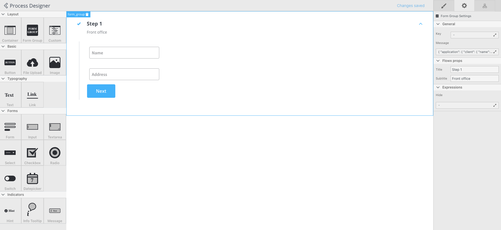
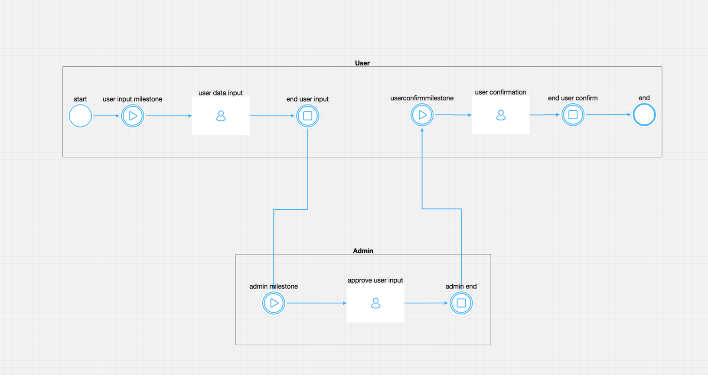
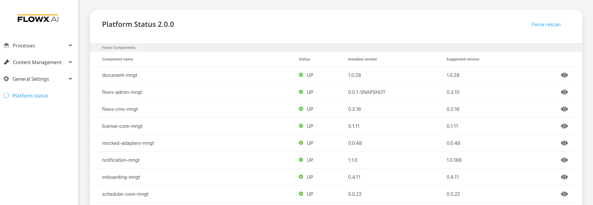
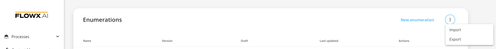

---
sidebar_position: 14
--- 

# v2.0.0 - February 2022

## New features

:::danger
**This version comes with changes that require an update in the configuration setup for all the platform microservices. Please make sure to follow the** [**update guidelines**](deployment-guidelines-v2.0)**.**
:::

:jigsaw: **UI Designer** - It is now possible to design the UI templates using an intuitive drag and drop editor that comes bundled into the FLOWX Designer.

:star2: **Enhanced flow designer** - We improved the display of the process flows in the Designer while also added the possibility of visually grouping nodes on swimlanes.

:::info
Read more information about [swimlanes](../../docs/platform-deep-dive/user-roles-management/swimlanes)
:::

:ballot_box_with_check: **Platform status** details can now be viewed directly from the FLOWX Designer. You can quickly  check the health status of all the FLOWX services and that of your custom connectors.

:open_file_folder: **Import and export CMS** contents - Substitution tags and enumerations can now be easily exported and imported in JSON format.

:recycle: **Rerun token in current node** - We've added the option of manually trying to advance a token from the designer in case there were errors in running the process and the token did not advance automatically.

:tools: **Standardized and simplified services configuration setup** - We have simplified to configuration setup to make adjusting configuration values by overwriting environment variables more straightforward. We've also standardized the FLOWX component names to make adhere to a consistent naming convention.&#x20;

:::danger
**Make sure to follow the** [**update guidelines**](deployment-guidelines-v2.0) **to make sure all the changes are applied.**
:::

## **Fixed**

### Engine

* Fixed an issue where subprocesses couldn’t be started by automated actions
* Fixed and issue where an error was returned while testing business rules swimlane owner details

### Admin

* Fixed an issue where processes with empty display options are not loaded in the designer
* Fixed form fields and nodes rules order in process exports
* Fixed an issue where sensitive date process configuration wasn’t added in the process export

### Designer

* Fixed an issue where ‘//’ was used in some REST requests path

### Process renderer

* Fixed an issue where hints configured with substitution tags weren’t rendered with the correct value
* Fixed an issue where checkboxes weren’t disabled when a disable expression was used

## **Changed**

### Designer

* Improved image source configuration

### Process renderer

* Improved image source

### Document plugin

* Added number of pages for combining documents

### CMS Core

* Added REST endpoint for translate CMS values
* Added the possibility to add a reply topic to KAFKA request CMS values

Additional information regarding the deployment for v2.0.0 are available below:

[Deployment guidelines v2.0](deployment-guidelines-v2.0)

