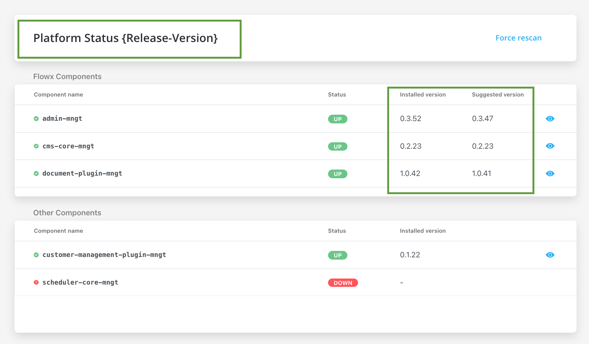

# Deployment guidelines v2.10.0

:::info
Do not forget, when upgrading to a new platform version,  always check and make sure your installed component versions match the versions stated in the release. To do that, go to **FLOWX.AI Designer > Platform Status**.
:::

## Component versions

|             :ballot_box_with_check:  | 2.10        | 2.9.0      | 2.8.1   | 2.8.0   | 2.7.0   | 2.6.0   | 2.5.0   | 2.4.0   | 2.3.0   | 2.2.0   | 2.1.0     | 2.0.0     | 1.16.0  | 1.15    | 1.14    | 1.13.0  | 1.12.0 | 1.11.0  |
| --------------------------------------- | ----------- | ---------- | ------- | ------- | ------- | ------- | ------- | ------- | ------- | ------- | --------- | --------- | ------- | ------- | ------- | ------- | ------ | ------- |
| **Process engine**                      | **0.4.60**  | 0.4.49     | 0.4.44  | 0.4.42  | 0.4.42  | 0.4.36  | 0.4.29  | 0.4.22  | 0.4.21  | 0.4.18  | 0.4.13    | 0.4.12    | 0.4.4   | 0.3.26  | 0.3.21  | 0.3.14  | 0.3.9  | 0.3.7   |
| **Designer**                            | **2.39.2**  | 2.33.0     | 2.28.1  | 2.24.2  | 2.23.0  | 2.19.2  | 2.18.2  | 2.17.4  | 2.15.2  | 2.14.4  | 2.11.2    | 2.10.0    | 2.5.0   | 2.1.1   | 1.21.0  | 1.16.3  | 1.15.2 | 1.14.0  |
| **CMS Core**                            | **0.2.25**  | 0.2.23     | 0.2.23  | 0.2.23  | 0.2.23  | 0.2.23  | 0.2.20  | 0.2.20  | 0.2.18  | 0.2.17  | 0.2.17    | 0.2.17    | 0.2.14  | 0.2.9   | 0.2.9   | 0.2.9   | 0.2.5  | 0.2.3   |
| **Scheduler Core**                      | **0.0.28**  | 0.0.27     | 0.0.27  | 0.0.27  | 0.0.27  | 0.0.27  | 0.0.24  | 0.0.24  | 0.0.23  | 0.0.23  | 0.0.23    | 0.0.23    | 0.0.19  | 0.0.12  | 0.0.12  | 0.0.12  | NA     | 0.0.6   |
| **flowx-process-renderer**              | **2.39.2**  | 2.33.0     | 2.28.1  | 2.24.2  | 2.23.0  | 2.19.2  | 2.18.2  | 2.17.4  | 2.15.2  | 2.14.4  | 2.11.2    | 2.10.0    | 2.4.2   | 2.1.1   | 1.21.0  | 1.16.3  | 1.15.2 | 1.14.0  |
| **flowx-web-components**                | 0.2.10      | 0.2.10     | 0.2.6   | 0.2.6   | 0.2.6   | 0.2.6   | 0.2.6   | 0.2.6   | 0.2.6   | 0.2.5   | 0.2.4     | 0.2.1     | 0.2.1   | 0.0.298 | 0.0.298 | 0.0.298 | NA     | 0.0.293 |
| **Admin**                               | **0.3.60**  | 0.3.55     | 0.3.47  | 0.3.43  | 0.3.40  | 0.3.36  | 0.3.34  | 0.3.29  | 0.3.23  | 0.3.21  | 0.3.13    | 0.3.13    | 0.3.3   | 0.2.26  | 0.2.26  | 0.2.26  | 0.2.25 | 0.2.23  |
| **Notification Plugin**                 | **1.0.200** | 1.0.198    | 1.0.198 | 1.0.197 | 1.0.194 | 1.0.194 | 1.0.191 | 1.0.191 | 1.0.190 | 1.0.190 | 1.0.186-1 | 1.0.186-1 | 1.0.186 | 1.0.182 | 1.0.182 | 1.0.182 | NA     | 1.0.179 |
| **Document Plugin**                     | **1.0.47**  | 1**.**0.42 | 1.0.41  | 1.0.38  | 1.0.37  | 1.0.37  | 1.0.35  | 1.0.35  | 1.0.31  | 1.0.31  | 1.0.30    | 1.0.30    | 1.0.26  | 1.0.24  | 1.0.20  | 1.0.18  | NA     | 1.0.15  |
| **OCR Plugin**                          | 0.1.5       | 0.1.5      | 0.1.5   | 0.1.5   | 0.1.5   | 0.1.5   | 0.1.5   | 0.1.5   | 0.0.109 | 0.0.109 | 0.0.109   | 0.0.109   | 0.0.109 | 0.0.106 |         |         |        |         |
| **License Core**                        | **0.1.23**  | 0.1.19     | 0.1.18  | 0.1.18  | 0.1.18  | 0.1.18  | 0.1.15  | 0.1.15  | 0.1.13  | 0.1.13  | 0.1.12    | 0.1.12    | 0.1.10  | 0.1.5   | n/a     |         |        |         |
| **Customer Management Plugin**          | **0.1.23**  | 0.1.22     | 0.1.22  | 0.1.22  | 0.1.22  | 0.1.22  | 0.1.20  | 0.1.20  | 0.1.18  | 0.1.18  | 0.1.18    | 0.1.18    | 0.1.16  | 0.1.10  | 0.1.10  | 0.1.10  | NA     | 0.1.6   |
| **Task Management Plugin**              | **0.0.29**  | 0.0.28     | 0.0.28  | 0.0.27  | 0.0.27  | 0.0.27  | 0.0.22  | 0.0.22  | 0.0.21  | 0.0.21  | 0.0.16    | 0.0.16    | 0.0.14  |         |         |         |        |         |

## Additional configuration

:::warning
The access rights-related configuration needs to be set up for each microservice. Default options are preconfigured. They can be overwritten using environment variables.
:::

To configure the roles for the users of the admin app, they need to be added to the identity provider solution.

New roles added for **Integrations Management:**

| Module              | Feature | Role default value                        | Microservice |
| ------------------- | ------- | ----------------------------------------- | ------------ |
| manage-integrations | import  | ROLE\_ADMIN\_MANAGE\_INTEGRATIONS\_IMPORT | Admin        |
| manage-integrations | read    | ROLE\_ADMIN\_MANAGE\_INTEGRATIONS\_READ   | Admin        |
| manage-integrations | edit    | ROLE\_ADMIN\_MANAGE\_INTEGRATIONS\_EDIT   | Admin        |
| manage-integrations | admin   | ROLE\_ADMIN\_MANAGE\_INTEGRATIONS\_ADMIN  | Admin        |

For more information on how to configure access rights for Integration Management, check the following section:

[Configuring access rights for integration management](../../docs/platform-deep-dive/core-components/core-extensions/integration-management/configuring-access-rights-for-intgr-mngmnt)

New roles added for **Content Management**:

| Module            | Feature | Role default value                                     | Microservice |
| ----------------- | ------- | ------------------------------------------------------ | ------------ |
| manage-taxonomies | read    | ROLE\_CMS\_TAXONOMIES\_EDITROLE\_CMS\_TAXONOMIES\_READ | CMS          |
| manage-taxonomies | edit    | ROLE\_CMS\_TAXONOMIES\_EDIT                            | CMS          |

[Configuring access rights for CMS](../../docs/platform-deep-dive/platform-setup-guide/cms-setup-guide/configuring-access-rights-for-cms)

