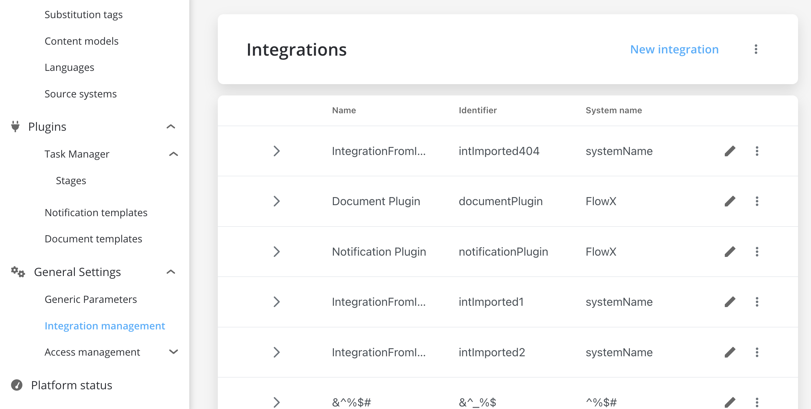

# v2.10.0 - July 2022

Howdy :wave:. Here is what we prepared for you on our latest release:

## New features

### 👩‍🏭 FLOWX.AI Admin

#### NEW: Integrations Management

Integration management helps you to keep a track of each integration (including scenarios) and its correspondent component. You can configure integrations between multiple components or different adapters.

For more information about Integration Management, check the following section:

[Integration management](../../docs/platform-deep-dive/core-components/core-extensions/integration-management)

## **Fixed**

### 👩‍🏭 FLOWX.AI Admin

#### Platform Health

* Fixed an issue when a component was incorrectly displayed as **DOWN** if the correct health status could not be retrieved for one of the services it depended on

### 🗃 FLOWX.AI Content Management

* Fixed an issue where the CMS content (taxonomies) is overwritten when 2 users are editing the same feature (instead of saving new changes)

### FLOWX.AI Engine / FLOWX.AI License Manager/ FLOWX.AI Documents Plugin

* Fixed an issue where the Liquibase lock remained active in a certain scenario

For more details, check the following section:

[Deployment guidelines v2.9.0](../v2.9.0-june-2022/deployment-guidelines-v2.9.0)

## **Changed**

### 👩‍🏭 FLOWX.AI Admin

#### User menu

* The user menu is now accessible from the bottom-left corner, here you can also open the **user settings menu** where you can edit user details, credentials, roles & groups, and attributes

### :rocket: FLOWX.AI Process Designer

* You can now set a process expiry time using a timer expression with a relative date (cron expression)

[Timer Expressions](../../docs/platform-overview/frameworks-and-standards/timer-expressions)

* New error status for process definitions duplication

### :page_with_curl: FLOWX.AI Documents plugin

#### S3 integration

* Introduced a new property `application.file-storage.partition-strategy` with two possible values:  **NONE** and **PROCESS_DATE**

| Property                                    | Value         | Explanation                                                                                                                              |
| ------------------------------------------- | ------------- | ---------------------------------------------------------------------------------------------------------------------------------------- |
| APPLICATION\_FILESTORAGE\_PARTITIONSTRATEGY | NONE          | saving documents in minio/amazon-s3 will be done as before in a bucket for each process instance                                         |
| APPLICATION\_FILESTORAGE\_PARTITIONSTRATEGY | PROCESS\_DATE | documents will be saved in a single bucket, with a subfolder, for example: `bucket/2022/2022-07-04/process-id-xxxx/customer-id/file.pdf` |

[Documents plugins setup](../../docs/platform-deep-dive/plugins/plugins-setup-guide/documents-plugin-setup)

### 🗃 FLOWX.AI Content Management

**Taxonomies**

Granular access rights can be configured to restrict the access for manipulating taxonomies:

#### Languages

* Added new user rights: **read** and **edit**

#### Source systems

* Added new user rights: **read** and **edit**

Check the following section for more details on how to configure the access rights :

[Configuring access rights for CMS](../../docs/platform-deep-dive/platform-setup-guide/cms-setup-guide/configuring-access-rights-for-cms)

### :steam_locomotive: FLOWX.AI Engine

#### :exclamation: Kafka configuration

* Changed the environment variable for the topic used for sending notifications to the [Task management](../../docs/platform-deep-dive/plugins/custom-plugins/task-management) plugin

| Old                        | New                    |
| -------------------------- | ---------------------- |
| `KAFKA_TOPIC_TASK_MAN_OUT` | `KAFKA_TOPIC_TASK_OUT` |

For more details about how to configure Kafka topics, check the following section:

[FLOWX.AI engine setup guide](../../docs/platform-deep-dive/platform-setup-guide/flowx-engine-setup-guide)

Additional information regarding the deployment for **v2.10** is available below:

[Deployment Guidelines v2.10.0](deployment-guidelines-v2.10.0)
