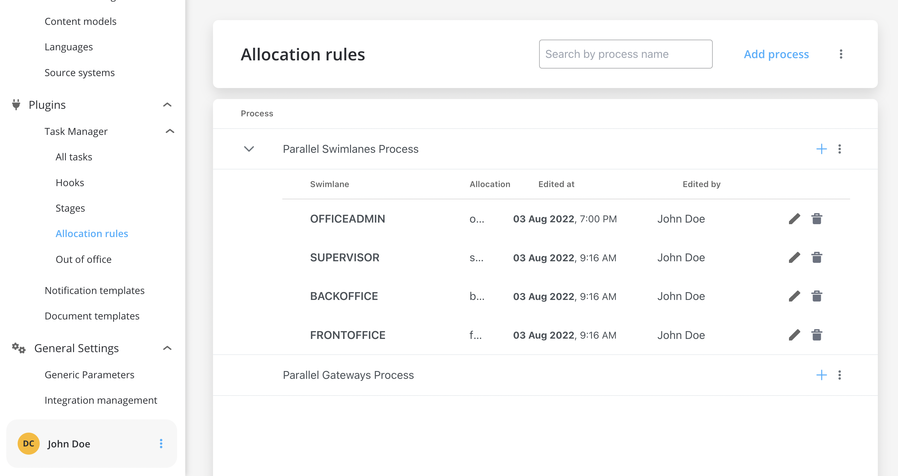
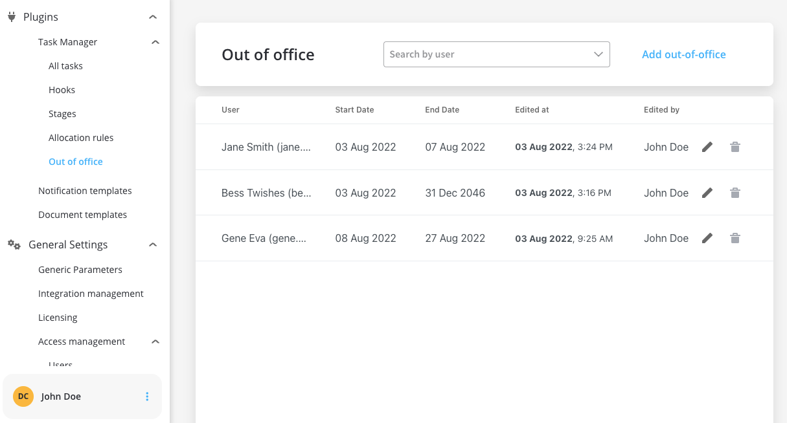
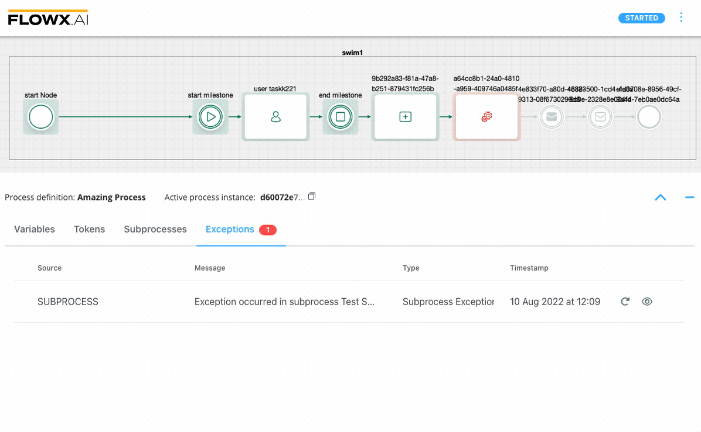
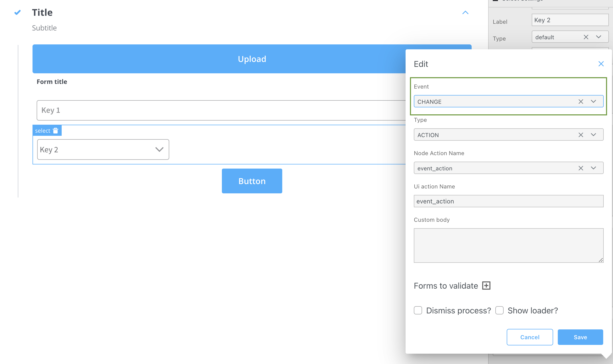
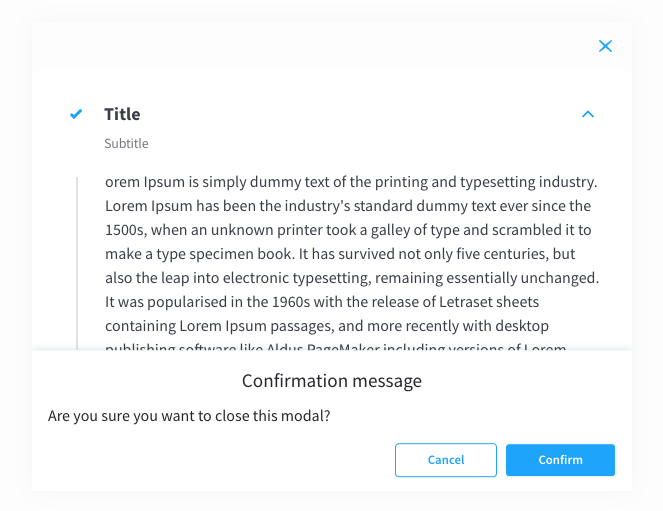
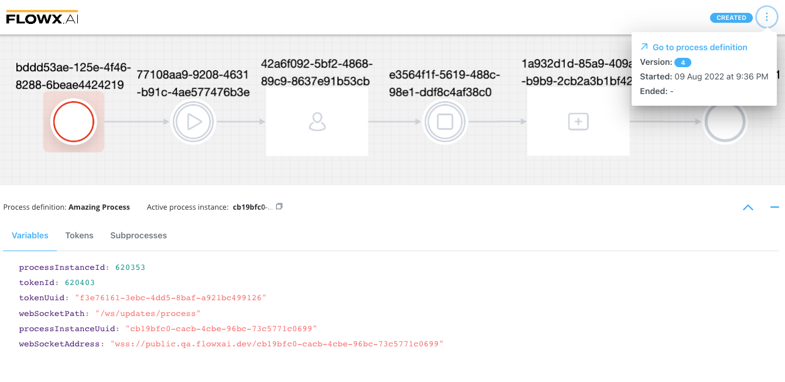

# 🆕  v2.11.0 - August 2022

Howdy:wave:. Did you miss us? Here is what we prepared for you on our latest release:

## **New features**

### 🤹‍♀️ Task management plugin

#### Tasks automatic allocation

* A new feature that will help you define when tasks should be auto-assigned, for example, when tasks reach a [swimlane](../../docs/platform-deep-dive/user-roles-management/swimlanes) that has a specific role configured

:::caution
New access rights must be configured to use **Allocation rules**. For more information check the [**Deployment guidelines v2.11.0**](deployment-guidelines-v2.11.0).
:::

[Using allocation rules](../../docs/platform-deep-dive/plugins/custom-plugins/task-management/using-allocation-rules)

**Out-of-office configuration**

* The Out-of-office feature allows you to register users' availability to perform a task, it can be allocated manually or automatically

:::caution
New access rights must be configured to use **Out of office** configuration. For more information check the [**Deployment guidelines v2.11.0**](deployment-guidelines-v2.11.0).
:::

[Using out of office records](../../docs/platform-deep-dive/plugins/custom-plugins/task-management/using-out-of-office-records)

### :rocket: FLOWX.AI Process Designer

#### **Exceptions**

* Added exceptions to help you debug a possible failure in the execution of a process

[Failed process start](../../docs/building-blocks/process/active-process/failed-process-start)

### :steam_locomotive: FLOWX.AI Engine

#### Parallel user tasks in different swimlanes

* Added the possibility to have parallel user tasks on different [swimlanes](../../docs/platform-deep-dive/user-roles-management/swimlanes) (parallel tasks are separated by using a [parallel gateway](../../docs/building-blocks/node/parallel-gateway))

### :pencil2: FLOWX.AI Process Renderer/ UI Designer

#### **Events on UI elements**

* You can now add **Events** on [UI elements](../../docs/building-blocks/ui-designer/ui-component-types) using [UI Actions](../../docs/building-blocks/ui-designer/ui-actions)

#### Added new dismiss modal configuration

* Added the possibility to dismiss modals

## **Fixed**

### 👩‍🏭 FLOWX.AI Designer

* Fixed an issue where the Designer web app couldn't be opened in Safari
* Fixed an issue where no error was displayed when you tried to save  a duplicate platform display options
* Added a friendly error message when node name already exists in the process
* Fixed an issue where the Actions tab was not visible in the [Process Designer](../../docs/building-blocks/process/process-definition) (when dropping a task/user task on a sequence)

### 🗃 FLOWX.AI Content Management

* Fixed an issue where child enumerations must not be displayed as main [enumerations](../../docs/platform-deep-dive/core-components/core-extensions/content-management/enumerations)

### :pencil2: UI Designer

* Updated an issue where [UI Actions](../../../flowx-elements/configure-a-template-config-element/ui-actions.md) duplicates were added when updating/adding UI Actions
* Modal content is now scrollable

## **Changed**

### :steam_locomotive: FLOWX.AI Engine

#### Specific roles

* Updated process operations permissions, a specific role is required for any operation

[configuring-access-roles-for-processes.md](../../../core-components/platform-setup-guide/flowx-engine-setup-guide/configuring-access-roles-for-processes)

### :rocket: FLOWX.AI Process Designer

#### Active process UI/UX improvements

* Added a new enhanced view for process instances (**Process status**)

[Process instance](../../../flowx-elements/process/active-process/process-instance)

#### Friendly error for node rename

* Added a friendly error message when node name already exists in the process

#### Removed swimlane rights info

* Removed swimlane rights info and updated process `403` error messages

#### Improved swimlanes latency

* Loading swimlanes for a process definition now is more efficient

### :mailbox_with_mail: Notifications plugin

#### Notification test templates

* Added `senderName` and `senderEmail` inputs for testing notifications

### Other

#### 🛰 Added the ability to enable/disable Jaeger tracing on multiple services when needed

:::caution
New configuration parameters must be added. More details on [**Deployment guidelines v2.11.0**](deployment-guidelines-v2.11.0).
:::

#### 🗝 Standardized Kafka authorization settings

Additional information regarding the deployment for **v2.11.0** is available below:

[deployment-guidelines-v2.11.0](deployment-guidelines-v2.11.0)
