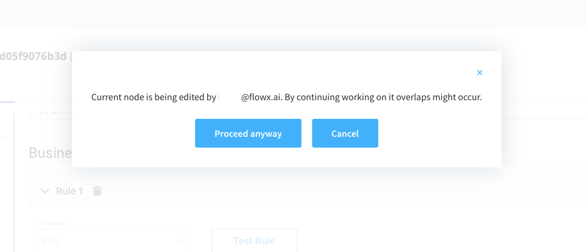
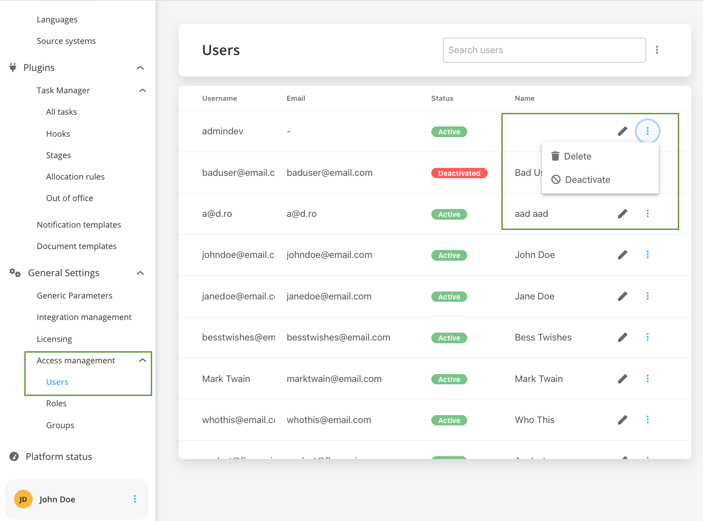
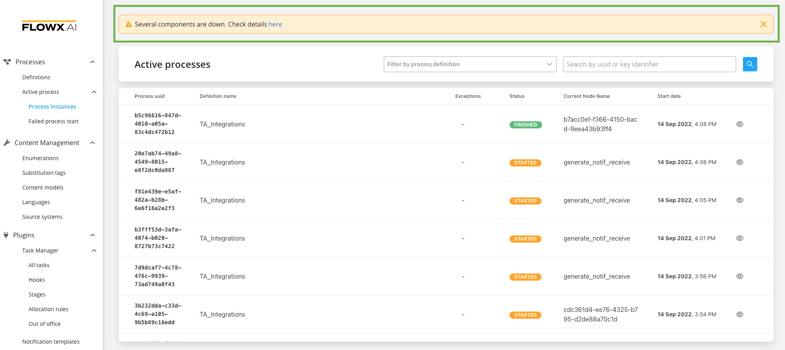
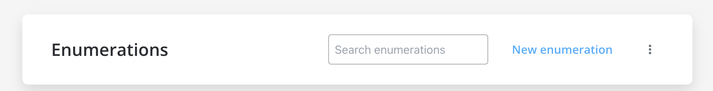

# v2.12.0 - September 2022

Howdy:wave:. Did you miss us? Here is what we prepared for you on our latest release:

## **New features**

### 🕵️ Search for data in another process

The new search data microservice enables you to create a process that can look for data (using [Kafka send](../../docs/building-blocks/node/message-send-received-task-node#configuring-a-message-send-task-node) / [Kafka receive](../../docs/building-blocks/node/message-send-received-task-node#configuring-a-message-receive-task-node) actions) in other processes.

[Search data microservice](../../docs/platform-deep-dive/core-components/core-extensions/search-data-service)

### :pencil2: UI Designer

#### Card UI element

 A new "CARD" UI component is now available, it acts like a **Container** component with the following FLOWX props available: title, subtitle and accordion. The new element will improve user experience while editing the UI of a process.  The card can be added to a user task using the [UI Designer](../../docs/building-blocks/ui-designer).

:::tip
The accordion is a component that organizes content within collapsible items. Accordion allows the display of only one collapsed item at a time.
:::

  

#### Form group updates

The FLOWX props items (**Title** and **Subtitle**) were removed from to **Form group** and moved to the new [**Card**](#card-ui-element) UI element.

#### Add node actions from UI Designer

Now is possible to create and add node actions directly from [UI Designer](../../docs/building-blocks/ui-designer), without having to go back and forth between UI and process config while designing a page that contains actions.

#### Prefill UI action name with node action name

The default value for a UI action name is prefilled with the node action name unless the user prefers to change it.

### 👩‍🏭 FLOWX.AI Designer

#### Display warning when a node is being edited by another user

When a node inside a [process definition](../../docs/building-blocks/process/process-definition) is being edited by a user and another user opens this process a warning will be displayed. Avatar icons of both users on the node are displayed. Hovering over an avatar will reveal the full name of the user.

:::tip
This is also available for UI Designer.

:::

#### Nodes multi-select and reposition

You can now select multiple BPMN nodes and reposition them anywhere in the process canvas - using **CMD/Ctrl + Click** command. The nodes you select will be highlighted as you can see in the picture below.

#### Deactivate user

You can now deactivate a user in FLOWX.AI Designer by accessing **Access Management** > **Users** and then pressing **Deactivate** on a selected user.

:::caution
When you deactivate a user, the following events are triggered:
* the user is logged out and all their active used sessions are deleted, users cannot log in anymore
* the user is marked as deactivated in the identity provider solution 
* an extra configuration needs to be made to the admin service to also delete the offline sessions on the user, more details in the [**2.12.0 deployment guidelines**](deployment-guidelines-v2.12.0.md)
* in case the configuration is not properly made, the deactivated user will still be able to interact with the application until auth token expires
:::

#### Warning when a platform component is down

Added a new warning message to display when a component/ or multiple components are down.

#### Access a subprocess definition

A user can now easily access a [subprocess](../../docs/building-blocks/process/subprocess) definition directly from the actions tab (inside a [user task node](../../docs/building-blocks/node/user-task-node) or [service task node](../../docs/building-blocks/node/task-node)).

## **Fixed**

### Admin

#### Token instance version

Fixed a bug where when you are trying to open a process instance that has a `null` token version you will get a `500` error.  You can open any process instance now, all tokens have a version that is not `null`.

### :steam_locomotive: FLOWX.AI Engine

#### Subprocess error

Fixed an issue that was causing failure in starting a [subprocess](../../docs/building-blocks/process/subprocess). Scenario: when you are trying to start a subprocess triggered from another subprocess using an automatic action (the subprocess on which you trigger the automatic [action](../../docs/building-blocks/actions) is triggered by a manual action on a process started with inherit).

#### Elastic search indexing

Fixed indexing on elastic search, more details in the [Deployment guidelines v2.12.0](./deployment-guidelines-v2.12.0.md) section.

### 👩‍🏭 FLOWX.AI Designer

#### Edit node name

Fixed an issue where the edit node name button was deactivated.

#### Enumerations

Fixed a bug where when deleting parent enumerations, child enumerations would become enumerations themselves.

### :pencil2: UI Designer

#### Autosave changes in UI Designer

Autosave function inside UI Designer is no longer closing pop-ups (while editing some fields) when it is triggered. 

## **Changed**

### Integration management

#### Scenario definition page

The design of the [scenario definition page](../../docs/platform-deep-dive/core-components/core-extensions/integration-management#adding-new-scenarios) has a new look meant to enhance the user experience.

#### Identifiers

Integration and scenario identifiers fields were removed from Integration Management's UI (they are now generated by the system backend).

### Enumerations 

#### Search by enumeration name

It is now possible to use the search function inside the enumerations menu.

#### Create child enumeration

*"Create child collection" *becomes *"Create child enumeration"* to avoid confusion when editing enumerations.

Additional information regarding the deployment for **v2.12.0** is available below:

[Deployment guidelines v2.12.0](deployment-guidelines-v2.12.0)

