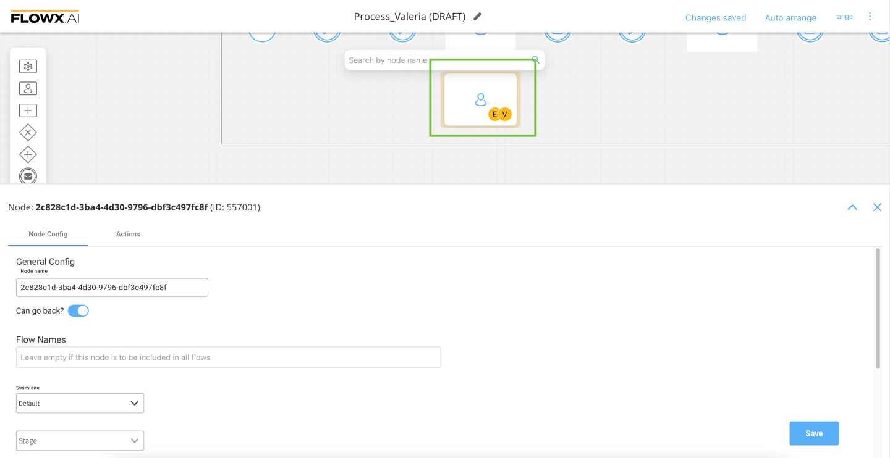

# 🆕  v2.12.0 - September 2022

Howdy:wave:. Did you miss us? Here is what we prepared for you on our latest release:

## **New features**

### 🕵️ Search for data in another process

The new search data microservice enables you to search/look for data (using Kafka Send/ Kafka receive actions) in another processes. Using elastic search the service will be able to search for keys that are indexed there via existing mechanics.

[Search data microservice](../../docs/platform-deep-dive/core-components/core-extensions/search-data-service)

### :pencil2: UI Designer

#### FormGroup UI Element should have no styling

To improve the mobile user experience, a new component identifier "CARD" was added, with FLOWX props title and subtitle. The new card element can be added as root component in a user task.

#### Add node actions from UI Designer

Now is possible to create and add node actions directly from UI Designer, without having to go back and forth between UI and process config while designing a page that contains actions.

#### Prefill UI action name with node action name

The default value for UI action name field is prefilled with the node action name, unless the user chooses to change it.

### 👩‍🏭 FLOWX.AI Designer

#### Display warning when a node is being edited by another user

When a node inside a process definition is being edited by a user and another user opens this process definition, avatar icons of both users are being displayed. Hovering over the avatar will display the full name of the user.

#### Warning when a platform component is down

Added a new warning message to display when a component/ or multiple components are down.

## **Fixed**

### Admin

#### Fixed an error when opening a process instance that has a token instance without version

### :steam_locomotive: FLOWX.AI Engine

#### Fixed a `NullPointerException` error when trying to start a subprocess in a certain scenario

### 👩‍🏭 FLOWX.AI Designer

##### Only Save Data action type is displayed in the dropdown list

Fixed a bug where when creating all types of actions, only the Save Data action is displayed in the dropdown list.

#### Edit node name icon doesn't allow the user to edit the name

Fixed a bug where the edit node name icon is not working properly.

### :pencil2: UI Designer

#### Autosave shouldn't close open pop-ups

Autosave function inside UI Designer is no longer closing pop-ups (while editing some fields) when it is triggered.

## **Changed**

### Integration management

#### Redesign scenario definition page

