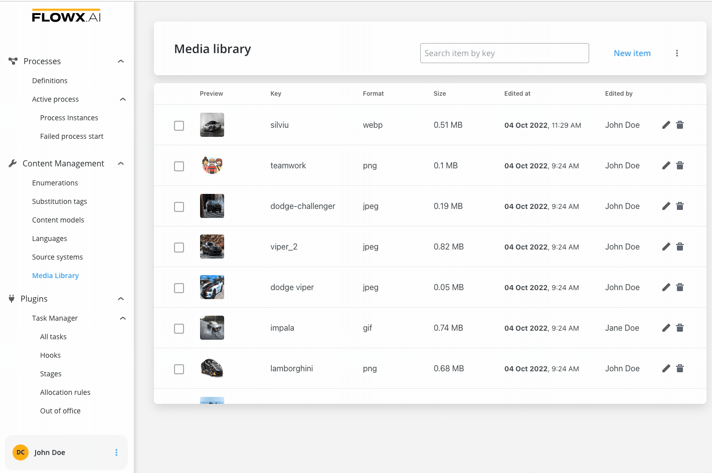

# v2.13.0 - October 2022

Howdy:wave:. Did you miss us? Here is what we prepared for you on our latest release:

## **New features**

### Core extensions

#### Audit log 🔎

New audit log component added. The new service is essentially a record of events and changes. The new audit microservice enables the user to have all the events/changes grouped in a dedicated section inside the Designer web app.

:::info
Audit log is also available at granular level, for example, you can also find an audit log at **Active Process** > **Process instance**.
:::

[Audit](../../docs/platform-deep-dive/core-components/core-extensions/audit)

:::caution
New access rights must be configured to view the Audit log. For more information check the Deployment guidelines v2.13.0.
:::

### CMS Core 📚

#### Media library  

A new media library component was added under the **Content management** tab in the Designer app. This is a new place where all the media assets used in the processes are centralized.

[Media library](../../docs/platform-deep-dive/core-components/core-extensions/content-management/media-library)

### UI Designer ✏️
 
#### Copy / Paste UI Elements

[UI Elements](../../docs/building-blocks/ui-designer/ui-component-types) configured using the [UI Designer](../../docs/building-blocks/ui-designer) can now be copied and pasted across the editor canvas (they must be compatible with the element in which they are pasted).

:::info
Check the [**UI Component types**](../../docs/building-blocks/ui-designer/ui-component-types) section for more information about UI elements and how to match them.
:::

#### New Source Location - Media Library

When configuring an **Image** on a process using the UI Designer, you have now the possibility to add one from a new **Source Location** -> **Media Library**.

There are two options available:

* to select an image from Media Library
* to upload an image to Media Library on the spot

[Image element](../../docs/building-blocks/ui-designer/ui-component-types/image)

## **Fixed**

### 👩‍🏭 FLOWX.AI Designer

* Fixed an issue where images couldn't be configured with process keys that include numbers

* A red border is now available in the design to indicate invalid data sources

* Fixed an issue where you couldn't start a process that hosts empty user tasks

### Data Search service

* Fixed an issue where data flowing from processes with definition names that contain upper case letters couldn't be retrieved
 
## **Changed**

### Process designer

#### Process settings redesign

[Process settings](../../docs/building-blocks/process/process-definition/)

#### Edit node name improvement

When editing a node name from a process, the displayed content of the input is now selected by default.

Additional information regarding the deployment for **v2.13.0** is available below:

## **Known issues** 

### Media Library

Media library image upload options are available in the UI Designer even if the user doesn't have access rights permissions for this component. Clicking any button that uses media library endpoints will return error messages.

[Deployment guidelines v2.13.0](deployment-guidelines-v2.13.0)

