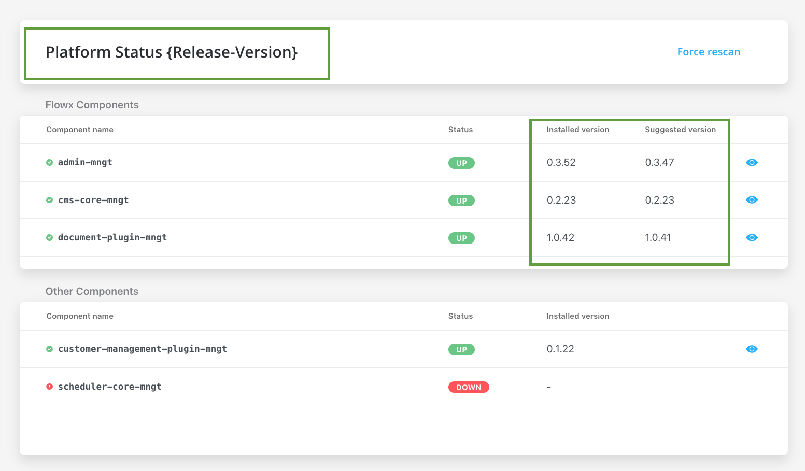

# Deployment guidelines v2.14.0

:::info
Do not forget, when upgrading to a new platform version, always check and make sure your installed component versions match the versions stated in the release. To do that, go to **FLOWX.AI Designer > Platform Status**.
:::

:::caution Process compatibility
After updating to **2.14.0** FLOWX.AI release, importing old processes definitions in the new platform release is not possible (available for exports from **<2.13.0** releases).
:::

## Component versions

| :ballot_box_with_check:        | 2.14.0     | 2.13.0      | 2.12.0  | 2.11.0  | 2.10.0  | 2.9.0   | 2.8.1   | 2.8.0   | 2.7.0   | 2.6.0   | 2.5.0   | 2.4.0   | 2.3.0   | 2.2.0   | 2.1.0     | 2.0.0     | 1.16.0  | 1.15    | 1.14    | 1.13.0  | 1.12.0 | 1.11.0  |
| ------------------------------ | ---------- | ----------- | ------- | ------- | ------- | ------- | ------- | ------- | ------- | ------- | ------- | ------- | ------- | ------- | --------- | --------- | ------- | ------- | ------- | ------- | ------ | ------- |
| **Process engine**             | **0.4.104**| 0.4.95      | 0.4.90  | 0.4.83  | 0.4.60  | 0.4.49  | 0.4.44  | 0.4.42  | 0.4.42  | 0.4.36  | 0.4.29  | 0.4.22  | 0.4.21  | 0.4.18  | 0.4.13    | 0.4.12    | 0.4.4   | 0.3.26  | 0.3.21  | 0.3.14  | 0.3.9  | 0.3.7   |
| **Designer**                   | **2.76.6** | 2.63.6      | 2.60.7  | 2.48.9  | 2.39.2  | 2.33.0  | 2.28.1  | 2.24.2  | 2.23.0  | 2.19.2  | 2.18.2  | 2.17.4  | 2.15.2  | 2.14.4  | 2.11.2    | 2.10.0    | 2.5.0   | 2.1.1   | 1.21.0  | 1.16.3  | 1.15.2 | 1.14.0  |
| **CMS Core**                   | **0.2.38** | 0.2.36      | 0.2.33  | 0.2.30  | 0.2.25  | 0.2.23  | 0.2.23  | 0.2.23  | 0.2.23  | 0.2.23  | 0.2.20  | 0.2.20  | 0.2.18  | 0.2.17  | 0.2.17    | 0.2.17    | 0.2.14  | 0.2.9   | 0.2.9   | 0.2.9   | 0.2.5  | 0.2.3   |
| **Scheduler Core**             | 0.0.34     | 0.0.34      | 0.0.34  | 0.0.33  | 0.0.28  | 0.0.27  | 0.0.27  | 0.0.27  | 0.0.27  | 0.0.27  | 0.0.24  | 0.0.24  | 0.0.23  | 0.0.23  | 0.0.23    | 0.0.23    | 0.0.19  | 0.0.12  | 0.0.12  | 0.0.12  | NA     | 0.0.6   |
| **flowx-process-renderer**     | **2.76.6** | 2.63.6      | 2.60.7  | 2.48.9  | 2.39.2  | 2.33.0  | 2.28.1  | 2.24.2  | 2.23.0  | 2.19.2  | 2.18.2  | 2.17.4  | 2.15.2  | 2.14.4  | 2.11.2    | 2.10.0    | 2.4.2   | 2.1.1   | 1.21.0  | 1.16.3  | 1.15.2 | 1.14.0  |
| **flowx-web-components**       | **2.76.6** | 2.63.6      | 2.60.7  | 0.2.10  | 0.2.10  | 0.2.10  | 0.2.6   | 0.2.6   | 0.2.6   | 0.2.6   | 0.2.6   | 0.2.6   | 0.2.6   | 0.2.5   | 0.2.4     | 0.2.1     | 0.2.1   | 0.0.298 | 0.0.298 | 0.0.298 | NA     | 0.0.293 |
| **Admin**                      | **0.3.119**| 0.3.103     | 0.3.92  | 0.3.81  | 0.3.60  | 0.3.55  | 0.3.47  | 0.3.43  | 0.3.40  | 0.3.36  | 0.3.34  | 0.3.29  | 0.3.23  | 0.3.21  | 0.3.13    | 0.3.13    | 0.3.3   | 0.2.26  | 0.2.26  | 0.2.26  | 0.2.25 | 0.2.23  |
| **Notification Plugin**        | 1.0.206    | 1.0.206     | 1.0.206 | 1.0.205 | 1.0.200 | 1.0.198 | 1.0.198 | 1.0.197 | 1.0.194 | 1.0.194 | 1.0.191 | 1.0.191 | 1.0.190 | 1.0.190 | 1.0.186-1 | 1.0.186-1 | 1.0.186 | 1.0.182 | 1.0.182 | 1.0.182 | NA     | 1.0.179 |
| **Document Plugin**            | 1.0.53     | 1.0.53      | 1.0.53  | 1.0.52  | 1.0.47  | 1.0.42  | 1.0.41  | 1.0.38  | 1.0.37  | 1.0.37  | 1.0.35  | 1.0.35  | 1.0.31  | 1.0.31  | 1.0.30    | 1.0.30    | 1.0.26  | 1.0.24  | 1.0.20  | 1.0.18  | NA     | 1.0.15  |
| **OCR Plugin**                 | 0.1.33     | 0.1.33      | 0.1.5   | 0.1.5   | 0.1.5   | 0.1.5   | 0.1.5   | 0.1.5   | 0.1.5   | 0.1.5   | 0.1.5   | 0.1.5   | 0.0.109 | 0.0.109 | 0.0.109   | 0.0.109   | 0.0.109 | 0.0.106 | n/a     |         |        |         |
| **License Core**               | 0.1.28     | 0.1.28      | 0.1.28  | 0.1.27  | 0.1.23  | 0.1.19  | 0.1.18  | 0.1.18  | 0.1.18  | 0.1.18  | 0.1.15  | 0.1.15  | 0.1.13  | 0.1.13  | 0.1.12    | 0.1.12    | 0.1.10  | 0.1.5   | n/a     |         |        |         |
| **Customer Management Plugin** | 0.1.28     | 0.1.28      | 0.1.28  | 0.1.27  | 0.1.23  | 0.1.22  | 0.1.22  | 0.1.22  | 0.1.22  | 0.1.22  | 0.1.20  | 0.1.20  | 0.1.18  | 0.1.18  | 0.1.18    | 0.1.18    | 0.1.16  | 0.1.10  | 0.1.10  | 0.1.10  | NA     | 0.1.6   |
| **Task Management Plugin**     | 0.0.42     | 0.0.42      | 0.0.40  | 0.0.37  | 0.0.29  | 0.0.28  | 0.0.28  | 0.0.27  | 0.0.27  | 0.0.27  | 0.0.22  | 0.0.22  | 0.0.21  | 0.0.21  | 0.0.16    | 0.0.16    | 0.0.14  |         |         |         |        |         |
| **Data search**                | 0.0.8      | 0.0.8       | 0.0.6   | n/a     | n/a     |         |         |         |         |         |         |         |         |         |           |           |         |         |         |         |        |         |
| **Audit Core**                 | **0.0.8**  | 0.0.5       | n/a     | n/a     | n/a     |         |         |         |         |         |         |         |         |         |           |           |         |         |         |         |        |         |
| **reporting**                  | **0.0.37** | n/a         | n/a     | n/a     | n/a     |         |         |         |         |         |         |         |         |         |           |           |         |         |         |         |        |         |
| **advancing-controller**       | **0.0.6**  | n/a         | n/a     | n/a     | n/a     |         |         |         |         |         |         |         |         |         |           |           |         |         |         |         |        |         |

### 2.14.0 recommended versions

| FLOWX.AI Platform Version 	| Component name 	                | Recommended version (tested version) 	|
|---------------------------	|---------------------------------- |--------------------------------------	|
| 2.14                      	| Keycloak       	                | 18.0.x                               	|
| 2.14                      	| Kafka          	                | 2.8.x                                	|
| 2.14                      	| PostgreSQL     	                | 14.3.0                               	|
| 2.14                      	| MongoDB        	                | 5.0.8                                	|
| 2.14                      	| Redis          	                | 6.2.6                                	|
| 2.14                      	| Elasticsearch   	                | 7.17                                 	|
| 2.14                      	| S3 (Min.IO) / minio-operator      | 2022-05-26T05-48-41Z / 4.5.4          |
| 2.14                      	| OracleDB       	                | 19.8.0.0.0                           	|
| 2.14                          | Angular (Web SDK)                 | 14.2.2                                |

