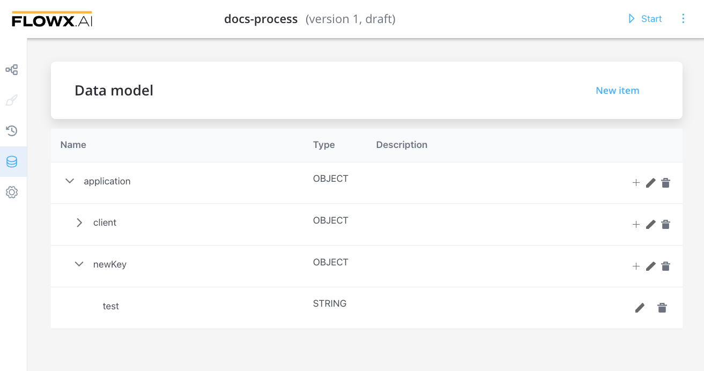
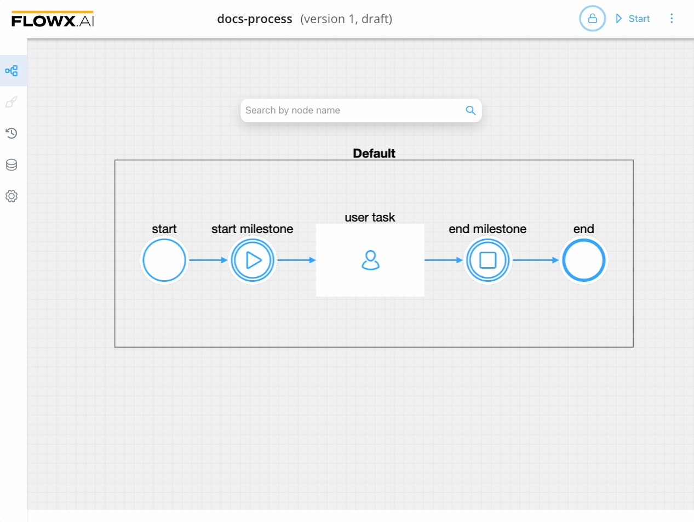
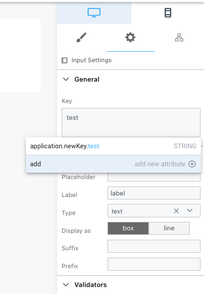
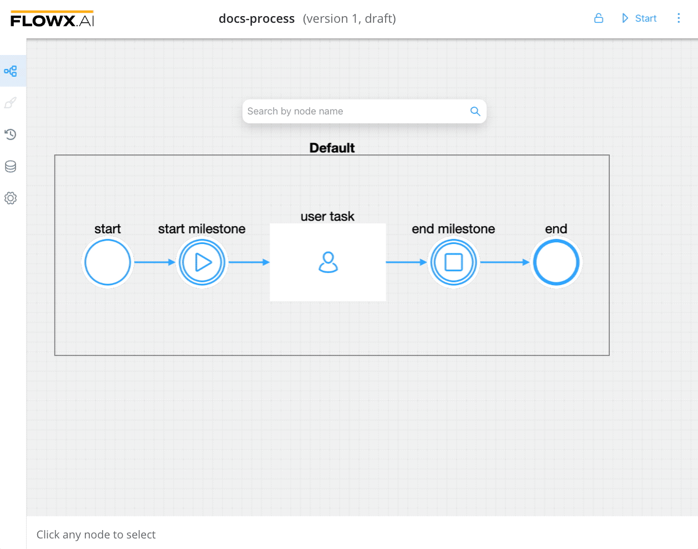
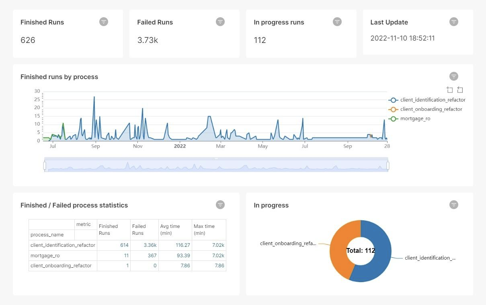
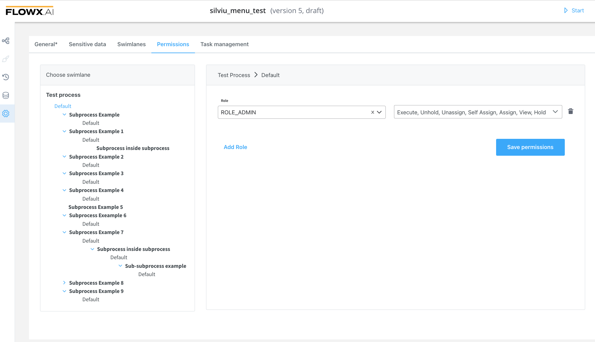
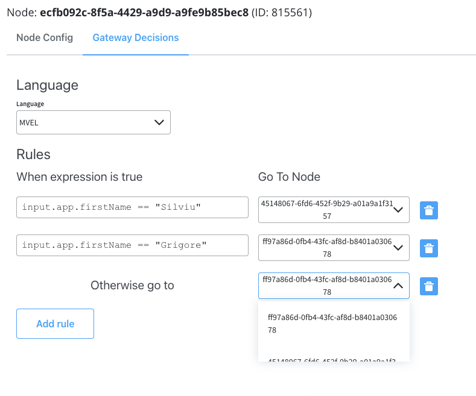

# 🆕 v2.14.0 - November 2022

Howdy :wave:. Did you miss us? Here is what we prepared for you on our latest release:

## **New features**

### FLOWX.AI Designer 👩‍🏭

#### Data model

Data model tab is now live. You can now go through the business data model and access the predefined data model whenever you need to write an attribute’s path.

[Data model](/docs/building-blocks/process/process-definition#data-model)

#### Process designer navigation redesign

A new polished UI navigation is available (left-side navigation panel), improving the overall user experience when working with FLOWX.AI Designer:

* new **Process Designer** tab
* new **UI Designer** tab 
* new **History** tab
* new **Data model** tab
* **Settings** menu moved in the left-side navigation panel

[Process designer](../../docs/building-blocks/process/process-definition#process-designer)

#### Exceptions on processes

* added new exceptions types

### UI Designer ✏️

#### Data model 

You can now add data model keys directly from the UI Designer. The already-defined keys in the **Data model** are also displayed (using the auto-suggestion tool).

#### UI redesign

A brand-new intuitive and user-friendly interface for UI designer is launched.

 
#### Removed Form Group UI element

**Form Group** UI element is removed, all [**Form Groups**](../../docs/building-blocks/ui-designer/ui-component-types/root-components/form-group) elements will become [**Containers**](../../docs/building-blocks/ui-designer/ui-component-types/root-components/container).
  
[UI Designer](../../docs/building-blocks/ui-designer)

### Reporting plugin 

Added the possibility to create and bootstrap custom reports built on generic information about usage and processes using the new reporting plugin. 

You can create multiple reports to meet any need when it comes to business flows. It enables users to analyze data using datasets, and to easily build charts and dashboards.

#### Use in reporting flag

This flag is available inside **Data model** (for the keys that must be used in the reporting) and inside **Process settings** tab, to include a process definition in reporting. 

[Reporting plugin](../../docs/platform-deep-dive/plugins/custom-plugins/reporting)

### FLOWX.AI Engine 🚂

#### New microservice: Advancing Controller

Advancing Controller holds the liquibase database scripts for the advancing PostgreSQL. It is also watching if a process-engine worker [pod](../../docs/platform-overview/frameworks-and-standards/event-driven-architecture-frameworks/intro-to-kubernetes#node--pods) is down. 

When a pod is down, the service reassigns the work of that dead pod, to be picked up by other pods, avoiding [process instances](../../docs/building-blocks/process/active-process/process-instance) to be blocked in advancing.

[Advancing controller](../../docs/platform-deep-dive/core-components/flowx-engine#advancing-controller)

## **Fixed**

### FLOWX.AI Designer 👩‍🏭

* fixed an issue when dropping a node after hovering it over a sequence drops it on that sequence
* fixed an issue with performance when trying to add a new node to an extensive process 

### UI Designer ✏️

* fixed a bug where UI Elements were not correctly displayed after pasting them

### FLOWX.AI Content Management 🗃

* fixed an issue where an export of enumerations / substitution tags would include also values for languages / source systems that are not available anymore
 
## **Changed**

### FLOWX.AI Designer 👩‍🏭

#### Audit log 

* improvements
* now audit-logs are customizable 

#### Subprocesses swimlanes hierarchy 

Now [subprocesses](../../docs/building-blocks/process/subprocess) (called by [subprocess actions](../../docs/building-blocks/node/task-node/start-subprocess-action) or by [subprocess run nodes](../../docs/building-blocks/node/subprocess-run-node) inside the main process) are displayed in the **Permissions** tab together with their swimlanes.

#### Exclusive gateway rules redesign

* a new design is available for [exclusive gateways](../../docs/building-blocks/node/exclusive-gateway-node) in order to improve user experience

### FLOWX.AI Engine 🚂

#### Exceptions improvements

* new [exceptions](../../docs/building-blocks/process/active-process/failed-process-start) types were added

#### elasticSearch

* elasticSearch index name is now customizable

#### Performance

* performance improvements

## **Known issues**

### UI Designer ✏️

* [DatePicker](../../docs/building-blocks/ui-designer/ui-component-types/form-elements/datepicker-form-field) default value overlaps with field placeholder

### Reporting

* not compatible with Oracle DBs

Additional information regarding the deployment for **v2.14.0** is available below:

[Deployment guidelines v2.14.0](./deployment-guidelines-v2.14.0)

