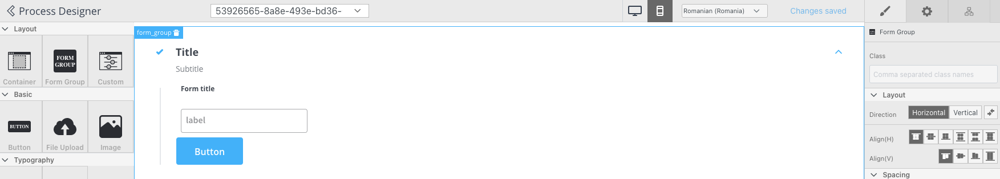

---
sidebar_position: 20
--- 

# v2.2.0 - March 2022

## **New features**

📱 **Platform specific configurations** - It is now possible to add different layout configurations to use different layouts for web and mobile apps.

:mag: **Configure and search process instances by indexed keys** - It is now easier to search process instances by various pre-configured keys.

:tada: **Updated npm version to 7.x.x and Angular 13**

## **Fixed**

### FLOWX Engine

* Fixed handle message from connector when processInstanceUuid header is missing

### Document plugin

* Fixed split document issue

### FLOWX Designer

* Fixed an issue where ‘Open in new tab’ switch is false even when it comes true from the backend API
* Fixed an issue where you couldn’t create a DMN rule inside a gateway if there was no rule configured

### Web components

* Fixed an issue where an ‘Input’ with prefix and suffix was not displayed correctly
* Fixed an issue where buttons couldn’t be clicked twice for uploading documents

## **Changed**

### License

* Added ‘year’ to license report

### Designer

* Added license report sorting by year also

### Task management plugin

* Migrated to FLOWX v2 helm package

### Notification plugin

* Make contentParams accept also object

### Process renderer

* Expose CMS service from the Angular Renderer Library

### Designer

* Added Font-weight: Bold (700) in UI Designer for text styling
* Updated default actions for Task and User Task notes
* Added language selector in UI Designer for previewing labels that use substitution tags
* Removed the option to map buttons with sub-actions
* Small UI updates

Additional information regarding the deployment for v2.2.0 are available below:

[Deployment guidelines v2.2](deployment-guidelines-v2.2)

